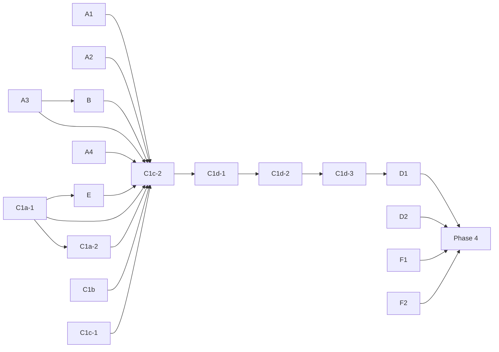

# Implementation Plan for Git Gem Redesign (v5.0.0)

This document outlines a step-by-step plan to implement the proposed architectural
redesign. The plan is structured to be incremental, ensuring that the gem remains
functional and passes its test suite after each major step. This approach minimizes
risk and allows for a gradual, controlled migration to the new architecture.

- [Progress Tracker](#progress-tracker)
  - [Facade Modules Completed](#facade-modules-completed)
    - [Facade module naming convention](#facade-module-naming-convention)
  - [Next Task](#next-task)
    - [D2 / Phase 4 is the remaining redesign step](#d2--phase-4-is-the-remaining-redesign-step)
    - [Phase 3 Overview](#phase-3-overview)
    - [Workstream A — Fill facade coverage gaps](#workstream-a--fill-facade-coverage-gaps)
    - [Workstream B — C0: Redirect `Git::Base` factory methods to `facade_repository`](#workstream-b--c0-redirect-gitbase-factory-methods-to-facade_repository)
    - [Workstream C — C1: Prepare and flip top-level entry points to return `Git::Repository`](#workstream-c--c1-prepare-and-flip-top-level-entry-points-to-return-gitrepository)
    - [Workstream D — C3: Remove compatibility fallbacks](#workstream-d--c3-remove-compatibility-fallbacks)
    - [Workstream E — Migrate or deprecate instance helper methods](#workstream-e--migrate-or-deprecate-instance-helper-methods)
    - [Workstream F — `Git` module utility methods still using `Git::Lib` directly](#workstream-f--git-module-utility-methods-still-using-gitlib-directly)
    - [Phase 3 dependency order](#phase-3-dependency-order)
    - [Phase 3 steps and release compatibility](#phase-3-steps-and-release-compatibility)
    - [Phase 3 completion criteria](#phase-3-completion-criteria)
    - [Facade coverage checklist](#facade-coverage-checklist)
    - [Quality gates (per step)](#quality-gates-per-step)
    - [Reference Files](#reference-files)
- [Phase 1: Foundation and Scaffolding](#phase-1-foundation-and-scaffolding)
- [Phase 2: The Strangler Fig Pattern - Migrating Commands](#phase-2-the-strangler-fig-pattern---migrating-commands)
  - [Key Architectural Insight: Git::Lib as the Adapter Layer](#key-architectural-insight-gitlib-as-the-adapter-layer)
  - [Architectural Insights from Command Migrations](#architectural-insights-from-command-migrations)
  - [Command Migration Checklist](#command-migration-checklist)
    - [✅ Migrated Commands](#-migrated-commands)
    - [⏳ Commands To Migrate](#-commands-to-migrate)
- [Phase 3: Refactoring the Public Interface](#phase-3-refactoring-the-public-interface)
- [Phase 4: Final Cleanup and Release Preparation](#phase-4-final-cleanup-and-release-preparation)
  - [Phase 4 step graph](#phase-4-step-graph)
    - [Step A — Remove old code](#step-a--remove-old-code)
    - [Step B — Finalize test suite](#step-b--finalize-test-suite)
    - [Step C — Update documentation](#step-c--update-documentation)

## Progress Tracker

| Phase | Status | Description | Estimated Effort | Percent Complete |
| ----- | ------ | ----------- | :--------------: | :--------------: |
| Phase 1 | ✅ Complete | Foundation and scaffolding | 5% | 100% |
| Phase 2 | ✅ Complete | Migrating commands (all checklist items done) | 40% | 100% |
| Phase 3 | ✅ Complete | Refactoring public interface — see [Facade Modules Completed](#facade-modules-completed) and [Facade coverage checklist](#facade-coverage-checklist) | 45% | 100% |
| Phase 4 | 🚧 In Progress | Final cleanup and release — Step A complete; Steps B and C remain | 10% | 33% |
| **TOTAL** | -- | -- | **100%** | **93%** |

### Facade Modules Completed

| Module | File | Included in `Git::Repository` | `Git::Base` delegates |
| ------ | ---- | ------------------------------ | --------------------- |
| `Git::Repository::Staging` | `lib/git/repository/staging.rb` | ✅ | `add`, `reset`, `reset_hard`, `apply`, `apply_mail`, `read_tree`, `rm`, `mv`, `clean`, `ignored_files` |
| `Git::Repository::Committing` | `lib/git/repository/committing.rb` | ✅ | `commit`, `commit_all`, `write_tree`; `commit_tree` and `write_and_commit_tree` wrap the SHA result in `Git::Object::Commit.new(self, ...)` |
| `Git::Repository::Branching` | `lib/git/repository/branching.rb` | ✅ | `checkout`, `checkout_file`, `checkout_index`, `current_branch`, `current_branch_state`, `local_branch?`, `remote_branch?`, `branch?`, `branch`, `branches`, `branch_delete`, `branch_new`, `change_head_branch`, `branch_contains`, `branches_all`, `update_ref` |
| `Git::Repository::ContextHelpers` | `lib/git/repository/context_helpers.rb` | ✅ | `chdir`, `with_index`, `with_temp_index`, `with_working`, `with_temp_working`, `set_index`, `set_working` |
| `Git::Repository::Merging` | `lib/git/repository/merging.rb` | ✅ | `merge`, `revert`, `each_conflict`; `merge_base` wraps the returned SHA strings in `Git::Object::Commit.new(self, ...)` instances |
| `Git::Repository::RemoteOperations` | `lib/git/repository/remote_operations.rb` | ✅ | `fetch`, `pull`, `push`, `remote_add` (alias: `add_remote`), `remote_remove` (alias: `remove_remote`), `remote_set_url` (alias: `set_remote_url`), `config_remote`, `remote`, `remotes`, `ls_remote`, `remote_set_branches` |
| `Git::Repository::Stashing` | `lib/git/repository/stashing.rb` | ✅ | `stash_list`, `stash_save`, `stash_apply`, `stash_clear`, `stashes_all` |
| `Git::Repository::Diffing` | `lib/git/repository/diffing.rb` | ✅ | `diff_full`, `diff_numstat`, `diff_stats`, `diff`, `diff_path_status` (alias: `diff_name_status`), `diff_files`, `diff_index` |
| `Git::Repository::Inspecting` | `lib/git/repository/inspecting.rb` | ✅ | `describe`, `show`, `fsck` |
| `Git::Repository::Logging` | `lib/git/repository/logging.rb` | ✅ | `log`, `full_log_commits` |
| `Git::Repository::Maintenance` | `lib/git/repository/maintenance.rb` | ✅ | `repack`, `gc` |
| `Git::Repository::ObjectOperations` | `lib/git/repository/object_operations.rb` | ✅ | `cat_file_contents`, `cat_file_size`, `cat_file_type`, `cat_file_commit`, `cat_file_tag`, `rev_parse`, `tag_sha`, `full_tree`, `tree_depth`, `name_rev`, `ls_tree`, `grep`, `archive`, `gblob`, `gcommit`, `gtree`, `tag`, `object`, `tags`, `add_tag`, `delete_tag` |
| `Git::Repository::StatusOperations` | `lib/git/repository/status_operations.rb` | ✅ | `ls_files`, `no_commits?` / `empty?`, `untracked_files`, `status` |
| `Git::Repository::Configuring` | `lib/git/repository/configuring.rb` | ✅ | `config`, `config_get`, `config_list`, `config_set`, `global_config`, `global_config_get`, `global_config_list`, `global_config_set` |
| `Git::Repository::WorktreeOperations` | `lib/git/repository/worktree_operations.rb` | ✅ | `worktrees_all`, `worktree_add`, `worktree_remove`, `worktree_prune`, `worktree`, `worktrees` |

#### Facade module naming convention

New topic modules follow a **three-tier** convention:

- **Gerund** (verb-ing) when a single action word clearly names the whole module:
  `Staging`, `Committing`, `Branching`, `Merging`, `Logging`, `Diffing`, `Stashing`,
  `Configuring`, `Inspecting`.
- **Noun + `Operations`** when the module is a mixed bag of methods grouped by git
  concept rather than a single action: `RemoteOperations`, `ObjectOperations`,
  `StatusOperations`, `WorktreeOperations`.
- **Descriptive utility names** for cross-cutting helpers or housekeeping APIs that
  are not domain-object names: `ContextHelpers`, `Maintenance`.

Do **not** use plain nouns that clash with existing domain-object class names
such as `Branch`, `Diff`, `Log`, `Object`, `Remote`, `Status`, `Worktree`, etc.

### Next Task

#### Phase 4 Step B (finalize test suite) is the next step

Phase 4 **Step A — Remove old code** is ✅ complete. The atomic removal landed in
[PR #1456](https://github.com/ruby-git/ruby-git/pull/1456) (commit `c1c53999`),
which deleted `Git::Base` and `Git::Lib`, removed the `base_object` / `from_base`
bridge from `Git::ExecutionContext::Repository`, and dropped the legacy `require`
lines from `lib/git.rb`. This also satisfies the long-standing **D2** redesign
item. The only remaining `Git::Base` / `Git::Lib` strings in `lib/` are YARD/comment
references to historical 4.x behavior, which the Step A done-criteria explicitly
allow.

The remaining redesign work is the rest of Phase 4:

| Step | Status | Summary |
| ---- | ------ | ------- |
| A — Remove old code | ✅ Complete | `Git::Base`/`Git::Lib` and the bridge deleted ([PR #1456](https://github.com/ruby-git/ruby-git/pull/1456)) |
| B — Finalize test suite | 🔲 Not Started | Port remaining Test::Unit coverage in `tests/units/` to RSpec, drop the `test-unit` dependency from `git.gemspec`, remove the `test`/`test-all` Rake tasks, and remove the `tests/` directory |
| C — Update documentation | 🚧 Partial | `UPGRADING.md` and broad `@api private` coverage exist; verify `yard stats` reports no missing public-API docs and that `README.md` reflects the new entry points |

The following earlier prerequisites are all ✅ complete:

| Step | Status |
| ---- | ------ |
| C1c-2: public-API parity audit and remediation sweep | ✅ |
| E: block-based helper/path-context methods migrated | ✅ |
| D2: remove the `base_object` / `from_base` bridge | ✅ |

Steps C1d-1, C1d-2, and C1d-3 are ✅ complete (see their detail sections below for full specs).

---

#### Phase 3 Overview

All 9 domain-object migrations are ✅ complete:

| Domain objects | PRs |
| -------------- | --- |
| `Git::Stash` + `Git::Stashes` | [PR #1306](https://github.com/ruby-git/ruby-git/pull/1306) |
| `Git::DiffPathStatus` | — |
| `Git::Object::*` | — |
| `Git::Log` | [PR #1327](https://github.com/ruby-git/ruby-git/pull/1327) |
| `Git::Diff` + `Git::DiffStats` | — |
| `Git::Status` | — |
| `Git::Branch` + `Git::Remote` | — |
| `Git::Branches` | [PR #1356](https://github.com/ruby-git/ruby-git/pull/1356), [PR #1357](https://github.com/ruby-git/ruby-git/pull/1357), [PR #1358](https://github.com/ruby-git/ruby-git/pull/1358), [PR #1359](https://github.com/ruby-git/ruby-git/pull/1359) |
| `Git::Worktree` + `Git::Worktrees` | — |

The work was organized into six workstreams (A–F). All workstreams that are
prerequisites for C1d are now ✅ complete. F1 and F2 are both ✅ complete — F2
moved the remaining `Git` module utility methods off `Git::Lib`. Phase 4 Step A
is complete; Steps B and C remain (see [Next Task](#next-task)).

**Sequencing** (see [Phase 3 dependency order](#phase-3-dependency-order) for the
reasoning behind each edge):



---

#### Workstream A — Fill facade coverage gaps

`Git::Base` still calls `lib.*` directly for 11 high-priority methods that have no
`Git::Repository` counterpart yet. Each step below adds the missing facade methods and
updates `Git::Base` to delegate.

**Step A1 — Extend `Git::Repository::Staging`: `rm`, `clean`, `ignored_files`** ✅

| `Git::Base` method | Facade to add |
| --- | --- |
| `rm(path, opts)` | `Git::Repository::Staging#rm` → `Commands::Rm` |
| `clean(opts)` | `Git::Repository::Staging#clean` → `Commands::Clean`; the `migrate_clean_legacy_options` deprecation adapter (`:ff`/`:force_force`) moves into the facade |
| `ignored_files` | `Git::Repository::Staging#ignored_files` → `Commands::LsFiles` |

Files touched: `lib/git/repository/staging.rb`, `spec/unit/git/repository/staging_spec.rb`, `lib/git/base.rb`

**Step A2 — Extend `Git::Repository::RemoteOperations`: `remotes`, `set_remote_url`, `remote_set_branches`** ✅

| `Git::Base` method | Facade to add |
| --- | --- |
| `remotes` | `Git::Repository::RemoteOperations#remotes` → `Commands::Remote::List`; returns `Array<Git::Remote>` |
| `set_remote_url(name, url)` | `Git::Repository::RemoteOperations#set_remote_url` → `Commands::Remote::SetUrl`; coerce local-repo `Git::Base` url to string in facade pre-processing; return `Git::Remote` |
| `remote_set_branches(name, *branches, add:)` | `Git::Repository::RemoteOperations#remote_set_branches` → `Commands::Remote::SetBranches` |

Files touched: `lib/git/repository/remote_operations.rb`, `spec/unit/git/repository/remote_operations_spec.rb`, `lib/git/base.rb`

**Step A3 — Extend `Git::Repository::ObjectOperations`: `tags`, `add_tag`, `delete_tag`** ✅

| `Git::Base` method | Facade to add |
| --- | --- |
| `tags` | `Git::Repository::ObjectOperations#tags` → `Commands::Tag::List` + `Parsers::Tag`; returns `Array<Git::Object::Tag>` |
| `add_tag(name, *options)` | `Git::Repository::ObjectOperations#add_tag` → `Commands::Tag::Create`; `validate_tag_options!` validation logic moves into the facade |
| `delete_tag(name)` | `Git::Repository::ObjectOperations#delete_tag` → `Commands::Tag::Delete` |

Files touched: `lib/git/repository/object_operations.rb`, `spec/unit/git/repository/object_operations_spec.rb`, `lib/git/base.rb`

**Step A4 — New `Git::Repository::Inspecting` module: `show`, `fsck`** ✅

These are read-only repository inspection operations that don't fit an existing topic module.

| `Git::Base` method | Facade to add |
| --- | --- |
| `show(objectish, path)` | `Git::Repository::Inspecting#show` → `Commands::Show`; returns `String` |
| `fsck(*objects, **opts)` | `Git::Repository::Inspecting#fsck` → `Commands::Fsck` + `Parsers::Fsck`; returns `Git::FsckResult` |

Files touched: `lib/git/repository/inspecting.rb` (new), `lib/git/repository.rb` (add `include Git::Repository::Inspecting`), `spec/unit/git/repository/inspecting_spec.rb` (new), `lib/git/base.rb`

**Later covered by C1c-2:** lower-level public methods such as `describe`,
`repack`, `gc`, `apply`, `apply_mail`, `read_tree`, and `cat_file_*` were
subsequently migrated into `Inspecting`, `Maintenance`, `Staging`, and
`ObjectOperations` before `Git.open` started returning `Git::Repository`.

---

#### Workstream B — C0: Redirect `Git::Base` factory methods to `facade_repository`

These `Git::Base` methods construct domain objects directly with `self` instead of
delegating. All corresponding facade methods already exist — this is pure delegation
wiring with no new facade code needed. Ship as one PR (`feat/c0-delegate-base-factories`).

⚠️ Depends on A3 (`tags`/`add_tag`/`delete_tag`) before `tag` can be redirected.

**Step B — Redirect `Git::Base` domain-object factories to `facade_repository`** ✅

| `Git::Base` method | Current | Replace with |
| --- | --- | --- |
| `branch(branch_name)` [L936] | `Git::Branch.new(self, ...)` | `facade_repository.branch(branch_name)` |
| `branches` [L950] | `Git::Branches.new(self)` | `facade_repository.branches` |
| `gblob(objectish)` [L993] | `Git::Object.new(self, objectish, 'blob')` | `facade_repository.gblob(objectish)` |
| `gcommit(objectish)` [L998] | `Git::Object.new(self, objectish, 'commit')` | `facade_repository.gcommit(objectish)` |
| `gtree(objectish)` [L1003] | `Git::Object.new(self, objectish, 'tree')` | `facade_repository.gtree(objectish)` |
| `object(objectish)` [L1030] | `Git::Object.new(self, objectish)` | `facade_repository.object(objectish)` |
| `remote(remote_name)` [L1035] | `Git::Remote.new(self, remote_name)` | `facade_repository.remote(remote_name)` |
| `tag(tag_name)` [L1045] | `Git::Object::Tag.new(self, tag_name)` | `facade_repository.tag(tag_name)` |

---

#### Workstream C — C1: Prepare and flip top-level entry points to return `Git::Repository`

⚠️ C1d, the actual return-type flip, depends on all of Workstreams A, B, and E plus
C1a-1/C1a-2/C1b/C1c being complete.

This workstream has six sub-tasks. C1a-1, C1a-2, and C1b can land early; C1c-1 and C1c-2 must run after
facade/helper coverage; C1d is the final step.

**C1a — Add factory class methods to `Git::Repository`** (group: Step C1a-1 and Step C1a-2)

The construction logic currently in `Git::Base.open`, `.bare`, `.clone`, and
`Git.init` must move to equivalent factory class methods on `Git::Repository` so
that `Git.open` etc. can call `Git::Repository.open` instead of `Git::Base.open`.
The notable complexity is clone result parsing/path resolution: `Git::Base.clone`
currently delegates to `Git::Lib#clone`, which already wraps `Git::Commands::Clone`.
Move that adapter behavior into `Git::Repository.clone` without reintroducing a
`Git::Lib` dependency.

This workstream is intentionally split into two PRs because the path/accessor
state work is independent of the clone/init work, and combining them would make a
very large PR.

**Step C1a-1 — Path state, accessors, and `.open`/`.bare` factories** ✅

| `Git::Base` class method | Target |
| --- | --- |
| `.open(working_dir, options)` | `Git::Repository.open` — path validation + `resolve_paths` + constructor |
| `.bare(git_dir, options)` | `Git::Repository.bare` — bare path resolution + constructor |

Also move `resolve_paths` and `root_of_worktree` private helpers from `Git::Base`
to `Git::Repository` (or a private `RepositoryPaths` helper module). `Git::Repository`
must also expose the path/accessor surface currently provided by `Git::Base`: `dir`,
`repo`, `index`, and `repo_size`.

Files touched: `lib/git/repository.rb`, `lib/git/base.rb`

**Step C1a-2 — `.clone` and `.init` factories** ✅

| `Git::Base` / `Git` method | Target |
| --- | --- |
| `.clone(url, dir, options)` | `Git::Repository.clone` — delegates to `Commands::Clone`, resolves paths, constructs instance |
| `Git.init(dir, options)` | `Git::Repository.init` — delegates to `Commands::Init` using `Git::ExecutionContext::Global` (not `Git::Lib`), then calls `.open`/`.bare` |

Note: `Git.init` in `lib/git.rb` currently passes `Git::Lib.new` into
`Git::Commands::Init`. That `Git::Lib.new` call is removed here by routing
through `Git::Repository.init` instead.

Note: `.repository_default_branch` is **not** part of C1a. That class method
routes through `Git::Lib` and belongs with the `LsRemote` parser migration in
Workstream F.

Files touched: `lib/git/repository.rb`, `lib/git/base.rb`, `lib/git.rb`

**Step C1b — Move global config singleton ownership off `Git::Base`** ✅

`Git.configure` and `Git.config` both delegate to `Base.config`, which returns the
`Git::Base`-owned `Git::Config` singleton. When `Git::Base` is deleted, these break.
The fix is to move `config` to `Git::Config` itself as a class-level singleton (or to
the `Git` module directly) and update `Git.configure`, `Git.config`,
`Git.git_version`, `Git.binary_version`, and the surviving `Git::ExecutionContext`
classes to reference it without going through `Git::Base`. While `Git::Base` exists,
`Git::Base.config` can remain as a delegator for compatibility.

Note: Both `Git.git_version` and the deprecated `Git.binary_version` in `lib/git.rb`
currently evaluate `Git::Base.config.binary_path` at call time (not definition time),
so both method bodies must be updated in this PR.

Files touched: `lib/git/config.rb`, `lib/git.rb`, `lib/git/base.rb`,
`lib/git/execution_context.rb`, `lib/git/execution_context/global.rb`,
`lib/git/execution_context/repository.rb`

**C1c — Public API parity/deprecation audit before the flip** (group: Step C1c-1 and Step C1c-2)

Before `Git.open`, `Git.clone`, `Git.init`, and `Git.bare` return
`Git::Repository`, every public `Git::Base` method that should survive in v5.0 must
exist on `Git::Repository`; every method that should not survive must be explicitly
documented as a v5 breaking change or already deprecated for removal. This audit is
the gate that prevents the entry-point flip from silently dropping public methods
just because `Git::Base` still exists in the tree.

**Step C1c-1 — Signature-compatibility guidance and process** ✅

Update extraction and review skills to document the signature-compatibility
classification policy (legacy-contract vs 5.x-native), parity-check requirements,
and test-creation expectations so that all future extraction work follows consistent
rules before the remediation sweep begins.

| Artifact | Change |
| --- | --- |
| `extract-facade-from-base-lib/SKILL.md` | Add `## Signature compatibility policy` section with legacy-contract vs 5.x-native classification table and four rules (legacy-contract preserves exact 4.x signatures, including rare `**opts`; 5.x-native uses `opts = {}` for consistency) |
| `facade-implementation/SKILL.md` | Add policy classification check to review workflow (step 4) |
| `facade-test-conventions/SKILL.md` | Add `context 'signature compatibility'` grouping convention and review checks |

Files touched: `.github/skills/extract-facade-from-base-lib/SKILL.md`,
`.github/skills/facade-implementation/SKILL.md`,
`.github/skills/facade-test-conventions/SKILL.md`

Tracked as [Issue #1369](https://github.com/ruby-git/ruby-git/issues/1369).

**Step C1c-2 — End-of-Phase-3 public-API parity audit and remediation sweep** ✅

Compare every public `Git::Base` method against `Git::Repository`; fix mismatches
or explicitly record each as a documented v5 breaking change. No unclassified
compatibility gap may remain before C1d.

Required audit buckets:

| Surface | Required decision before C1d |
| --- | --- |
| Path/accessors | `dir`, `repo`, `index`, `repo_size` must exist on `Git::Repository` (C1a-1 owns this) |
| Compatibility aliases/wrappers | `remove`, `revparse`, `diff_name_status`, `reset_hard`, `is_local_branch?`, `is_remote_branch?`, `is_branch?`, `checkout` must be migrated or intentionally removed with upgrade notes (`checkout` is called by `Git.export` on the `Git.clone` result) |
| Low-level public methods | Resolved in the current tree: `describe` → `Inspecting`; `repack`/`gc` → `Maintenance`; `apply`/`apply_mail`/`read_tree` → `Staging`; `cat_file_*` → `ObjectOperations`. Any intentional removals still require upgrade notes. |
| Factory/domain-object returns | Confirm B plus A2/A3 cover `branch`, `branches`, `remote`, `remotes`, `tag`, `tags`, object factories, and tag create/delete return shapes |
| Keyword-arg facades | For `legacy-contract` methods, preserve the exact 4.x call shape (including rare `**opts` signatures); for `5.x-native` methods, use `opts = {}` style for consistency |

Files touched: `lib/git/repository/*.rb` (topic modules for migrated methods),
`lib/git/base.rb`, upgrade notes / CHANGELOG for documented removals

Tracked as [Issue #1370](https://github.com/ruby-git/ruby-git/issues/1370).

##### Step C1d-1 — Flip entry points

With C1a, C1b, C1c, A, B, and E in place, update `Git.open`, `Git.clone`,
`Git.init`, and `Git.bare` in `lib/git.rb` to call `Git::Repository.*` and return
`Git::Repository` directly, bypassing `Git::Base` entirely.

**Prerequisite fix before landing C1d-1:** delete `spec/integration/git/lib/config_spec.rb`
after confirming behavior coverage exists in `spec/integration/git/repository/configuring_spec.rb`.
The `def lib = self` shim causes `subject(:lib) { repo.lib }` to return `Git::Repository` (self),
which triggers deprecation warnings from every deprecated alias call (config_set, config_get,
global_config_set, etc.) in that spec.

##### Step C1d-2 — Eliminate internal `.lib` callers

Clean up all `.lib` callers from tests while the silent `def lib = self` shim is still in
place, then add `Git::Deprecation.behavior = :raise` to both test suites. See the phase table
in the [Next Task](#next-task) section for the full per-phase breakdown.

##### Step C1d-3 — Remove dead fallbacks and add deprecation warning

- Add `diff_numstat` delegator to `Git::Base` (prerequisite: not currently defined there)
- Remove dead `respond_to?` + `.lib` fallback branches from `lib/git/diff.rb`,
  `lib/git/diff_stats.rb`, `lib/git/diff_path_status.rb`, `lib/git/status.rb`
- Replace `def lib = self` in `lib/git/repository.rb` with a `Git::Deprecation.warn` body
  (removal version: v6.0.0; returns `self`)
- Remove `command_capturing`, `command_streaming`, and private `env_overrides` from
  `lib/git/repository.rb` — these were added only to feed the silent shim
- Add unit test asserting the deprecation warning and `self` return

---

#### Workstream D — C3: Remove compatibility fallbacks

⚠️ These are v5-only cleanup steps. They are not 4.x-compatible and must be kept out
of 4.x release candidates unless an explicit breaking-change decision has already
been recorded.

##### Step D1 — Remove domain-object compatibility fallbacks

⚠️ Depends on C1d. This can be a releasable v5 cleanup PR after `Git.open` returns
`Git::Repository`, because normal construction paths no longer pass `Git::Base` into
domain objects. It is breaking for callers that directly construct domain objects
with a `Git::Base` provider, so that removal must be documented in the upgrade notes.

Remove `is_a?(Git::Base)` guards. Current sites:

| File | Line |
| --- | --- |
| `lib/git/branch.rb` | L478 (`branch_repository` helper) |
| `lib/git/branches.rb` | L150 (`branches_repository` helper) |
| `lib/git/log.rb` | L170 (`log_repository` helper) |
| `lib/git/object.rb` | L137, L329, L405 |
| `lib/git/remote.rb` | L149 (`remote_repository` helper) |
| `lib/git/stash.rb` | L104 (`stash_repository` helper) |
| `lib/git/stashes.rb` | L170 (`stashes_repository` helper) |
| `lib/git/worktree.rb` | L151 (`worktree_repository` helper) |
| `lib/git/worktrees.rb` | L144 (`worktrees_repository` helper) |
| `lib/git/repository/remote_operations.rb` | L418 (`url.is_a?(Git::Base)` coercion — handled in A2 facade pre-processing instead) |

Each guard simplifies to just the `Git::Repository` branch — the `Git::Base` branch is deleted.

Verify no guards remain: `grep -r 'is_a?(Git::Base)' lib/`

Also remove legacy `@base.lib` fallback paths that only exist to support
`Git::Base`/`Git::Lib`-backed domain objects:

| File | Fallback |
| --- | --- |
| `lib/git/diff.rb` | `@base.lib.diff_full` |
| `lib/git/diff_stats.rb` | `@base.lib.diff_stats` |
| `lib/git/diff_path_status.rb` | `@base.lib.diff_path_status` |

After D1, domain objects should assume their provider is `Git::Repository` (or a
compatible object that implements the repository facade methods directly), not an
object with a `.lib` escape hatch.

---

#### Workstream E — Migrate or deprecate instance helper methods

⚠️ Depends on C1a (factory/path state must exist so the helpers have a home). E must
complete before C1d, because `Git.open` returning `Git::Repository` without these
helpers would drop existing public `Git::Base` behavior.

`Git::Base` exposes several block-based helper methods that have no counterpart on
`Git::Repository`. They must either be migrated before `Git::Base` can be deleted,
or explicitly deprecated with removal in v6.0. The recommended path is migration.

**Step E — Migrate block-based helper/path-context methods to `Git::Repository`** ✅

| `Git::Base` method | Proposed destination | Notes |
| --- | --- | --- |
| `#chdir(&block)` | `Git::Repository#chdir` | `Dir.chdir(dir.to_s) { yield dir }` — trivial; just needs the `dir` accessor on `Git::Repository` |
| `#with_index(new_index, &block)` | `Git::Repository#with_index` | Invalidates and restores `@index`; rebuilds the repository execution context |
| `#with_temp_index(&block)` | `Git::Repository#with_temp_index` | Creates a `Tempfile`-backed index, delegates to `with_index` |
| `#with_working(work_dir, &block)` | `Git::Repository#with_working` | Invalidates and restores `@working_directory`; rebuilds the repository execution context |
| `#with_temp_working(&block)` | `Git::Repository#with_temp_working` | Creates a `Dir.mktmpdir`-backed working dir, delegates to `with_working` |

`set_index` and `set_working` (the non-block mutators) must also be migrated or
removed at the same time, since `with_index`/`with_working` depend on the same
invalidation logic.

Files touched: `lib/git/repository/context_helpers.rb`, `lib/git/base.rb`,
`spec/unit/git/repository/` (new or extended spec)

---

#### Workstream F — `Git` module utility methods still using `Git::Lib` directly

⚠️ These are **Phase 4 prerequisites** — they do not block A–E but must be done
before `Git::Lib` can be deleted.

Three `Git`-module-level methods bypass `Git::Repository` entirely and call
`Git::Lib` directly. The required command classes already exist; each method needs a
non-`Git::Lib` adapter path using `Git::ExecutionContext::Global` plus existing
parsing logic.

**Step F1 — Move `Git.ls_remote` and `Git.default_branch` off `Git::Lib`** ✅

| `Git` module method | Current path | Required work |
| --- | --- | --- |
| `Git.default_branch(repo, options)` | `Base.repository_default_branch` → `Git::Lib.new.repository_default_branch` | Use `Git::Commands::LsRemote` with `symref: true` and migrate the default-branch parser out of `Git::Lib` |
| `Git.ls_remote(location, options)` | `Git::Lib.new.ls_remote` | Migrate to `Git::Commands::LsRemote` (shared with `default_branch`) |

Also migrate `Git::Base.repository_default_branch` to use `Git::Commands::LsRemote`
directly (sharing the `LsRemote` parser with `Git.ls_remote`). This is the call
chain behind `Git.default_branch` and can be migrated in the same F1 PR since both
use the same command class.

Files touched: `lib/git.rb`, `lib/git/base.rb`, and parser/helper code extracted
from `Git::Lib` as needed

**Step F2 — Move `Git.global_config`, `#config`, and `#global_config` off `Git::Lib`** ✅

| `Git` module method | Current path | Required work |
| --- | --- | --- |
| `Git.global_config(name, value)` | `Git::Lib.new.global_config_{get,set,list}` | Use `Git::Commands::ConfigOptionSyntax::{Get,List,Set}` with `global: true` |

Also audit the `Git` module instance methods `#config` and `#global_config` for
callers that `include Git`; `#global_config` should continue delegating to the class
method, while `#config` must either be reimplemented without `Git::Lib.new` or
documented as removed.

Files touched: `lib/git.rb`, `lib/git/base.rb`, and parser/helper code extracted
from `Git::Lib` as needed

---

#### Phase 3 dependency order

1. **Parallel starters**: A1–A4, C1a, C1b, F1, and F2 can begin independently.
2. **B after A3**: B can start once A3 supplies facade tag factories.
3. **E after C1a**: helper/path-context methods need `Git::Repository` path state.
4. **C1c-2 after A+B+E+C1c-1**: API parity remediation can only be actioned after facade and helper coverage exists and the guidance/policy (C1c-1) is in place.
5. **C1d is the v5 boundary step**: the `Git.open`/`.clone`/`.init`/`.bare` return-type flip waits for A, B, C1a, C1b, C1c-1, C1c-2, and E, and is explicitly not a 4.x-compatible change.
6. **D1 after C1d**: domain-object fallback removal waits until normal construction no longer passes `Git::Base` into domain objects.
7. **Phase 4 after D1+F1+F2**: deleting `Git::Base`/`Git::Lib` waits for domain-object fallback removal and `Git` module utilities to stop using `Git::Lib`; D2 lands with that deletion, not before it.

---

#### Phase 3 steps and release compatibility

Default rule: every step before C1d that produces code must be small, independently releasable on the
4.x-compatible line, and must preserve public signatures, return values, deprecation
warnings, and top-level factory behavior. Any intentional break must be explicitly
classified as a v5-only PR with upgrade-note coverage before it lands.

**GitHub PR column:** ⬜ = not yet opened; replace with a PR link (e.g. `[#1234](…)`) when opened, then append ✅ when merged.

| Step | GitHub PR | Scope | Release lane | Backward-compatibility rule |
| --- | --- | --- | --- | --- |
| A1 | ✅ | Add `rm`, `clean`, `ignored_files` facade coverage | 4.x-compatible | `Git::Base` public methods keep the same signatures, return values, and deprecation behavior. |
| A2 | ✅ | Add `remotes`, `set_remote_url`, `remote_set_branches` facade coverage | 4.x-compatible | `Git::Base` remote methods keep the same return objects and validation behavior. |
| A3 | ✅ | Add `tags`, `add_tag`, `delete_tag` facade coverage | 4.x-compatible | Tag list/create/delete return contracts match 4.x behavior. |
| A4 | ✅ | Add `Inspecting#show` and `#fsck` | 4.x-compatible | `Git::Base#show` and `#fsck` remain behavior-compatible and delegate internally. |
| B | ✅ | Redirect `Git::Base` domain-object factories | 4.x-compatible | Method signatures and return types stay the same; only the internal provider changes to `Git::Repository`. Split into object/tag factories and branch/remote factories if the PR grows. |
| C1a-1 | ✅ | Add `Git::Repository.open`/`.bare`, path state, and `dir`/`repo`/`index`/`repo_size` | 4.x-compatible additive | `Git.open`/`.bare` still return `Git::Base`; new repository factories are additive until C1d. |
| C1a-2 | ✅ | Add `Git::Repository.clone`/`.init` | 4.x-compatible additive | `Git.clone`/`.init` still return `Git::Base`; clone/init behavior is duplicated behind new factories without changing public entry points. |
| C1b | [#1385](https://github.com/ruby-git/ruby-git/pull/1385) ✅ | Move global config ownership | 4.x-compatible | `Git.config`, `Git.configure`, and `Git::Base.config` keep working; `Git::Base.config` remains as a delegator. |
| E | ✅ | Add repository helper/path-context methods | 4.x-compatible additive | `Git::Base` helpers keep working; `Git::Repository` gains equivalent behavior before any top-level return-type change. Split index helpers and working-directory helpers if needed. |
| F1 | ✅ | Move `Git.ls_remote` and `Git.default_branch` off `Git::Lib` | 4.x-compatible | Return formats and error behavior match current 4.x-compatible behavior. |
| F2 | ✅ | Move `Git.global_config`, module `#config`, and module `#global_config` off `Git::Lib` | 4.x-compatible | Config methods keep the same return formats and write behavior. |
| C1c-1 | ✅ | Guidance/process: signature-compatibility policy for extraction and review ([#1369](https://github.com/ruby-git/ruby-git/issues/1369)) | 4.x-compatible / docs-only | Guidance and review checklists define legacy-contract vs 5.x-native signatures, including test expectations. |
| C1c-2 | ✅ | End-of-Phase-3 public-API parity audit and remediation sweep ([#1370](https://github.com/ruby-git/ruby-git/issues/1370)) | 4.x-compatible | All four parity audit buckets resolved (fix or documented removal) before C1d; no unclassified compatibility gap remains. |
| C1d | ✅ | Flip `Git.open`/`.clone`/`.init`/`.bare` to return `Git::Repository` | v5 boundary | Explicit breaking change because class identity changes from `Git::Base` to `Git::Repository`; method-level parity must be complete first. Split into C1d-1 (entry point flip), C1d-2 (eliminate internal .lib callers + add deprecation enforcement to both test suites), and C1d-3 (remove dead fallbacks + replace silent lib shim with real deprecation warning). |
| D1 | ✅ | Remove domain-object `Git::Base` guards and `@base.lib` fallbacks | v5 cleanup | Explicitly drops direct `Git::Base` provider support in domain-object constructors; normal factory-created objects remain supported. |
#### Phase 3 completion criteria

Use this table to decide whether a checklist item can be marked complete. A step is
done only when its code, focused specs, and delegation/cleanup checks are all true.

| Step | Done when |
| --- | --- |
| A1: `Staging` — `rm`, `clean`, `ignored_files` | `Git::Repository::Staging` implements all three methods; `Git::Base#rm`, `#clean`, and `#ignored_files` delegate to `facade_repository`; legacy clean option deprecations still fire; focused staging specs cover success, option validation, and return values. |
| A2: `RemoteOperations` — `remotes`, `set_remote_url`, `remote_set_branches` | `Git::Repository::RemoteOperations` implements all three methods; returned remotes are `Git::Remote` objects backed by `Git::Repository`; local repository URL coercion no longer requires a `Git::Base` branch after D1; focused remote-operation specs cover branch validation, return values, and command arguments. |
| A3: `ObjectOperations` — `tags`, `add_tag`, `delete_tag` | `Git::Repository::ObjectOperations` implements all three methods; tag parsing/validation matches the legacy `Git::Lib` behavior; `tags`/`add_tag` return repository-backed tag objects; `delete_tag` preserves the legacy return contract; focused object-operation specs cover create/delete/list paths. |
| A4: `Inspecting` — `show`, `fsck` | `Git::Repository::Inspecting` exists, is required and included by `Git::Repository`, and implements both methods; `show` returns the expected string output; `fsck` returns `Git::FsckResult`; `Git::Base#show` and `#fsck` delegate to the facade; focused inspecting specs cover parser and command wiring. |
| B: `Git::Base` factory delegation wiring | Every listed `Git::Base` factory delegates to `facade_repository`; constructed domain objects receive a `Git::Repository` provider, not `self`; legacy method signatures and default arguments stay unchanged; focused specs prove each factory return type and provider. |
| C1a-1: `Git::Repository.open`/`.bare` + path state | `Git::Repository.open` and `.bare` exist; `resolve_paths` and `root_of_worktree` helpers are on `Git::Repository`; repository instances expose `dir`, `repo`, `index`, and `repo_size`; focused specs cover working and bare construction. |
| C1a-2: `Git::Repository.clone`/`.init` | `Git::Repository.clone` and `.init` exist and preserve legacy path resolution, `git_ssh:`, `binary_path:`, `log:`, `index:`, and `repository:` behavior; clone/init use `Git::ExecutionContext::Global`, not `Git::Lib`; `Git.init` in `lib/git.rb` no longer passes `Git::Lib.new` into `Commands::Init`; focused specs cover clone and init construction. |
| C1b: global config ownership | `Git.config`, `Git.configure`, `Git.git_version`, `Git.binary_version`, and `Git::ExecutionContext` resolve global config without referencing `Git::Base.config`; both the method body of `git_version` and the default-parameter expression of `binary_version` are updated; `Git::Base.config` remains only as a compatibility delegator while `Git::Base` exists; specs prove runtime changes to global `binary_path` and `git_ssh` are still honored. |
| C1c-1: signature-compatibility guidance | Skill updates merged (Issue #1369): `extract-facade-from-base-lib`, `facade-implementation`, and `facade-test-conventions` skills document the legacy-contract vs 5.x-native classification policy, parity-check requirements, and test-creation expectations; legacy-contract methods preserve exact 4.x call shapes while 5.x-native methods use `opts = {}`; keyword-arg remediation list for C1c-2 is established. |
| C1c-2: public-API parity audit and remediation | End-of-Phase-3 sweep complete (Issue #1370): a public-method inventory compares `Git::Base` and `Git::Repository`; every surviving public method has a repository implementation and focused coverage; every intentional removal has an upgrade-note/deprecation decision; no unclassified compatibility gap remains. |
| C1d: entry-point flip | `Git.open`, `Git.clone`, `Git.init`, and `Git.bare` return `Git::Repository`; common existing workflows still pass through those entry points; YARD return docs are updated; no top-level factory method calls `Git::Base.*`; full suite passes. |
| D1: domain-object fallback removal | No `is_a?(Git::Base)` guards remain; no `@base.lib` fallback remains in domain objects; direct `Git::Base` provider support is documented as a v5-only removal; full suite passes. |
| E: instance helper methods | `Git::Repository` implements or explicitly deprecates `chdir`, `with_index`, `with_temp_index`, `with_working`, `with_temp_working`, `set_index`, and `set_working`; context rebuilding after index/worktree changes is covered by specs; helpers yield the same values and restore state after block exit/errors. |
| F: `Git` module utilities off `Git::Lib` | `Git.default_branch`, `Git.global_config`, `Git.ls_remote`, module instance `#config`, and module instance `#global_config` no longer call `Git::Lib.new`; `Git::Base.repository_default_branch` migrated to use `Git::Commands::LsRemote` directly; existing `LsRemote` and `ConfigOptionSyntax` commands provide the behavior; parser/helper code needed from `Git::Lib` has moved; `grep -n 'Lib.new' lib/git.rb` returns no matches. |

---

#### Facade coverage checklist

| Step | Status |
| --- | --- |
| A1: `Staging` — `rm`, `clean`, `ignored_files` | ✅ |
| A2: `RemoteOperations` — `remotes`, `set_remote_url`, `remote_set_branches` | ✅ |
| A3: `ObjectOperations` — `tags`, `add_tag`, `delete_tag` | ✅ |
| A4: new `Inspecting` — `show`, `fsck` | ✅ |
| B (C0): `Git::Base` factory delegation wiring | ✅ |
| C1a-1: `Git::Repository.open`/`.bare`, path state (`dir`, `repo`, `index`, `repo_size`) | ✅ |
| C1a-2: `Git::Repository.clone`/`.init` (no `Git::Lib` dependency) | ✅ |
| C1b: Global config ownership (`Base.config` → `Git::Config`) | ✅ |
| C1c-1: Guidance/process updates for signature compatibility (#1369) | ✅ |
| C1c-2: End-of-Phase-3 public-API parity audit and remediation (#1370) | ✅ |
| C1d: Entry-point flip (`Git.open` etc. → `Git::Repository`) | ✅ |
| D1 (C3): Remove `is_a?(Git::Base)` guards + `@base.lib` fallbacks | ✅ |
| E: Instance helpers (`#chdir`, `#with_index`, `#with_temp_index`, `#with_working`, `#with_temp_working`) | ✅ |
| F: `Git` module utilities (`default_branch`, `global_config`, `ls_remote`) off `Git::Lib` | ✅ |

#### Quality gates (per step)

1. Run the focused spec for the touched module: `bundle exec rspec spec/unit/git/repository/<topic>_spec.rb`
2. Run the full suite: `bundle exec rake default:parallel` — CI-equivalent aggregate task covering Test::Unit, RSpec, RuboCop, YARD, and build
3. For every 4.x-compatible step before C1d: confirm no public `Git`, `Git::Base`, or `Git::Lib` method signature/return contract changes unless the step explicitly documents a compatible deprecation path
4. After C1b: confirm `Git.configure`, `Git.config`, `Git.git_version`, and `Git::ExecutionContext` no longer depend on `Git::Base.config`
5. After C1c-2: compare `Git::Base` public methods against `Git::Repository` and record every intentional removal in upgrade notes
6. After C1d: confirm `Git.open(...)` returns a `Git::Repository` instance and common legacy call sites still work or fail with documented breaking-change coverage
7. After D1: confirm no guards or legacy lib fallbacks remain: `grep -r 'is_a?(Git::Base)\|@base\.lib' lib/`
8. After D2: confirm no `base_object` or `from_base` bridge remains and `Git::Base` is deleted or retired in the same releasable PR
9. After F: confirm no `Git::Lib.new` calls remain in `lib/git.rb`: `grep -n 'Lib.new' lib/git.rb`

#### Reference Files

- Facade shell: `lib/git/repository.rb`
- Staging module (pattern reference): `lib/git/repository/staging.rb`
- Staging spec (pattern reference): `spec/unit/git/repository/staging_spec.rb`
- RemoteOperations (more complex example): `lib/git/repository/remote_operations.rb`
- Command classes: `lib/git/commands/` (especially `clone.rb`, `ls_remote.rb`, and `config_option_syntax/*`)

## Phase 1: Foundation and Scaffolding

***Goal**: Set up the new file structure and class names without altering existing
logic. The gem will be fully functional after this phase.*

1. **Create New Directory Structure**

   - `lib/git/commands/` ✅
   - `lib/git/repository/` ✅ — populated with 15 included modules in Phase 3 (see [Facade Modules Completed](#facade-modules-completed))

2. **Eliminate Custom Path Classes**

   Path wrapper classes removed and replaced with `Pathname` objects:

   - `Git::Path` ✅
   - `Git::WorkingDirectory` ✅
   - `Git::Index` ✅
   - `Git::Repository` (the path class) ✅

   `Git::Base` now stores paths as `Pathname` objects directly via
   `@working_directory`, `@repository`, and `@index` instance variables.

3. **Introduce New Core Classes (Empty Shells)**

   - `Git::ExecutionContext` in `lib/git/execution_context.rb` ✅
     - Real base class with `command_capturing`, `command_streaming`, `git_version`
     - `Git::ExecutionContext::Repository` subclass in `lib/git/execution_context/repository.rb` ✅
     - `Git::ExecutionContext::Global` subclass in `lib/git/execution_context/global.rb` ✅

   - `Git::Repository` in `lib/git/repository.rb` ✅
     - Now includes 15 modules via `include` (see [Facade Modules Completed](#facade-modules-completed))

   - `Git::Commands::Arguments` DSL in `lib/git/commands/arguments.rb` ✅
     - Provides declarative argument definition for command classes

4. **Set Up RSpec Environment**

    RSpec configured and working alongside Test::Unit. Specs live in `spec/` and can be
    run with `bundle exec rspec`. ✅

## Phase 2: The Strangler Fig Pattern - Migrating Commands

***Goal**: Incrementally move the implementation of each git command from `Git::Lib`
to a new `Command` class, strangling the old implementation one piece at a time using
a Test-Driven Development workflow.*

**Important Note**: During this phase, `Git::Lib` acts as a stand-in for the
`ExecutionContext` hierarchy:

- `Git::Lib.new(nil, logger)` effectively acts like `ExecutionContext::Global` (no repository
  paths set)
- `Git::Lib.new(base, logger)` effectively acts like `ExecutionContext::Repository` (repository
  paths set)

All new `Git::Commands::*` classes should accept any object that responds to
`command` (duck typing), not a specific context class. This allows them to work with
`Git::Lib` during migration and the proper context classes in Phase 3.

The `command` method provides important functionality including default options
(normalize, chomp, timeout), option validation, and a simplified interface that
returns just stdout. Commands should call `@execution_context.command('subcommand',
*args, **opts)` rather than working with `CommandLine` instances directly.

### Key Architectural Insight: Git::Lib as the Adapter Layer

A fundamental principle of this migration is that `Git::Lib` methods serve as
**adapters** between the legacy public interface and the new `Git::Commands::*`
classes. This separation of concerns provides several benefits:

1. **Legacy Interface Acceptance**: `Git::Lib` methods continue to accept the
   historical interface—positional arguments, deprecated options, and quirky
   parameter names that users have come to rely on.

2. **Interface Translation**: The adapter converts legacy patterns to the clean
   `Git::Commands::*` API. For example:
   - Positional `message` argument → `:message` keyword
   - `:no_gpg_sign => true` → `:gpg_sign => false`
   - Options hash → keyword arguments via `**options`

3. **Deprecation Handling**: Warnings about deprecated options are issued in the
   adapter layer, *before* delegating to the command class. This ensures users are
   informed even if they're making other errors.

4. **Clean Command Classes**: `Git::Commands::*` classes remain free of legacy
   baggage. They have a consistent, modern API that:
   - Uses keyword arguments with sensible defaults
   - Matches the underlying git command's interface closely
   - Is easier to test in isolation
   - Could potentially be used directly by advanced users

Example adapter pattern:

```ruby
# Git::Lib#commit - the adapter layer
def commit(message, opts = {})
  # Legacy: positional message → keyword argument
  opts = opts.merge(message: message) if message

  # Legacy: :no_gpg_sign → :gpg_sign => false (with deprecation warning)
  if opts[:no_gpg_sign]
    Git::Deprecation.warn(':no_gpg_sign option is deprecated...')
    raise ArgumentError, '...' if opts.key?(:gpg_sign)
    opts.delete(:no_gpg_sign)
    opts[:gpg_sign] = false
  end

  # Delegate to clean interface
  Git::Commands::Commit.new(self).call(**opts)
end
```

This pattern makes future cleanup straightforward—once deprecation periods end, the
adapter logic can be simplified or removed entirely.

**Parameter Design Principle**: Command class `#call` method parameters should
generally match the underlying git command's interface. This keeps the Commands layer
thin and transparent—directly mapping to git documentation. The public facade API
(Git.*, Git::Repository#*) can add convenience features like:

- Path expansion or normalization
- Ruby-idiomatic defaults
- Parameter validation specific to the Ruby context
- Combining multiple git operations into one public method

Keep Command parameters matching git closely for simplicity, maintainability, and
easier testing. Allow the public API to diverge when it adds real value, but without
obscuring what's actually happening underneath.

**Method Signature Convention**: The `#call` signature SHOULD, if possible, use
anonymous repeatable arguments for both positional and keyword arguments:

```ruby
# ✅ Preferred: anonymous forwarding with ARGS.bind
# Note: defaults defined in the DSL (e.g., `positional :paths, default: ['.']`)
# are applied automatically by ARGS.bind
def call(*, **)
  @execution_context.command('add', *ARGS.bind(*, **))
end

# ✅ Acceptable: assign bound_args when you need to access argument values
def call(*, **)
  bound_args = ARGS.bind(*, **)
  output = @execution_context.command('diff', *bound_args).stdout
  Parsers::Diff.parse(output, include_dirstat: !bound_args.dirstat.nil?)
end

# ❌ Incorrect: options hash parameter
def call(paths = '.', options = {})
  @execution_context.command('add', *ARGS.bind(*Array(paths), **options))
end
```

This convention provides:

- **Better IDE support**: Editors can autocomplete and validate keyword arguments
- **Clearer method signatures**: The `#call` signature documents available options
- **Centralized validation**: `ARGS.bind` enforces allowed options and raises errors for unknown or invalid keywords
- **Consistency**: All command classes follow the same pattern

The facade layer (`Git::Lib`, `Git::Base`) may accept either keyword arguments or an
options hash for backward compatibility, but must use `**options` when delegating to
command classes.

### Architectural Insights from Command Migrations

The following insights were discovered during command migrations and should guide
future work:

1. **`Data.define` creates frozen objects—no memoization allowed**

   Ruby's `Data.define` creates immutable, frozen objects. This means patterns like
   `@cached ||= expensive_computation` will raise `FrozenError`. When using
   `Data.define` for value objects, either:
   - Accept repeated computation (preferred for simple operations)
   - Move caching outside the value object
   - Use a regular class with `freeze` called explicitly after initialization

2. **Parsing logic duplication is unavoidable when one path needs repository context**

   Value objects like `BranchInfo` cannot create domain objects like `Remote` because
   they lack repository context. This leads to seemingly duplicate parsing:

   ```ruby
   # Value object (pure, no context)
   BranchInfo#short_name  # → returns String

   # Domain object (has @base context)
   Branch#parse_name      # → returns [Remote, String]
   ```

   This is **intentional duplication**, not a code smell. Eliminating it would couple
   the value object to the repository, defeating its purpose.

3. **The command's return type shapes the entire downstream architecture**

   When a command returns primitive types (`Array<Array>`), all consumers need magic
   index knowledge. Changing to value objects (`Array<BranchInfo>`) ripples through
   every consumer. Plan return types carefully—they define contracts across the
   system.

4. **Constructor polymorphism enables gradual deprecation**

   When changing a constructor's expected argument type, accept both old and new
   types with a deprecation warning for the legacy path:

   ```ruby
   def initialize(base, branch_info_or_name)
     if branch_info_or_name.is_a?(Git::BranchInfo)
       initialize_from_branch_info(branch_info_or_name)
     else
       Git::Deprecation.warn('...')
       initialize_from_name(branch_info_or_name)
     end
   end
   ```

   This allows migrating internal code first while external users continue working.

5. **The boundary between "pure data" and "contextualized operations" is the most
   important architectural decision**

   Commands should return pure value objects (no repository context needed).
   Domain objects wrap those value objects and add operations requiring context.
   This single decision determines where parsing lives, what types flow where, and
   how the system layers together.

6. **Use `flag_or_value_option ..., negatable: true` for options with positive, negative, and value forms**

   When a git option supports `--flag`, `--no-flag`, AND `--flag=value` forms (like
   `--track`/`--no-track`/`--track=inherit`), use `flag_or_value_option` with
   `negatable: true` instead of defining separate options with conflict declarations.
   Under the companion-key model this registers two entries (`:track` and
   `:no_track`), each following standard boolean semantics, with an automatic
   conflict between them:

   ```ruby
   # ✅ Preferred: single declaration registers the companion-key pair
   flag_or_value_option :track, negatable: true, inline: true
   # track: nil       → (omitted)
   # track: true      → --track
   # track: 'inherit' → --track=inherit
   # no_track: true   → --no-track
   # track: false     → (omitted; false is always absent)

   # ❌ Avoid: separate definitions require manual conflict management
   flag_option :track
   flag_option :no_track
   conflicts :track, :no_track
   ```

   **Validation delegation policy — constraint DSL declarations are not used in
   command classes.** The Arguments DSL provides `conflicts`, `requires`,
   `requires_one_of`, `requires_exactly_one_of`, `forbid_values`, and
   `allowed_values` for declaring inter-option constraints. Command classes
   generally do **not** use these declarations. Git is the single source of truth
   for its own option semantics. Command classes use per-argument validation
   parameters (`required:`, `type:`, `allow_nil:`, etc.) and operand format
   validation (option-like operand rejection before `--`). The narrow exception is
   arguments that git cannot observe — see the exception policy below.

   **What command classes validate:**

   | Validation | Mechanism | Rationale |
   | --- | --- | --- |
   | Unknown options | `validate_unsupported_options!` in Arguments DSL | Catches typos/misspellings before spawning a process. Git would also reject these, but the error message would be less clear about the Ruby-side fix needed. |
   | Required options | `required: true` in Arguments DSL | Enforces the minimum contract for a command to be meaningful. Avoids spawning a process that will certainly fail. |
   | Type checking | `type:` in Arguments DSL | Catches programming errors (e.g., passing an Integer where a String is expected) that would produce confusing git errors or silent coercion. |
   | Option-like operand rejection | Automatic for operands before `--` | Security concern: prevents user-supplied strings like `'-s'` from being misinterpreted as git flags. |

   **What command classes do NOT validate (semantic concerns — delegated to git):**

   | Validation | Delegated to | Rationale |
   | --- | --- | --- |
   | Option conflicts (`--soft` vs `--hard`) | Git (stderr → `Git::FailedError`) | Git is the authority on which options conflict. Constraints drift as git evolves. |
   | Option dependencies (`--all-match` requires `--grep`) | Git (stderr or silent behavior) | Same drift risk. Some dependencies are version-specific. |
   | At-least-one-of groups | Git (stderr → `Git::FailedError`) | Git enforces its own required-argument semantics. |
   | Value-set membership (`--chmod` only accepts `+x`/`-x`) | Git (stderr → `Git::FailedError`) | Git may expand accepted values in future versions. |
   | Forbidden value combinations | Git (stderr → `Git::FailedError`) | Specific to git's internal semantics. |

   **Design rationale:**

   1. **Git is the single source of truth.** Git validates its own option
      interactions and reports clear errors via stderr, surfaced as
      `Git::FailedError`. Ruby-side constraints duplicate this validation and risk
      becoming stale — potentially blocking valid usage when git relaxes a
      restriction in a newer version.

   2. **Partial coverage is worse than none.** Inconsistent constraint coverage
      creates a false promise of safety: users can't know whether the absence of
      an `ArgumentError` means "this combination is valid" or "this command
      doesn't have constraints."

   3. **Constraint violations are programming errors.** When a developer passes
      conflicting options, they must stop and fix their code regardless of whether
      the error is `ArgumentError` or `Git::FailedError`. The cost difference is
      negligible.

   4. **Uniform error semantics.** All invalid-option errors surface uniformly as
      `Git::FailedError` with git's actual error message, rather than a mix of
      `ArgumentError` (Ruby constraint) and `Git::FailedError` (git rejection).

   5. **The DSL infrastructure remains available.** The constraint methods in
      `Git::Commands::Arguments` are kept intact. If a compelling case arises for
      a specific constraint (e.g., preventing data loss that git silently allows),
      it can be added on a case-by-case basis with documented justification.

   **Exception policy — declare constraints only for arguments git cannot observe:**

   The test: *does this argument appear in git's argv?*
   - **Yes** (normal `flag_option`, `value_option`, etc.) → git can observe it and
     report the error → do not declare a constraint.
   - **No** (`skip_cli: true` arguments, or arguments transformed before reaching
     argv) → git has no mechanism to detect incompatibilities → Ruby must enforce
     them with a constraint declaration.

   The canonical case is `skip_cli: true` operands routed via stdin. `cat-file
   --batch` commands declare both `conflicts :objects, :batch_all_objects` and
   `requires_one_of :objects, :batch_all_objects`. `:objects` is `skip_cli: true`
   — git never sees it, only `:batch_all_objects` reaches argv. Git cannot detect
   that you passed both (silent wrong result: dumps entire object database) or
   neither (empty output with exit 0), so Ruby must enforce those constraints.

   A secondary exception: if a combination of **git-visible** arguments causes
   git to **silently discard data** (no error, wrong result), a `conflicts`
   declaration MAY be added with: a code comment explaining why, a reference to
   the git version(s) where the behavior was verified, and a test. As of this
   writing, no such case has been identified.

7. **Adapter methods should forward all positional arguments, not just options**

   **BUT ONLY IF BACKWARD COMPATIBILITY IS MAINTAINED**

   When `Git::Lib` methods delegate to command classes, ensure the method signature
   supports ALL positional arguments the command class accepts:

   ```ruby
   # ❌ Wrong: loses start_point positional argument
   def branch_new(branch, options = {})
     Git::Commands::Branch::Create.new(self).call(branch, **options)
   end

   # ✅ Correct: forwards all positional arguments
   def branch_new(branch, start_point = nil, options = {})
     Git::Commands::Branch::Create.new(self).call(branch, start_point = nil, **options)
   end
   ```

   Review the command class's `#call` signature when writing the adapter to ensure
   no arguments are lost in translation.

8. **Arguments are rendered in definition order**

   The Arguments DSL outputs arguments in the exact order they are defined,
   regardless of type. This allows precise control over argument positioning,
   which is important for commands like `git checkout` where `--` must appear
   between options and pathspecs only when pathspecs are present:

   ```ruby
   # Arguments render in definition order; end_of_options emits '--' only when
   # at least one following operand produces output
   ARGS = Arguments.define do
     flag_option :force
     operand :tree_ish
     end_of_options
     operand :paths, repeatable: true
   end
   # bind('HEAD', 'file.txt', force: true) => ['--force', 'HEAD', '--', 'file.txt']
   # bind('HEAD', force: true)             => ['--force', 'HEAD']  (no trailing --)

   # Common pattern: static flags first for subcommands like branch --delete
   ARGS = Arguments.define do
     literal '--delete'
     flag_option %i[force f], args: '--force'
     operand :branch_names, repeatable: true, required: true
   end
   # build('feature', force: true) => ['--delete', '--force', 'feature']
   ```

9. **Use `%i[long short]` array syntax for flag aliases**

   When defining flags with short aliases, use the `%i[]` symbol array syntax with
   the long (canonical) name first. This provides a clean, consistent pattern:

   ```ruby
   flag_option %i[force f], args: '--force'      # force: true OR f: true
   flag_option %i[remotes r], args: '--remotes'  # remotes: true OR r: true
   flag_option %i[quiet q], args: '--quiet'      # quiet: true OR q: true
   ```

   The first symbol becomes the primary name used in documentation and error
   messages; subsequent symbols are aliases.

10. **Consider repeatable support in adapter methods when command supports it**

    When a command class supports repeatable positional arguments (e.g., deleting
    multiple branches), consider whether the `Git::Lib` adapter should expose this
    capability:

    ```ruby
    # Command class supports multiple branches
    def call(*, **)  # repeatable positional
      @execution_context.command('branch', *ARGS.bind(*, **))
    end

    # ❌ Adapter only accepts single branch
    def branch_delete(branch, options = {})
      Git::Commands::Branch::Delete.new(self).call(branch, **options)
    end

    # ✅ Adapter exposes repeatable capability
    def branch_delete(*branches, **options)
      options = { force: true }.merge(options)
      Git::Commands::Branch::Delete.new(self).call(*branches, **options)
    end
    ```

    This allows callers to delete multiple branches efficiently in one git command.

11. **Use `def call(*, **)` when Arguments DSL handles all validation**

    When using the Arguments DSL with patterns where optional positionals precede
    required ones (matching Ruby's parameter binding semantics), prefer the
    catch-all signature `def call(*, **)` and let `ARGS.bind(*, **)` handle
    all validation.

    Note: `ARGS.bind` validates per-argument parameters (unknown options,
    `required:`, `type:`, `allow_nil:`, and operand format) and also evaluates
    any declared cross-argument constraints (`conflicts`, `requires`,
    `requires_one_of`, `requires_exactly_one_of`, `forbid_values`, `allowed_values`).
    Command classes generally do not declare cross-argument constraints (see Insight
    6 validation delegation policy) — inter-option constraint enforcement is
    delegated to git, with the exception of `skip_cli: true` arguments that never
    reach git's argv (see the `cat-file --batch` example above).

    ```ruby
    # git branch -m [<old-branch>] <new-branch>
    ARGS = Arguments.define do
      literal '--move'
      flag_option :force
      operand :old_branch                  # optional (no required: true)
      operand :new_branch, required: true  # required
    end.freeze

    # ✅ Preferred: let ARGS.bind handle validation
    def call(*, **)
      @execution_context.command('branch', *ARGS.bind(*, **))
    end

    # ❌ Avoid: explicit params trigger RuboCop Style/OptionalArguments
    def call(old_branch = nil, new_branch, **)
      # ...
    end
    ```

    The Arguments DSL with Ruby-like positional allocation correctly fills
    required parameters before optional ones, so `move.call('new-name')` works
    as expected.

12. **Arguments DSL supports Ruby-like positional parameter allocation**

    The `PositionalAllocator` in the Arguments DSL follows Ruby's method parameter
    binding semantics. When optional positionals precede required ones, values are
    allocated to required parameters first:

    ```ruby
    # Ruby method: def foo(a = 'default', b); end
    # foo('value') → a='default', b='value' (required b filled first)

    # Arguments DSL equivalent:
    operand :old_branch                  # optional
    operand :new_branch, required: true  # required

    # Single value: ARGS.bind('new-name')
    # → old_branch=nil, new_branch='new-name'

    # Two values: ARGS.bind('old-name', 'new-name')
    # → old_branch='old-name', new_branch='new-name'
    ```

    This enables command interfaces that match git CLI patterns like
    `git branch -m [<old-branch>] <new-branch>` without awkward workarounds.

13. **Commands layer maps option semantics, not argument ergonomics**

    The Commands layer should strictly mirror git CLI semantics. When git uses
    `--option=value` syntax, the Commands class should use a keyword argument—even
    if a positional would feel more natural in Ruby:

    ```ruby
    # Git CLI: git branch --set-upstream-to=<upstream> [<branch>]
    # ↑ <upstream> is the VALUE of --set-upstream-to option, not a positional

    # ✅ Commands layer: strict CLI mapping
    class SetUpstream
      ARGS = Arguments.define do
        value_option :set_upstream_to, inline: true  # keyword, not positional
        operand :branch_name
      end

      def call(*, **)
        @execution_context.command('branch', *ARGS.bind(*, **))
      end
    end

    # ✅ Higher-layer facade: ergonomic Ruby API (Phase 3)
    # This wrapper belongs in Git::Repository or Git::Branch, NOT in Git::Lib.
    # Git::Lib only adapts methods that existed in v4.3.0.
    def branch_set_upstream(upstream, branch_name = nil)
      SetUpstream.new(@execution_context).call(branch_name, set_upstream_to: upstream)
    end
    ```

    This separation keeps Commands classes predictable (they mirror git 1:1) while
    allowing higher layers to provide intuitive Ruby interfaces. Ergonomic
    transformations—like reordering arguments or converting keywords to
    positionals—belong in higher layers (`Git::Repository`, `Git::Base`, `Git::Branch`),
    not in `Git::Lib` (which only adapts pre-existing methods for backward compatibility).

14. **Use `allow_nil: true` for positional arguments that can be intentionally omitted**

    Some git commands have positional arguments that are semantically present but
    should not appear in the command line. For example, `git checkout -- file.txt`
    restores from the index (no tree-ish), while `git checkout HEAD -- file.txt`
    restores from a commit.

    Use `allow_nil: true` to mark a positional that can accept `nil` as a valid
    "present but empty" value:

    ```ruby
    ARGS = Arguments.define do
      operand :tree_ish, required: true, allow_nil: true
      end_of_options
      operand :paths, repeatable: true
    end

    # Restore from index (tree_ish intentionally nil)
    ARGS.bind(nil, 'file.txt')
    # → ['--', 'file.txt']

    # Restore from commit
    ARGS.bind('HEAD', 'file.txt')
    # → ['HEAD', '--', 'file.txt']
    ```

    Without `allow_nil: true`, passing `nil` would either skip the positional slot
    (causing argument misalignment) or raise a validation error for required
    arguments.

15. **Namespace commands by mode, not just by operation**

    When a git command has fundamentally different modes (not just different
    operations on the same concept), use nested namespaces that reflect the mode:

    ```ruby
    # ✅ Different modes of git checkout → separate namespaces
    Git::Commands::Checkout::Branch  # branch switching, creation
    Git::Commands::Checkout::Files   # file restoration from tree-ish/index

    # ✅ Different operations on same concept → flat namespace with operation suffix
    Git::Commands::Branch::Create
    Git::Commands::Branch::Delete
    Git::Commands::Branch::Move
    ```

    The distinction: `Checkout::Branch` and `Checkout::Files` accept fundamentally
    different arguments and have different semantics. `Branch::Create` and
    `Branch::Delete` operate on the same conceptual entity (a branch) with the same
    core argument (branch name).

16. **Subclass by operation, not output mode; `literal` is for operation selectors only**

    Early command migrations created output-mode subclasses (`Diff::Patch`,
    `Diff::Numstat`, `Diff::Raw`, `Stash::ShowPatch`, etc.) that hardcoded format
    flags as `literal` entries. This was an anti-pattern: those subclasses were
    differentiated only by which output format they requested, not by which git
    operation they performed. The result was that every format change required a
    new class, the facade had to choose between them by type, and the parser
    contract was invisible.

    **Correct subclass criterion:** Create a subclass (or a separate class in a
    namespace) only when the git operation itself differs — e.g.,
    `Branch::Create` vs `Branch::Delete` (different `--delete` flag makes them
    different operations). Do **not** create subclasses for the same operation
    with different `--format`, `--patch`, `--numstat`, `--raw`, etc. flags.

    **Correct `literal` criterion:** A `literal` entry is justified only when it
    is an operation selector that defines what the class does — e.g.,
    `literal 'stash'` and `literal 'show'` in `Stash::Show`, or
    `literal '--delete'` in `Branch::Delete`. Output-mode flags (`--patch`,
    `--numstat`, `--raw`, `--no-color`, `--format=…`) are never operation
    selectors; they are options the facade passes to fulfill its own parsing or
    display requirements.

    **Correct option placement:** Output-mode flags and parser-contract options
    belong at the facade call site, not inside the command class as `literal`
    entries. Declare them with `flag_option` or `value_option` in the DSL so the
    facade can pass them explicitly:

    ```ruby
    # ❌ Anti-pattern: output mode hardcoded as literal
    class Diff::Patch < Git::Commands::Base
      arguments do
        literal 'diff'
        literal '--patch'   # ← hides the parser contract; wrong layer
        ...
      end
    end

    # ✅ Correct: single class; facade controls output mode
    class Diff < Git::Commands::Base
      arguments do
        literal 'diff'
        flag_option :patch     # facade passes patch: true when it needs patch output
        flag_option :numstat   # facade passes numstat: true when it needs numstat
        flag_option :raw       # facade passes raw: true when it needs raw output
        ...
      end
    end

    # lib/git/lib.rb — parser contract is now explicit and auditable:
    Git::Commands::Diff.new(self).call(patch: true, numstat: true, ...)
    ```

    **Known anti-patterns (now fixed):** `Git::Commands::Diff::Patch`,
    `Git::Commands::Diff::Numstat`, `Git::Commands::Diff::Raw`,
    `Git::Commands::Stash::ShowPatch`, `Git::Commands::Stash::ShowNumstat`,
    `Git::Commands::Stash::ShowRaw` — all collapsed in this refactor.
    Additionally, `literal '--no-color'` in `Log` and `Grep`, and
    `literal "--format=…"` in `Branch::List` and `Tag::List` were moved to
    their respective facade call sites.

17. **Command classes are neutral; the facade owns policy**

    Command classes are faithful, neutral representations of the git CLI. They
    never hardcode `literal` entries for output-control, editor-suppression, or
    progress flags. The facade (`Git::Lib`) sets safe defaults at each call site
    (e.g. `edit: false`, `progress: false`); callers may override when needed.
    The execution layer (`GIT_EDITOR='true'`) is an unconditional safety net.

    ```ruby
    # ❌ Anti-pattern: policy embedded in command class
    class Pull < Git::Commands::Base
      arguments do
        literal 'pull'
        literal '--no-edit'      # ← wrong layer
        literal '--no-progress'  # ← same problem
      end
    end

    # ✅ Correct: command is neutral; facade passes policy options
    class Pull < Git::Commands::Base
      arguments do
        literal 'pull'
        flag_option :edit, negatable: true
        flag_option :progress, negatable: true
      end
    end

    # lib/git/lib.rb — facade sets safe defaults:
    Git::Commands::Pull.new(self).call(edit: false, progress: false)
    ```

    See "Command-layer neutrality" in CONTRIBUTING.md for the full policy.

- **1. Migrate the First Command (`add`)**:

  - **Write Unit Tests First**: Write comprehensive RSpec unit tests for the
    *proposed* `Git::Commands::Add` class. These tests will fail initially because
    the class doesn't exist yet. The tests should be fast and mock an object with a
    `command` method that returns stdout strings.

  - **Create Command Class**: Implement `Git::Commands::Add` to make the tests pass.
    This class will contain all the logic for building git add arguments and parsing
    its output. It will accept an execution context (any object responding to
    `command`) in its constructor and call `@execution_context.command('add', *args,
    **opts)` to execute commands.

  - **Delegate from `Git::Lib`**: Modify the `add` method within the existing
    `Git::Lib` class. Instead of containing the implementation, it will now
    instantiate and call the new `Git::Commands::Add` object, passing `self` as the
    context.

  - **Verify**: Run the full test suite (both Test::Unit and RSpec). The existing tests
    for `g.add` should still pass, but they will now be executing the new, refactored
    code.

- **2. Incrementally Migrate Remaining Commands:**

  - Repeat the process from the previous step for all other commands, one by one or
    in logical groups (e.g., all `diff` related commands, then all `log` commands).

  - For each command (`add`, `commit`, `log`, `diff`, `status`, etc.):

    1. Create the corresponding Git::Commands::* class.

    2. Write isolated RSpec unit tests for the new class.

    3. Change the method in Git::Lib to delegate to the new command object.

    4. Run the full test suite to ensure no regressions have been introduced.

### Command Migration Checklist

The following tracks the migration status of commands from `Git::Lib` to
`Git::Commands::*` classes.

**Reference implementations** (use these as templates):

- Simple command: `lib/git/commands/add.rb` + `spec/unit/git/commands/add_spec.rb`
- Command with output parsing: `lib/git/commands/fsck.rb` +
  `spec/unit/git/commands/fsck_spec.rb`
- Command with complex options: `lib/git/commands/clone.rb` +
  `spec/unit/git/commands/clone_spec.rb`

#### ✅ Migrated Commands

| Git::Lib Method | Command Class | Spec | Git Command |
| --------------- | ------------- | ---- | ----------- |
| `add` | `Git::Commands::Add` | `spec/unit/git/commands/add_spec.rb` | `git add` |
| `clone` | `Git::Commands::Clone` | `spec/unit/git/commands/clone_spec.rb` | `git clone` |
| `commit` | `Git::Commands::Commit` | `spec/unit/git/commands/commit_spec.rb` | `git commit` |
| `fsck` | `Git::Commands::Fsck` | `spec/unit/git/commands/fsck_spec.rb` | `git fsck` |
| `init` | `Git::Commands::Init` | `spec/unit/git/commands/init_spec.rb` | `git init` |
| `mv` | `Git::Commands::Mv` | `spec/unit/git/commands/mv_spec.rb` | `git mv` |
| `reset` | `Git::Commands::Reset` | `spec/unit/git/commands/reset_spec.rb` | `git reset` |
| `rm` | `Git::Commands::Rm` | `spec/unit/git/commands/rm_spec.rb` | `git rm` |
| `clean` | `Git::Commands::Clean` | `spec/unit/git/commands/clean_spec.rb` | `git clean` |
| `branches_all` | `Git::Commands::Branch::List` | `spec/unit/git/commands/branch/list_spec.rb` | `git branch --list` |
| `branch_new` | `Git::Commands::Branch::Create` | `spec/unit/git/commands/branch/create_spec.rb` | `git branch <name>` |
| `branch_delete` | `Git::Commands::Branch::Delete` | `spec/unit/git/commands/branch/delete_spec.rb` | `git branch --delete <branch>` |
| N/A (new) | `Git::Commands::Branch::Move` | `spec/unit/git/commands/branch/move_spec.rb` | `git branch --move <old-name> <new-name>` |
| `branch_current` | `Git::Commands::Branch::ShowCurrent` | `spec/unit/git/commands/branch/show_current_spec.rb` | `git branch --show-current` |
| N/A (new) | `Git::Commands::Branch::Copy` | `spec/unit/git/commands/branch/copy_spec.rb` | `git branch --copy <old-name> <new-name>` |
| N/A (new) | `Git::Commands::Branch::SetUpstream` | `spec/unit/git/commands/branch/set_upstream_spec.rb` | `git branch --set-upstream-to <upstream> [<branch>]` |
| N/A (new) | `Git::Commands::Branch::UnsetUpstream` | `spec/unit/git/commands/branch/unset_upstream_spec.rb` | `git branch --unset-upstream [<branch>]` |
| `diff_full` / `diff_stats` / `diff_path_status` / `diff_index` | `Git::Commands::Diff` | `spec/unit/git/commands/diff_spec.rb` | `git diff` |
| `stashes_list` | `Git::Commands::Stash::List` | `spec/unit/git/commands/stash/list_spec.rb` | `git stash list` |
| `stash_save` | `Git::Commands::Stash::Push` | `spec/unit/git/commands/stash/push_spec.rb` | `git stash push` |
| `stash_pop` | `Git::Commands::Stash::Pop` | `spec/unit/git/commands/stash/pop_spec.rb` | `git stash pop` |
| `stash_apply` | `Git::Commands::Stash::Apply` | `spec/unit/git/commands/stash/apply_spec.rb` | `git stash apply` |
| `stash_drop` | `Git::Commands::Stash::Drop` | `spec/unit/git/commands/stash/drop_spec.rb` | `git stash drop` |
| `stash_clear` | `Git::Commands::Stash::Clear` | `spec/unit/git/commands/stash/clear_spec.rb` | `git stash clear` |
| `checkout` / `checkout_file` | `Git::Commands::Checkout::Branch` / `Git::Commands::Checkout::Files` | `spec/unit/git/commands/checkout/branch_spec.rb` / `spec/unit/git/commands/checkout/files_spec.rb` | `git checkout` (branch) / `git checkout` (files) |
| `merge` | `Git::Commands::Merge::Start` | `spec/unit/git/commands/merge/start_spec.rb` | `git merge` |
| `tag` | `Git::Commands::Tag::*` | `spec/unit/git/commands/tag/*_spec.rb` | `git tag` |
| N/A (new) | `Git::Commands::Merge::Abort` | `spec/unit/git/commands/merge/abort_spec.rb` | `git merge --abort` |
| N/A (new) | `Git::Commands::Merge::Continue` | `spec/unit/git/commands/merge/continue_spec.rb` | `git merge --continue` |
| N/A (new) | `Git::Commands::Merge::Quit` | `spec/unit/git/commands/merge/quit_spec.rb` | `git merge --quit` |
| `merge_base` | `Git::Commands::MergeBase` | `spec/unit/git/commands/merge_base_spec.rb` | `git merge-base <commit> <commit>...` |
| N/A (new) | `Git::Commands::Stash::Create` | `spec/unit/git/commands/stash/create_spec.rb` | `git stash create` |
| N/A (new) | `Git::Commands::Stash::Store` | `spec/unit/git/commands/stash/store_spec.rb` | `git stash store` |
| N/A (new) | `Git::Commands::Stash::Branch` | `spec/unit/git/commands/stash/branch_spec.rb` | `git stash branch` |
| N/A (new) | `Git::Commands::Stash::Show` | `spec/unit/git/commands/stash/show_spec.rb` | `git stash show` |
| `cat_file_*` | `Git::Commands::CatFile::*` | `spec/unit/git/commands/cat_file/*_spec.rb` | `git cat-file` |
| `checkout_index` | `Git::Commands::CheckoutIndex` | `spec/unit/git/commands/checkout_index_spec.rb` | `git checkout-index` |
| `archive` | `Git::Commands::Archive` | `spec/unit/git/commands/archive_spec.rb` | `git archive` |
| `grep` | `Git::Commands::Grep` | `spec/unit/git/commands/grep_spec.rb` | `git grep` |
| `log_commits` / `full_log_commits` | `Git::Commands::Log` | `spec/unit/git/commands/log_spec.rb` | `git log` |
| `show` | `Git::Commands::Show` | `spec/unit/git/commands/show_spec.rb` | `git show` |
| `describe` | `Git::Commands::Describe` | `spec/unit/git/commands/describe_spec.rb` | `git describe` |
| `ls_files` | `Git::Commands::LsFiles` | `spec/unit/git/commands/ls_files_spec.rb` | `git ls-files` |
| `ls_tree` / `full_tree` / `tree_depth` | `Git::Commands::LsTree` | `spec/unit/git/commands/ls_tree_spec.rb` | `git ls-tree` |
| `fetch` | `Git::Commands::Fetch` | `spec/unit/git/commands/fetch_spec.rb` | `git fetch` |
| `pull` | `Git::Commands::Pull` | `spec/unit/git/commands/pull_spec.rb` | `git pull` |
| `push` | `Git::Commands::Push` | `spec/unit/git/commands/push_spec.rb` | `git push` |
| `ls_remote` / `repository_default_branch` | `Git::Commands::LsRemote` | `spec/unit/git/commands/ls_remote_spec.rb` | `git ls-remote` |
| `unmerged` | `Git::Commands::Diff` (existing) | — | `git diff --cached` |
| N/A (index refresh for `diff_files`/`diff_index`) | `Git::Commands::Status` | `spec/unit/git/commands/status_spec.rb` | `git status` |
| N/A (ref listing namespace) | `Git::Commands::ShowRef::List` | `spec/unit/git/commands/show_ref/list_spec.rb` | `git show-ref` |
| N/A (ref verification namespace) | `Git::Commands::ShowRef::Verify` | `spec/unit/git/commands/show_ref/verify_spec.rb` | `git show-ref --verify` |
| N/A (stdin filter namespace) | `Git::Commands::ShowRef::ExcludeExisting` | `spec/unit/git/commands/show_ref/exclude_existing_spec.rb` | `git show-ref --exclude-existing` |
| N/A (existence check namespace) | `Git::Commands::ShowRef::Exists` | `spec/unit/git/commands/show_ref/exists_spec.rb` | `git show-ref --exists` |
| `tag_sha` | `Git::Commands::ShowRef::List` | `spec/unit/git/lib_command_spec.rb` | `git show-ref --tags --hash` |
| `apply` | `Git::Commands::Apply` | `spec/unit/git/commands/apply_spec.rb` | `git apply` |
| `apply_mail` | `Git::Commands::Am::Apply` | `spec/unit/git/commands/am/apply_spec.rb` | `git am` |
| N/A (new) | `Git::Commands::Am::Abort` | `spec/unit/git/commands/am/abort_spec.rb` | `git am --abort` |
| N/A (new) | `Git::Commands::Am::Continue` | `spec/unit/git/commands/am/continue_spec.rb` | `git am --continue` |
| N/A (new) | `Git::Commands::Am::Skip` | `spec/unit/git/commands/am/skip_spec.rb` | `git am --skip` |
| N/A (new) | `Git::Commands::Am::Quit` | `spec/unit/git/commands/am/quit_spec.rb` | `git am --quit` |
| N/A (new) | `Git::Commands::Am::Retry` | `spec/unit/git/commands/am/retry_spec.rb` | `git am --retry` |
| N/A (new) | `Git::Commands::Am::ShowCurrentPatch` | `spec/unit/git/commands/am/show_current_patch_spec.rb` | `git am --show-current-patch` |
| `name_rev` | `Git::Commands::NameRev` | `spec/unit/git/commands/name_rev_spec.rb` | `git name-rev` |
| `commit_tree` | `Git::Commands::CommitTree` | `spec/unit/git/commands/commit_tree_spec.rb` | `git commit-tree` |
| `update_ref` | `Git::Commands::UpdateRef::Update` | `spec/unit/git/commands/update_ref/update_spec.rb` | `git update-ref` |
| N/A (new) | `Git::Commands::UpdateRef::Delete` | `spec/unit/git/commands/update_ref/delete_spec.rb` | `git update-ref -d` |
| N/A (new) | `Git::Commands::UpdateRef::Batch` | `spec/unit/git/commands/update_ref/batch_spec.rb` | `git update-ref --stdin` |
| `gc` | `Git::Commands::Gc` | `spec/unit/git/commands/gc_spec.rb` | `git gc` |
| `repack` | `Git::Commands::Repack` | `spec/unit/git/commands/repack_spec.rb` | `git repack` |
| `config_get` / `global_config_get` | `Git::Commands::ConfigOptionSyntax::Get` | `spec/unit/git/commands/config_option_syntax/get_spec.rb` | `git config --get` |
| `config_list` / `global_config_list` / `parse_config` | `Git::Commands::ConfigOptionSyntax::List` | `spec/unit/git/commands/config_option_syntax/list_spec.rb` | `git config --list` |
| `config_set` / `global_config_set` | `Git::Commands::ConfigOptionSyntax::Set` | `spec/unit/git/commands/config_option_syntax/set_spec.rb` | `git config` (set value) |
| N/A (new) | `Git::Commands::ConfigOptionSyntax::Add` | `spec/unit/git/commands/config_option_syntax/add_spec.rb` | `git config --add` |
| N/A (new) | `Git::Commands::ConfigOptionSyntax::GetAll` | `spec/unit/git/commands/config_option_syntax/get_all_spec.rb` | `git config --get-all` |
| N/A (new) | `Git::Commands::ConfigOptionSyntax::GetColor` | `spec/unit/git/commands/config_option_syntax/get_color_spec.rb` | `git config --get-color` |
| N/A (new) | `Git::Commands::ConfigOptionSyntax::GetColorBool` | `spec/unit/git/commands/config_option_syntax/get_color_bool_spec.rb`, `spec/integration/git/commands/config_option_syntax/get_color_bool_spec.rb` | `git config --get-colorbool` |
| N/A (new) | `Git::Commands::ConfigOptionSyntax::GetRegexp` | `spec/unit/git/commands/config_option_syntax/get_regexp_spec.rb` | `git config --get-regexp` |
| N/A (new) | `Git::Commands::ConfigOptionSyntax::GetUrlmatch` | `spec/unit/git/commands/config_option_syntax/get_urlmatch_spec.rb` | `git config --get-urlmatch` |
| N/A (new) | `Git::Commands::ConfigOptionSyntax::RemoveSection` | `spec/unit/git/commands/config_option_syntax/remove_section_spec.rb` | `git config --remove-section` |
| N/A (new) | `Git::Commands::ConfigOptionSyntax::RenameSection` | `spec/unit/git/commands/config_option_syntax/rename_section_spec.rb` | `git config --rename-section` |
| N/A (new) | `Git::Commands::ConfigOptionSyntax::ReplaceAll` | `spec/unit/git/commands/config_option_syntax/replace_all_spec.rb` | `git config --replace-all` |
| N/A (new) | `Git::Commands::ConfigOptionSyntax::Unset` | `spec/unit/git/commands/config_option_syntax/unset_spec.rb` | `git config --unset` |
| N/A (new) | `Git::Commands::ConfigOptionSyntax::UnsetAll` | `spec/unit/git/commands/config_option_syntax/unset_all_spec.rb` | `git config --unset-all` |

| `worktrees_all` / `worktree_add` / `worktree_remove` / `worktree_prune` | `Git::Commands::Worktree::List` / `Git::Commands::Worktree::Add` / `Git::Commands::Worktree::Remove` / `Git::Commands::Worktree::Prune` (+ `Lock`, `Unlock`, `Move`, `Repair`) | `spec/unit/git/commands/worktree/*_spec.rb` | `git worktree` |
| `change_head_branch` | `Git::Commands::SymbolicRef::Update` (+ `Read`, `Delete`) | `spec/unit/git/commands/symbolic_ref/*_spec.rb` | `git symbolic-ref` |
| `current_command_version` | `Git::Commands::Version` | `spec/unit/git/commands/version_spec.rb` | `git version` |
| `diff_as_hash` (private) | `Git::Commands::DiffFiles` / `Git::Commands::DiffIndex` | `spec/unit/git/commands/diff_files_spec.rb` / `spec/unit/git/commands/diff_index_spec.rb` | `git diff-files` / `git diff-index` |
| `remote_add` / `remote_remove` / `remote_set_url` / `remote_set_branches` | `Git::Commands::Remote::*` | `spec/unit/git/commands/remote/*_spec.rb` | `git remote` |
| `revert` | `Git::Commands::Revert::*` | `spec/unit/git/commands/revert/*_spec.rb` | `git revert` |
| `rev_parse` | `Git::Commands::RevParse` | `spec/unit/git/commands/rev_parse_spec.rb` | `git rev-parse` |
| `read_tree` | `Git::Commands::ReadTree` | `spec/unit/git/commands/read_tree_spec.rb` | `git read-tree` |
| `write_tree` | `Git::Commands::WriteTree` | `spec/unit/git/commands/write_tree_spec.rb` | `git write-tree` |
| N/A (new) | `Git::Commands::Maintenance::*` | `spec/unit/git/commands/maintenance/*_spec.rb` ⚠️ missing — needs specs | `git maintenance` |

#### ⏳ Commands To Migrate

Commands are listed in recommended migration order within each group. Migrate in
order: Basic Snapshotting → Branching & Merging → etc.

**Basic Snapshotting**:

- [x] `rm` → `Git::Commands::Rm` — `git rm`
- [x] `mv` → `Git::Commands::Mv` — `git mv`
- [x] `commit` → `Git::Commands::Commit` — `git commit`
- [x] `reset` → `Git::Commands::Reset` — `git reset`
- [x] `clean` → `Git::Commands::Clean` — `git clean`

**Branching & Merging:**

- [x] `branches_all` → `Git::Commands::Branch::List` — `git branch --list` (returns `BranchInfo` value objects)
- [x] `branch_new` → `Git::Commands::Branch::Create` — `git branch <name> [start-point]`
- [x] `branch_delete` → `Git::Commands::Branch::Delete` — `git branch --delete <branch>`
- [x] N/A (new) → `Git::Commands::Branch::Move` — `git branch --move <old-name> <new-name>`
- [x] `branch_current` → `Git::Commands::Branch::ShowCurrent` — `git branch --show-current`
- [x] N/A (new) → `Git::Commands::Branch::Copy` — `git branch --copy <old-name> <new-name>`
- [x] N/A (new) → `Git::Commands::Branch::SetUpstream` — `git branch --set-upstream-to <upstream> [<branch>]`
- [x] N/A (new) → `Git::Commands::Branch::UnsetUpstream` — `git branch --unset-upstream [<branch>]`
- [x] `merge_base` → `Git::Commands::MergeBase` — `git merge-base <commit> <commit>...`
- [x] `checkout` / `checkout_file` → `Git::Commands::Checkout::Branch` / `Git::Commands::Checkout::Files` — `git checkout`
- [x] `merge` → `Git::Commands::Merge::Start` — `git merge`
- [x] N/A (new) → `Git::Commands::Merge::Abort` / `Git::Commands::Merge::Continue` / `Git::Commands::Merge::Quit` — `git merge --abort/--continue/--quit`
- [x] `tag` → `Git::Commands::Tag::*` — `git tag` (implemented as `List`, `Create`, `Delete`, and `Verify`)
- [x] `stash_*` → `Git::Commands::Stash::*` — `git stash` (List, Push, Pop, Apply, Drop, Clear, Create, Store, Branch, Show)

**Inspection & Comparison:**

- [x] `log_commits` / `full_log_commits` → `Git::Commands::Log` — `git log`
- [x] `diff_full` / `diff_stats` / `diff_path_status` / `diff_index` →
  `Git::Commands::Diff` — `git diff`
- [x] `unmerged` → (use existing `Git::Commands::Diff` class) — `git diff`
  (one unmigrated call site in `Git::Lib#unmerged`; command class already exists)
- [x] `diff_as_hash` (private) → `Git::Commands::DiffFiles` / `Git::Commands::DiffIndex`
  — `git diff-files` / `git diff-index`
- [x] `status` → `Git::Commands::Status` — `git status`
- [x] `tag_sha` (uses `show-ref` internally) → `Git::Commands::ShowRef::List` — `git show-ref`
- [x] `show` → `Git::Commands::Show` — `git show`
- [x] `describe` → `Git::Commands::Describe` — `git describe`
- [x] `grep` → `Git::Commands::Grep` — `git grep`
- [x] `ls_files` → `Git::Commands::LsFiles` — `git ls-files`
- [x] `ls_tree` / `full_tree` / `tree_depth` → `Git::Commands::LsTree` — `git ls-tree`

**Sharing & Updating:**

- [x] `fetch` → `Git::Commands::Fetch` — `git fetch`
- [x] `pull` → `Git::Commands::Pull` — `git pull`
- [x] `push` → `Git::Commands::Push` — `git push`
- [x] `remote_add` / `remote_remove` / `remote_set_url` / `remote_set_branches` →
  `Git::Commands::Remote` — `git remote`
- [x] `ls_remote` / `repository_default_branch` → `Git::Commands::LsRemote` — `git ls-remote`

**Patching:**

- [x] `apply` / `apply_mail` → `Git::Commands::Apply` / `Git::Commands::Am::Apply` — `git apply` / `git am`
- [x] `revert` → `Git::Commands::Revert::*` — `git revert` (implemented as `Start`, `Continue`, `Skip`, `Abort`, and `Quit`)

**Plumbing:**

- [x] `rev_parse` → `Git::Commands::RevParse` — `git rev-parse`
- [x] `name_rev` → `Git::Commands::NameRev` — `git name-rev`
- [x] `cat_file_*` → `Git::Commands::CatFile::*` — `git cat-file` (implemented as `Full`, `Meta`, `Pretty`, and `Typed`, with `Git::Lib#cat_file_*` delegating through these classes)
- [x] `read_tree` → `Git::Commands::ReadTree` — `git read-tree`
- [x] `commit_tree` → `Git::Commands::CommitTree` — `git commit-tree`
- [x] `update_ref` → `Git::Commands::UpdateRef::*` — `git update-ref` (implemented as `Update`, `Delete`, and `Batch`)
- [x] `checkout_index` → `Git::Commands::CheckoutIndex` — `git checkout-index`
- [x] `archive` → `Git::Commands::Archive` — `git archive`
- [x] `write_tree` → `Git::Commands::WriteTree` — `git write-tree`

**Administration:**

- [x] `gc` → `Git::Commands::Gc` — `git gc`
- [x] `repack` → `Git::Commands::Repack` — `git repack`

**Setup & Config:**

- [x] `config_get` / `config_set` / `global_config_*` / `config_list` →
  `Git::Commands::ConfigOptionSyntax::*` — `git config`

**Other:**

- [x] `worktree_add` / `worktree_remove` → `Git::Commands::Worktree` — `git worktree`
- [x] `branch_contains` → (part of `Git::Commands::Branch`)
- [x] `change_head_branch` → `Git::Commands::SymbolicRef` — `git symbolic-ref`
- [x] `repository_default_branch` → (part of `Git::Commands::LsRemote`)
- [x] `current_command_version` → `Git::Commands::Version` — `git version`
- [x] N/A (new) → `Git::Commands::Maintenance::*` — `git maintenance` (Register, Run, Start, Stop, Unregister) ⚠️ missing specs

## Phase 3: Refactoring the Public Interface

***Goal**: Switch the public-facing classes to use the new architecture directly,
breaking the final ties to the old implementation.*

> **Status**: Phase 3 is ✅ complete. Tasks 1 and 2 are both complete; the remaining
> redesign work is the Phase 4 cleanup described in the [Next Task](#next-task)
> section above.

1. **Add `binary_path:` to `Git::ExecutionContext`** ✅

   `Git::ExecutionContext` gained `binary_path:` in its constructor; all subclasses
   forward it. `command_line_capturing`/`command_line_streaming` use `@binary_path`.
   `Git::ExecutionContext::Repository.from_base` forwards `binary_path:`. The `Open3`
   stopgap in `Git.run_git_version` was replaced with
   `Git::Commands::Version.new(Git::ExecutionContext::Global.new(...)).call`.

2. **Implement the Facade** ✅

   `Git::Repository` now includes 15 modules via `include` in
   `lib/git/repository.rb` (see [Facade Modules Completed](#facade-modules-completed)).
   `Git::Base` wraps the corresponding methods via `facade_repository`, and the
   end-of-Phase-3 parity sweep landed the remaining low-level facade coverage
   needed before the entry-point flip — including `describe`, `show`, `fsck`,
   `apply`, `apply_mail`, `read_tree`, `cat_file_*`, `repack`, `gc`, helper/path
   context methods, and the remaining remote/tag convenience APIs.

## Phase 4: Final Cleanup and Release Preparation

***Goal**: Remove all old code, finalize the test suite, and prepare for the v5.0.0
release.*

### Phase 4 step graph


#### Step A — Remove old code

**Status: ✅ Complete.** Completed in [PR #1456](https://github.com/ruby-git/ruby-git/pull/1456)
(commit `c1c53999`).

- Delete `attr_reader :base_object`, remove `base_object:` from `#initialize`, and remove or convert `from_base`.
- Delete the `Git::Lib` class entirely.
- Delete the `Git::Base` class file.
- Remove any other dead code that was part of the old implementation.

**Done when**: `lib/git/lib.rb` and `lib/git/base.rb` are deleted; `Git::ExecutionContext::Repository` no longer accepts or exposes `base_object`; no runtime references to `Git::Lib` or `Git::Base` remain in `lib/` (YARD/comment references to historical 4.x behavior are allowed). ✅ Met — the only surviving `Git::Lib`/`Git::Base` strings in `lib/` are such doc/comment references.

**Planning tip**: Before generating a deletion plan, audit all remaining callers of `Git::Lib`, `Git::Base`, and `from_base` across `lib/` and `spec/`. The bridge removal and `Git::Base` deletion must land atomically in the same PR — plan for a single large deletion commit rather than incremental removals.

#### Step B — Finalize test suite

**Status: 🚧 In progress** — see the detailed execution plan in
[Phase 4 - Step B.md](Phase%204%20-%20Step%20B.md). The legacy-test audit (W1) is
complete and verified; matrix enrichment, porting, and removal (W1.5–W5) remain.

- Convert any remaining, relevant Test::Unit tests to RSpec.
- Remove the `test-unit` dependency from `git.gemspec`.
- Ensure the RSpec suite has comprehensive coverage for the new architecture.

**Audit outcome (W1):** all 484 legacy test cases were classified per-method and
layer-verified → 288 non-ported rows, 196 PORT (158 to `spec/unit/`, 38 to minimal
`spec/integration/`). The authoritative source matrix is persisted at
[phase-4-step-b-test-audit.tsv](phase-4-step-b-test-audit.tsv); before W2 it will be
enriched with `disposition`, `target_spec`, and `port_status` columns (the TSV is the
single source of truth for per-row port progress).

**Done when**: The `tests/` directory is empty or removed; `test-unit` is no longer
in `git.gemspec`; RSpec is the sole test framework.

#### Step C — Update documentation

**Status: 🚧 Partial.**

- Thoroughly document the new public API (`Git`, `Git::Repository`, etc.).
- Mark all internal classes (`ExecutionContext`, `Commands`, `*Path`) with `@api private` in the YARD documentation.
- Update the `README.md` and create a `UPGRADING.md` guide explaining the breaking changes for v5.0.0.

**Done when**: `yard stats` reports no missing docs on public API; `UPGRADING.md`
covers all breaking changes; `README.md` reflects the new entry points. `UPGRADING.md`
exists and `@api private` markers are applied broadly; remaining work is to confirm
full public-API doc coverage and that `README.md` reflects the new entry points.
