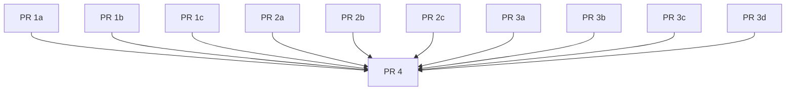

# Phase 4 / Step A — Remove Old Code: Execution Plan

## Goal

Delete `Git::Base`, `Git::Lib`, and the `from_base`/`base_object` bridge in a
single atomic breaking PR. The preceding PRs are strictly preparatory and
backward-compatible — each is releasable independently unless a dependency is
noted.

---

## Done-When Criteria

- `lib/git/lib.rb` and `lib/git/base.rb` are deleted.
- `Git::ExecutionContext::Repository` has no `base_object:` param, no
  `attr_reader :base_object`, no `.from_base` factory, and no propagation of
  `@base_object` in `dup_with`.
- `grep -rEn 'Git::Lib|Git::Base' lib/` returns only YARD history comments,
  no runtime references.
- Entry-point behavior (`Git.open`, `.clone`, `.init`, `.bare`,
  `.default_branch`, `.git_version`) still works entirely through
  `Git::Repository` / command / parser paths.
- Full CI pipeline (RSpec + Test::Unit + linters) is green after all removals.

---

## Sequencing

PRs with no incoming edges may be merged in any order or in parallel. PR 4
cannot begin until every other PR has merged.

---

## PR 1a — Rewire `Git.default_branch`

**Releasable independently. No breaking changes.**

In `lib/git.rb`, replace `Git.default_branch`'s delegation to
`Base.repository_default_branch` with the direct
`Git::Commands::LsRemote` + `Git::Parsers::LsRemote.parse_default_branch`
flow.

**Co-merge the spec that asserts the old delegation** — this rewire breaks an
existing expectation, so its update must ship in this PR to keep CI green:

- `spec/unit/git/git_remote_utilities_spec.rb` — the `.default_branch` example
  asserts `expect(Git::Base).to receive(:repository_default_branch)`. Replace
  it with a test against the direct `LsRemote` + parser path.

(The `.repository_default_branch` example in `spec/unit/git/base_spec.rb` tests
`Git::Base` directly, still passes, and is deleted by PR 3c — leave it alone
here.)

**Gate:** `Git.default_branch` works; full CI green.

---

## PR 1b — Rewire `Git.git_version`

**Releasable independently. No breaking changes.**

Move the git-version cache out of `Git::Lib` to a module-level cache on `Git`
(in `lib/git.rb`) so that `Git.git_version` no longer routes through
`Git::Lib`.

- **Relocate the cache state.** Move the cache initialization currently in
  `Git::Lib` (`@git_version_cache = {}` and `@git_version_cache_mutex =
  Mutex.new`) to module-level instance variables on `Git` in `lib/git.rb`.
  Keep the mutex — it guards parallelism on JRuby/TruffleRuby.
- **Relocate the cache API.** Add `Git.cached_git_version(binary_path,
  &block)` (memoize per binary path) and `Git.clear_git_version_cache`
  (used by tests) as class methods on `Git`. Mark both `@api private`.
- **Rewire the caller.** In `lib/git.rb`, change `Git.git_version` to call
  `Git.cached_git_version` instead of `Git::Lib.cached_git_version`
  ([lib/git.rb#L512](../lib/git.rb#L512)).
- The instance method `Git::Lib#git_version` and the class methods on
  `Git::Lib` are deleted wholesale in PR 4, so they need no rewiring here; do
  not leave a second live cache behind.

**Co-merge the specs that assert the old cache owner** — this rewire breaks
existing expectations, so their updates must ship in this PR to keep CI green:

- `spec/unit/git/git_configure_spec.rb` — replace the
  `Git::Lib.clear_git_version_cache` setup and the
  `expect(Git::Lib).to have_received(:cached_git_version)` assertion with
  `Git.clear_git_version_cache` / `Git.cached_git_version`.
- `spec/unit/git/git_version_spec.rb` — replace the
  `before { Git::Lib.clear_git_version_cache }` setup with
  `Git.clear_git_version_cache`; otherwise it clears the now-unused cache and
  the new `Git` cache leaks across examples (flaky/failing per-binary-path
  tests).

**Gate:** `Git.git_version` works and caches per binary path; full CI green.

---

## PR 1c — Remove `require 'git/base'` from Domain Object Files

**Releasable independently. No breaking changes.**

Remove `require 'git/base'` from each of these files:
`branch.rb`, `branches.rb`, `remote.rb`, `object.rb`, `log.rb`,
`stash.rb`, `stashes.rb`, `worktree.rb`, `worktrees.rb`.

This is safe because `lib/git.rb` still requires `git/base` and `git/lib`
directly, so both constants remain loaded. The only effect is that `base.rb`
is no longer force-loaded early (out of order) by the domain-object files;
load order then depends entirely on `lib/git.rb`, which the CI gate verifies.
Doing this early is beneficial — it shrinks PR 4 and exercises the
`lib/git.rb` load order under CI ahead of the breaking change.

> The removal of the `require 'git/lib'` / `require 'git/base'` lines from
> `lib/git.rb` itself is **not** done here — that is the breaking change and is
> folded into [PR 4](#pr-4--atomic-removal).

**Gate:** full CI green; no `require 'git/base'` in domain object files.

---

## PR 2a — Update Command-Layer YARD

**Releasable independently. Documentation only.**

- `lib/git/commands.rb` — update architecture diagram to reference
  `Git::Repository` instead of `Git::Base`/`Git::Lib`.
- `lib/git/command_line.rb` — update factory helper references.
- `lib/git/command_line/capturing.rb`, `streaming.rb` — update
  `@see Git::Lib#…` tags.

**Gate:** linters and YARD doc build pass; no behavior changes.

---

## PR 2b — Update Repository-Layer YARD

**Releasable independently. Documentation only.**

- `lib/git/repository/path_resolver.rb` — update `Git::Base.config.binary_path`
  reference.
- `lib/git/repository/factories.rb` — update or remove deprecation message
  strings mentioning `Git::Lib#clone`.

**Gate:** linters and YARD doc build pass; no behavior changes.

---

## PR 2c — Update Domain Object `@param base` YARD Types

**Releasable independently. Documentation only.**

In `diff.rb`, `status.rb`, `diff_path_status.rb`, update `@param base`
YARD type from `[Git::Base, Git::Repository]` → `[Git::Repository]`.

**Gate:** linters and YARD doc build pass; no behavior changes.

---

## PR 3a — Delete Confirmed-Removable Test::Unit Files

**Releasable independently. No production behavior changes.**

Delete these files, which test removed API only and have no surviving
behavioral value:

| File | Reason |
| --- | --- |
| `tests/units/test_base.rb` | Tests `Git::Base` directly |
| `tests/units/test_lib.rb` | Tests `Git::Lib` directly |
| `tests/units/test_lib_repository_default_branch.rb` | Tests `Git::Lib` default-branch path |
| `tests/units/test_lib_meets_required_version.rb` | Tests `Git::Lib` version deprecation shim |
| `tests/units/test_git_base_root_of_worktree.rb` | Tests `Git::Base.root_of_worktree` |

**Gate:** full CI green.

---

## PR 3b — Patch Incidental Test::Unit References

**Releasable independently. No production behavior changes.**

Audit all remaining `tests/units/` files for incidental `Git::Base`/`Git::Lib`
references and patch them to use `Git::Repository` / `Git.open` entry points.
Port any still-valuable behavioral coverage to RSpec before removing a file.

**Gate:** full CI green; no `tests/units/` file references `Git::Base`
or `Git::Lib` at runtime.

---

## PR 3c — Delete RSpec Specs Testing Only Removed API

**Releasable independently. No production behavior changes.**

| File | Reason |
| --- | --- |
| `spec/unit/git/base_spec.rb` | Tests `Git::Base` |
| `spec/unit/git/lib_command_spec.rb` | Tests `Git::Lib` |
| `spec/unit/git/lib_version_deprecations_spec.rb` | Tests `Git::Lib` version deprecation shims |
| `spec/unit/git/lib/git_version_spec.rb` | Tests `Git::Lib` version cache |
| `spec/integration/git/base/` (all files) | Tests `Git::Base` delegators |

**Gate:** full CI green.

---

## PR 3d — Migrate RSpec Bridge and `from_base` References

**Releasable independently. No production behavior changes.**

- `spec/integration/git/repository/*_spec.rb` — replace `from_base` setup
  with `Git::Repository.open(…)` or `ExecutionContext::Repository.from_hash`.
- `spec/unit/git/execution_context/repository_spec.rb` — remove `from_base`
  and `base_object` test contexts; keep all other execution context coverage.
- `spec/unit/git/repository/remote_operations_spec.rb` — remove the
  `base_object:` instance double.
- `spec/integration/git/branches_spec.rb`, `worktrees_spec.rb` — two changes
  each:
  1. Remove the "initialized via `Git::Base`" context block entirely.
  2. In the surviving "initialized via `Git::Repository`" context, replace the
     `let(:execution_context) { Git::ExecutionContext::Repository.from_base(repo) }`
     setup with `ExecutionContext::Repository.from_hash` or
     `Git::Repository.open`.
- `spec/integration/git/commands/init_spec.rb`, `clone_spec.rb` — replace
  `Git::Lib.new(nil)` with a proper `ExecutionContext::Global` or
  `ExecutionContext::Repository`.

**Gate:** full CI green; no spec references `from_base` or `base_object`.

---

## PR 4 — Atomic Removal

**Breaking change. Targets `main` (v5.x only). Cannot be further decomposed.**

With all callers rewired (1a–1c), docs updated (2a–2c), and tests migrated
(3a–3d), this PR is the single deletion event. Unloading `Git::Base` /
`Git::Lib` is itself the breaking change, so it must happen here — after every
test that references those constants (3a–3d) has been migrated.

**Remove the legacy `require` lines from `lib/git.rb`**

File: `lib/git.rb`
- Remove `require 'git/lib'`.
- Remove `require 'git/base'`.

After this, `Git::Base` and `Git::Lib` are no longer loaded at runtime.

**Remove the `ExecutionContext::Repository` bridge**

File: `lib/git/execution_context/repository.rb`
- Remove `base_object:` keyword and `@base_object = base_object` from `#initialize`.
- Remove `attr_reader :base_object`.
- Remove `base_object: @base_object` from `dup_with`.
- Delete the `.from_base` class method.
- Update `#initialize` YARD docs to drop the `base_object` param entry.

**Delete legacy class files**
- Delete `lib/git/lib.rb`.
- Delete `lib/git/base.rb`.

---

## Done-Gates (All Must Pass Before PR 4 Merges)

| Gate | How to verify |
| --- | --- |
| `lib/git/lib.rb` deleted | `ls lib/git/lib.rb` → not found |
| `lib/git/base.rb` deleted | `ls lib/git/base.rb` → not found |
| No `base_object` / `from_base` in `ExecutionContext::Repository` | Read file |
| No `require 'git/lib'` / `require 'git/base'` anywhere in `lib/` | `grep -rEn "require 'git/(lib|base)'" lib/` returns nothing |
| No runtime `Git::Lib` / `Git::Base` references in `lib/` | `grep -rEn 'Git::Lib|Git::Base' lib/` returns no code lines |
| `Git.open`, `.clone`, `.init`, `.bare` return `Git::Repository` and work | Existing RSpec integration suite |
| `Git.default_branch`, `Git.git_version` work without `Git::Lib` | Existing unit + integration specs |
| Full RSpec suite green | `bundle exec rake spec:parallel` |
| Full Test::Unit suite green | `bundle exec rake test:parallel` |
| Linters pass | `bundle exec rake rubocop yard build` |
