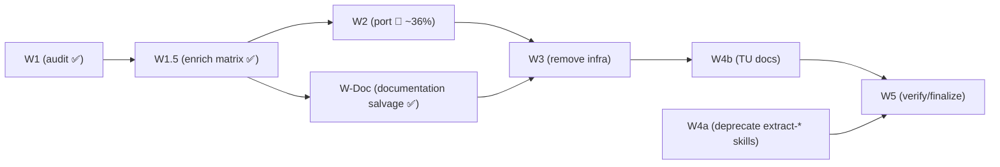

# Phase 4 / Step B — Finalize Test Suite: Execution Plan

> **🚧 Status: In progress.** W1 (the legacy-test audit) is **complete and verified**;
> its results are captured below and in the companion data file
> [`phase-4-step-b-test-audit.tsv`](phase-4-step-b-test-audit.tsv). **W1.5 (matrix
> enrichment) is complete and signed off** — the TSV now carries `disposition`,
> `target_spec`, and `port_status`; results are summarized in
> [W1.5 enrichment results](#w15-enrichment-results-for-sign-off). The one-time human
> sign-off that gates W2 has been **given**. Execution decisions are
> **resolved** (see [Resolved Decisions](#resolved-decisions)). **W-Doc (documentation
> salvage) is complete and merged** — the 4 `test_archive.rb` content cases were salvaged
> as YARD examples on `Git::Object#archive` / `Git::Branch#archive`. **W2 (port) is in
> progress:** of **159 PORT rows** (down from the planned 192 after dedup), **57 are
> complete and merged (~36%)** and **102 remain** — see
> [W2 progress](#w2-progress). **W3, W4a, W4b, and W5** (remove infrastructure, deprecate
> `extract-*` skills, update Test::Unit docs, finalize) are not yet started.

## Goal

Make RSpec the **sole** test framework for the gem. Port every still-valuable
Test::Unit test in `tests/units/` to RSpec, then remove the legacy Test::Unit
suite, its tooling, its gem dependency, and all documentation references to it.

Source of truth in the implementation tracker:
[`3_architecture_implementation.md`](3_architecture_implementation.md) →
"Phase 4 → Step B — Finalize test suite".

This is the second half of Phase 4. [Step A](Phase%204%20-%20Step%20A.md) removed
the old `Git::Base` / `Git::Lib` code; Step B removes the old test framework that
those classes were originally written against.

---

## Done-When Criteria

- The `tests/` directory is removed.
- `test-unit` is no longer a dependency in `git.gemspec`.
- RSpec is the sole test framework: no `test` / `test-all` Rake tasks, and
  `rake default` is green without a Test::Unit step.
- No surviving runtime/tooling references to `bin/test*`, `tests/units`, or
  `Test::Unit`. Historical/reference mentions are allowed only in `CHANGELOG.md`,
  redesign historical docs, and `.github/skills-deprecated/`.
- All **unique** behavioral coverage from `tests/units/` now lives in `spec/`,
  placed in the correct layer (logic in `spec/unit/`, real-git wiring in
  `spec/integration/`), except rows explicitly classified as `intentional_drop`,
  `document`, or `obsolete` in the enriched audit matrix (`document` rows are preserved
  as documentation rather than specs).
- Full quality gate green: `bundle exec rake default:parallel`
  (RSpec unit + integration + RuboCop + YARD + build).

---

## Testing Philosophy (governs the port)

Per the `rspec-unit-testing-standards` skill and the project's layering:

- **`spec/unit/`** — pure logic with **no external dependencies** (no real git,
  no subprocesses). Externals are stubbed. Must achieve **100% branch coverage**.
  This is where option/argument building, output parsing, value-object behavior,
  error mapping, and deprecation-warning emission belong.
- **`spec/integration/`** — **minimal** checks that the layers are wired together
  correctly against real git. These exist only to prove the facade → command →
  subprocess path is connected; they do not re-test logic already covered by unit
  specs, and they do not recreate the legacy exhaustive matrices.

The W1 audit assigns every PORT case a `target_layer` according to this philosophy,
so the bulk of legacy "integration-style" assertions collapse into unit specs, with
only a thin residue remaining as true integration checks.

---

## W1 — Audit & Categorize (✅ complete, verified)

Every legacy test was classified at **per-test-method granularity**, not per file: a
file-level verdict would hide the common case where a file mixes already-covered
methods with one or two methods carrying unique coverage — and a file is only safe to
delete if *every* method in it is covered.

All **484 individual test cases** (307 `def test_*` methods + 177 declarative
`test '...' do` macros, across 70 files) received their own verdict. The full matrix
is persisted as [`phase-4-step-b-test-audit.tsv`](phase-4-step-b-test-audit.tsv).
The **W1 baseline** carried 10 columns (`file, line, style, test_name,
initial_verdict, final_verdict, target_layer, spec_coverage, verify_notes, behavior`);
**W1.5 enrichment appended three more** (`disposition, target_spec, port_status`), so the
file on disk is now the enriched **13-column** version — see
[W1.5 enrichment results](#w15-enrichment-results-for-sign-off).

The audit ran in two passes:

1. **First pass** — each case classified REDUNDANT (covered by existing specs, or
   intentionally dropped/obsolete) or PORT (unique coverage). When a single existing spec
   cleanly covers a REDUNDANT case, that spec is cited in `spec_coverage`; when coverage
   is **diffuse across multiple specs**, or the case is an **intentional drop / obsolete**,
   `spec_coverage` is `none` and the citation or rationale lives in `verify_notes`. W1.5's
   `disposition` column formalizes the covered / intentional_drop / obsolete distinction.
2. **Layer-aware verification pass** — re-checked every verdict against the testing
   philosophy above, assigning each PORT a `target_layer` (`unit` vs `integration`)
   and correcting verdicts that the first pass got wrong.

### Verified totals

These are the **W1** outputs (first pass + verification). W1.5 enrichment later reconciled
them to **292 REDUNDANT / 192 PORT** (4 archive cases flipped PORT → `document`) — see
[W1.5 enrichment results](#w15-enrichment-results-for-sign-off).

| Verdict | Count | Meaning |
| --- | ---: | --- |
| **REDUNDANT** | **288** | Already covered, intentionally dropped, or obsolete → classify with `disposition` before deleting |
| **PORT → unit** | **158** | Unique logic → add a mocked `spec/unit/` example |
| **PORT → integration** | **38** | Genuinely needs real git/process → add a *minimal* `spec/integration/` example |
| **PORT (total)** | **196** | |

### Verification corrected 56 verdicts vs. the first pass

- **49 PORT → REDUNDANT** — the first pass over-counted; the logic is already
  unit-covered by command/parser/value-object specs, so no heavy end-to-end port is
  warranted.
- **7 REDUNDANT → PORT** — real coverage gaps the first pass would have **silently
  deleted**:
  - `test_fsck_result.rb:6,36,49` — `Git::FsckResult#initialize` defaults, `#empty?`,
    and `#any_issues?` have no direct unit spec.
  - `test_log.rb:153`, `test_log_execute.rb:134` — `Git::Log#merges` lacks unit
    coverage.
  - `test_status.rb:155,172` — `Git::Status#untracked` collection logic is only
    touched by integration, with no unit coverage.

  All seven target the **unit** layer and should be prioritized in W2 because they
  close genuine holes.

### Files deletable outright

**20 files are 100% REDUNDANT** — every case in them is already covered, so they can
be deleted with no porting:

```
test_checkout_index.rb              test_ignored_files_with_escaped_path.rb
test_command_line_result.rb         test_index_ops.rb
test_command_raises_on_failure.rb   test_ls_files_with_escaped_path.rb
test_describe.rb                    test_ls_tree.rb
test_each_conflict.rb               test_merge.rb
test_git_binary_version.rb          test_merge_base.rb
test_git_clone.rb                   test_pull.rb
test_git_default_branch.rb          test_repack.rb
test_git_path.rb                    test_show.rb
                                    test_tags.rb
                                    test_tree_ops.rb
```

### Per-file verdict roll-up

Counts are the **post-W1.5 enriched** `REDUNDANT / PORT-unit / PORT-integration / total`.
Use the TSV for the exact line numbers, behaviors, and verification notes behind each
count.

| File | Red | Unit | Integ | Total |
| --- | ---: | ---: | ---: | ---: |
| test_archive.rb | 7 | 1 | 0 | 8 |
| test_bare.rb | 0 | 0 | 1 | 1 |
| test_branch.rb | 18 | 0 | 2 | 20 |
| test_checkout.rb | 8 | 1 | 1 | 10 |
| test_checkout_index.rb | 8 | 0 | 0 | 8 |
| test_command_line.rb | 8 | 4 | 5 | 17 |
| test_command_line_env_overrides.rb | 0 | 14 | 0 | 14 |
| test_command_line_error.rb | 0 | 2 | 0 | 2 |
| test_command_line_result.rb | 1 | 0 | 0 | 1 |
| test_command_raises_on_failure.rb | 4 | 0 | 0 | 4 |
| test_commit_with_empty_message.rb | 0 | 0 | 2 | 2 |
| test_commit_with_gpg.rb | 3 | 1 | 0 | 4 |
| test_config.rb | 4 | 0 | 1 | 5 |
| test_deprecations.rb | 9 | 10 | 0 | 19 |
| test_describe.rb | 2 | 0 | 0 | 2 |
| test_diff.rb | 6 | 11 | 1 | 18 |
| test_diff_non_default_encoding.rb | 0 | 0 | 2 | 2 |
| test_diff_path_status.rb | 7 | 1 | 0 | 8 |
| test_diff_stats.rb | 6 | 1 | 0 | 7 |
| test_diff_with_escaped_path.rb | 0 | 1 | 0 | 1 |
| test_each_conflict.rb | 3 | 0 | 0 | 3 |
| test_escaped_path.rb | 2 | 3 | 0 | 5 |
| test_failed_error.rb | 0 | 2 | 0 | 2 |
| test_fsck.rb | 27 | 3 | 0 | 30 |
| test_fsck_object.rb | 1 | 3 | 0 | 4 |
| test_fsck_result.rb | 0 | 10 | 0 | 10 |
| test_git_alt_uri.rb | 0 | 3 | 0 | 3 |
| test_git_binary_version.rb | 3 | 0 | 0 | 3 |
| test_git_clone.rb | 7 | 0 | 0 | 7 |
| test_git_default_branch.rb | 2 | 0 | 0 | 2 |
| test_git_dir.rb | 1 | 1 | 1 | 3 |
| test_git_path.rb | 5 | 0 | 0 | 5 |
| test_ignored_files_with_escaped_path.rb | 1 | 0 | 0 | 1 |
| test_index_ops.rb | 7 | 0 | 0 | 7 |
| test_init.rb | 16 | 1 | 0 | 17 |
| test_log.rb | 5 | 14 | 0 | 19 |
| test_log_execute.rb | 5 | 16 | 0 | 21 |
| test_logger.rb | 0 | 2 | 0 | 2 |
| test_ls_files_with_escaped_path.rb | 1 | 0 | 0 | 1 |
| test_ls_tree.rb | 1 | 0 | 0 | 1 |
| test_merge.rb | 5 | 0 | 0 | 5 |
| test_merge_base.rb | 6 | 0 | 0 | 6 |
| test_object.rb | 10 | 1 | 0 | 11 |
| test_object_new.rb | 1 | 2 | 0 | 3 |
| test_per_instance_config.rb | 2 | 1 | 0 | 3 |
| test_pull.rb | 6 | 0 | 0 | 6 |
| test_push.rb | 18 | 0 | 2 | 20 |
| test_remotes.rb | 21 | 1 | 0 | 22 |
| test_repack.rb | 1 | 0 | 0 | 1 |
| test_rm.rb | 8 | 0 | 1 | 9 |
| test_set_index.rb | 3 | 1 | 1 | 5 |
| test_set_working.rb | 3 | 1 | 0 | 4 |
| test_show.rb | 1 | 0 | 0 | 1 |
| test_signaled_error.rb | 0 | 2 | 0 | 2 |
| test_signed_commits.rb | 0 | 0 | 1 | 1 |
| test_stash_list.rb | 6 | 0 | 1 | 7 |
| test_stash_save.rb | 2 | 0 | 1 | 3 |
| test_stashes.rb | 4 | 0 | 1 | 5 |
| test_status.rb | 2 | 10 | 2 | 14 |
| test_status_object.rb | 0 | 12 | 0 | 12 |
| test_status_object_empty_repo.rb | 0 | 12 | 0 | 12 |
| test_submodule.rb | 0 | 0 | 2 | 2 |
| test_tags.rb | 2 | 0 | 0 | 2 |
| test_thread_safety.rb | 0 | 0 | 1 | 1 |
| test_timeout_error.rb | 0 | 2 | 0 | 2 |
| test_tree_ops.rb | 8 | 0 | 0 | 8 |
| test_url_clone_to.rb | 0 | 4 | 0 | 4 |
| test_url_parse.rb | 0 | 3 | 0 | 3 |
| test_windows_cmd_escaping.rb | 0 | 1 | 0 | 1 |
| test_worktree.rb | 5 | 0 | 5 | 10 |
| **Total** | **292** | **158** | **34** | **484** |

---

## Current State (audit findings)

- **70** Test::Unit files remain in `tests/units/` (~8,300 lines total).
- `spec/` already has ~361 spec files; earlier Step A PRs (3a/3b) already deleted the
  `Git::Base` / `Git::Lib`-only Test::Unit files and patched incidental references.
- **RSpec does NOT depend on `tests/files/` fixtures** — no spec references those
  paths (only stale *comments* point at `tests/units/...`). `tests/files/` can be
  deleted once porting is done.
- **5 spec files explicitly defer integration coverage to Test::Unit** (high-priority
  porting targets; their comments say "full integration is covered by
  tests/units/..."):
  - `spec/unit/git/object_spec.rb` → `tests/units/test_object.rb`
  - `spec/unit/git/stash_spec.rb`, `spec/unit/git/stashes_spec.rb` → `test_stashes.rb`
  - `spec/unit/git/repository/diffing_spec.rb` +
    `spec/integration/.../diffing_spec.rb` → `test_diff_path_status.rb`,
    `test_diff_stats.rb`
- `bin/command_line_test` is a fixture script used **only** by
  `tests/units/test_command_line.rb`; its fate is decided when that test is ported.

### Infrastructure / tooling inventory to remove or update

| Item | Action |
| --- | --- |
| `tests/units/` (70 files) | Port unique coverage, pass pre-delete verification, then delete |
| `tests/files/` (fixtures) | Delete (RSpec doesn't use them — verify per-fixture) |
| `tests/Dockerfile`, `tests/docker-compose.yml` | Move to `docker/test/Dockerfile` and `docker/test/docker-compose.yml`; repoint at RSpec |
| `bin/test`, `bin/test-verbose` | Delete |
| `bin/test-in-docker` | Rename to `bin/spec-in-docker`; repoint at RSpec entrypoint |
| `bin/command_line_test` | Relocate into the RSpec support tree (kept as a real shell-out fixture) |
| `tasks/test.rake` (`test`, `test:parallel`) | Delete |
| `Rakefile` (`test-all`, `test-all:parallel`, default task lists) | Update to drop `test` |
| `git.gemspec` (`test-unit ~> 3.7`) | Remove |
| `.github/copilot-instructions.md` (commands table, suite description) | Update |
| `CONTRIBUTING.md` (Test::Unit sections, `bin/test` usage) | Update |
| Skills referencing Test::Unit / `bin/test` / `tests/units` | Update |
| `.github/workflows/*` | Verify `rake default` still green; no direct `bin/test` calls (currently none) |

Skills with Test::Unit references to reconcile: `extract-command-from-lib`,
`extract-facade-from-base-lib`, `project-context`, `test-debugging`,
`development-workflow`, `ci-cd-troubleshooting`, `command-test-conventions`.

---

## Workstreams & Sequencing



- **W1.5 → W2** is a hard one-time gate: the human signs off the enriched matrix once
  before any porting starts.
- **W2 → W3 → W4b → W5** run in order (W4b's doc claims only become true after W3
  deletes `tests/`).
- **W-Doc** (documentation salvage of `disposition = document` rows) is gated by the same
  W1.5 sign-off and may run in parallel with W2, but **must merge before W3** — W3 deletes
  `tests/units/`, so the source examples must already be relocated to docs.
- **W4a** (retiring the finished `extract-*` skills) is independent of W2/W3 and may
  land at any time; W5 waits on W4a as well so the final verification sees the retired
  skills.

### W1.5 — Enrich audit matrix for execution (before W2)

Before any W2 porting starts, extend the audit matrix so an agent can execute without
guessing and the human reviewer can validate each case quickly.

- Add a **`disposition`** column for non-ported rows. Keep `final_verdict` stable unless
  the W1.5 sign-off explicitly approves a verdict flip (as it did for the 4 archive
  `document` rows), and distinguish why a REDUNDANT row is safe to delete:
  - `covered` — behavior is already covered by an existing cited spec.
  - `intentional_drop` — behavior is deliberately not ported because it is flaky,
    obsolete, an exhaustive real-git matrix, or otherwise outside the RSpec testing
    philosophy, **and** the example carries no residual user value.
  - `document` — the case is **not** kept as a spec, but its *usage example* has
    user-facing value, so it is converted into documentation (a YARD `@example` or a
    README usage section) instead of being discarded. This is an `intentional_drop` whose
    "how" is worth preserving; W-Doc relocates it.
  - `obsolete` — behavior no longer applies after the architectural redesign.
  PORT rows may use `port` or leave `disposition` blank.

  **Pass-through vs. parse rule (when content checks become `intentional_drop` /
  `document`).** A legacy test that asserts on the *content* git produces is testing
  **git**, not the gem, when the gem is a pure **pass-through** — it forwards options as
  CLI flags and hands back git's bytes without inspecting them (e.g. `archive` writes a
  tar/tgz the gem never parses). Once that gem's option→flag forwarding is unit-covered
  and its byte-capture-to-file is integration-covered, the residual content assertion adds
  no gem coverage → classify it `intentional_drop`, or `document` when the example teaches
  the user something. When the gem instead **parses or transforms** git output into Ruby
  objects (diff, status, log, branch/tag metadata, encoding, fsck), the content assertion
  exercises the gem's parser → keep it as **PORT**. Flag any PORT→REDUNDANT flip this rule
  produces for the one-time enriched-matrix sign-off.
- Add a **`target_spec`** column naming the **destination** for every actionable row. For
  PORT rows it is a spec path — prefer extending an existing spec file that mirrors the
  source under test; only create a new spec file when no suitable target exists. For
  `document` rows it is the **doc destination** instead, written as `yard:<Class>#<method>`
  (add/extend a YARD `@example`) or `readme:<section>` (a README usage section). The
  `disposition` value disambiguates how to read the column, so no separate doc column is
  needed. This is required before W2 so placement is deterministic and reviewable.
- **Split rows by destination, not by individual example.** The unit of work is a
  **destination** — one `(target_layer, target_spec)` pair — and a single row may produce
  **multiple `it` examples** in that one spec (porting a legacy test is rarely 1:1 with a
  single example; those examples are reviewed, committed, and tracked together as one row).
  Split a legacy test into multiple rows **only when it maps to more than one
  destination**:
  - **Multiple specs, same layer** (e.g. its examples belong in two different `spec/unit/`
    files) → one row per `target_spec`.
  - **Multiple layers** — a single legacy test can exercise both logic (→ a mocked
    `spec/unit/` example) and real-git wiring (→ a minimal `spec/integration/` example) →
    one row per layer. The layer-aware W1 pass already assigned PORT to the one layer with
    a genuine gap and marked the other layer's behavior as already-covered, so the 196
    starting rows each carry a single `target_layer`; this is the escape hatch if
    enrichment or W2 finds a case that truly needs both.

  To split, **add one matrix row per `(target_layer, target_spec)`** — duplicate `file`,
  `line`, and `test_name`, give each row its own `target_layer` / `target_spec` /
  `port_status`, and cross-reference the siblings in `verify_notes`. This preserves the
  core invariant that **one row = one destination (`target_layer` + `target_spec`) = one
  review gate = one commit = one `port_status`** (the mirror image of the dedup/`grouped`
  rule, which merges rows). A single row never spans more than one destination.
- Add a **`port_status`** column — the single, authoritative progress tracker for every
  actionable row (PORT rows in W2, and `document` rows in W-Doc). It lives **only** in
  this TSV; the prose plans (this document and the session plan) describe the protocol but
  never maintain their own per-row status, so there is exactly one source of truth.
  Initialize it during W1.5:
  - PORT and `document` rows → `pending`.
  - `covered` / `intentional_drop` / `obsolete` rows → leave blank (their fate is governed
    by `disposition`; no further action follows).
  See [W2](#w2--port-unique-coverage-to-rspec-batched-prs) and
  [W-Doc](#w-doc--documentation-salvage-disposition--document) for exactly when the agent
  advances each value.
- Define W2 PR batches from `target_spec` / component groupings. A batch must contain
  **no more than 10 matrix rows** (the cap counts *work items / examples*, i.e. enriched
  matrix rows after any splits and approved merges — not original legacy tests). If a
  target spec has more than 10 rows, split it into multiple PRs by method/context so each
  review remains small.
- For integration rows, pre-identify likely deduplication groups where multiple legacy
  rows can be satisfied by one minimal wiring example. These groups are proposals only;
  W2 still requires explicit reviewer approval before grouping rows.

**Done-when (hard gate before any W2 porting begins):**

- Every PORT row has a non-empty `target_spec`, and any case needing more than one layer
  has been split into one row per `(target_layer, target_spec)`.
- Every non-PORT row has a `disposition` (`covered`, `intentional_drop`, `document`, or
  `obsolete`); every `document` row has a `target_spec` doc destination.
- Every PORT row and every `document` row has `port_status = pending`; proposed dedup
  groups are recorded.
- The proposed W2 batches (≤ 10 matrix rows each) are listed, and the final PORT
  work-item count (after splits/merges) is reconciled in the TSV — the 196 figure is the
  W1 starting count and may shift during enrichment.
- **The human reviewer approves the enrichment once, before W2 starts — reviewing a
  generated review summary, not the raw 484-row TSV.** A line-by-line read of the matrix
  is not an effective review, so the gate artifact is a concise summary
  ([W1.5 enrichment results](#w15-enrichment-results-for-sign-off)) that surfaces only the
  decisions that carry risk: every PORT→REDUNDANT verdict flip, every `intentional_drop`
  and `obsolete` row, every `document` row and its doc target, and every **new** spec file
  the ports will create. The bulk `covered` and ordinary `port` rows are summarized in
  aggregate, not individually. This front-loads the placement/disposition decisions into a
  single review so they are not re-litigated at the per-case gates. W2 MUST NOT begin
  until this approval is given.

#### W1.5 enrichment results (for sign-off)

The full pass is complete; the enriched TSV has 13 columns (`disposition`, `target_spec`,
`port_status` appended). Reconciled totals:

| Metric | W1 start | After W1.5 |
| --- | ---: | ---: |
| PORT | 196 | **192** |
| REDUNDANT | 288 | **292** |
| — of which `covered` | — | 287 |
| — of which `document` | — | 4 |
| — of which `intentional_drop` | — | 1 |
| Rows with `port_status = pending` (PORT + document) | — | 196 |

**Verdict flips to review (the risk surface):**

- **4 PORT → REDUNDANT/`document`** — all `test_archive.rb` content-validation cases, by
  the pass-through rule (the gem forwards `--format`/`--prefix` and hands back git's bytes
  it never inspects; forwarding is unit-covered, byte-capture is integration-covered).
  Salvaged as YARD examples: L41/62/80 → `yard:Git::Object#archive`, L93 →
  `yard:Git::Branch#archive`.
- **1 `intentional_drop`** — `test_git_clone.rb:15` (flaky real-clone global-timeout test;
  timeout plumbing is unit-covered by the ExecutionContext/CommandLine specs).
- **0 `obsolete`.**

**New spec files the ports will create** (no existing mirror; all error/cross-cutting):
`spec/unit/git/command_line_error_spec.rb` (2 rows),
`spec/unit/git/escaped_path_spec.rb` (3), `spec/unit/git/failed_error_spec.rb` (2),
`spec/unit/git/signaled_error_spec.rb` (2), `spec/unit/git/timeout_error_spec.rb` (2),
`spec/integration/git/thread_safety_spec.rb` (1). All other 180 PORT rows extend an
existing spec.

**Proposed dedup group (needs reviewer approval in W2):** `test_log.rb` and
`test_log_execute.rb` carry the same 14 query-builder test names, both targeting
`spec/unit/git/log_spec.rb`; they are near-duplicate sources that likely collapse to one
set of examples (`test_log_execute.rb` adds 2 unique `#execute` snapshot/empty-repo cases).
Recorded as a proposal; rows are not pre-merged.

**Initial W2 batch plan** (all row counts are enriched matrix rows before deduplication
is approved by a reviewer; each batch stays at or below the 10-row cap):

| Batch | Scope | Rows | Status |
| --- | --- | ---: | --- |
| U1 | CommandLine base/capturing/error rows | 9 | ✅ merged |
| U2 | Git error objects (`FailedError`, `SignaledError`, `TimeoutError`) | 6 | ✅ merged |
| U3 | `Diff` unit rows, first chunk | 10 | ✅ merged |
| U4 | `Diff` remainder plus path/status/stats/escaped-path rows | 7 | ✅ merged |
| U5 | `ExecutionContext` environment override rows, first chunk | 7 | ✅ merged |
| U6 | `ExecutionContext` remainder plus config/init/path-resolver rows | 10 | ✅ merged |
| U7 | Git remote URL utilities | 10 | ✅ merged |
| U8 | `Log` deprecation rows plus first `test_log.rb` chunk | 10 | ✅ merged |
| U9 | `Log` remaining `test_log.rb` rows | 10 | ✅ merged |
| U10 | `Log#execute` snapshot/empty-repo rows (deduped against `test_log.rb`) | 10 | ✅ merged |
| U11 | `Log#execute` remainder | 6 | ➖ folded into U10 (dedup) |
| U12 | Object/repository/remote miscellaneous rows | 10 | ⬜ pending |
| U13 | Repository staging/committing rows | 3 | ⬜ pending |
| U14 | `Fsck` parser rows, first chunk | 10 | ⬜ pending |
| U15 | `Fsck` parser remainder | 6 | ⬜ pending |
| U16 | `Status` facade rows plus ignore-case rows | 10 | ⬜ pending |
| U17 | `StatusFile` rows, first chunk | 10 | ⬜ pending |
| U18 | `StatusFile` remainder plus empty-repo first chunk | 10 | ⬜ pending |
| U19 | `StatusFile` empty-repo remainder | 4 | ⬜ pending |
| I1 | Command-line subprocess integration rows | 5 | ⬜ pending |
| I2 | Branch/checkout integration rows | 3 | ⬜ pending |
| I3 | Commit/config/remote integration rows | 7 | ⬜ pending |
| I4 | Diff/status/staging integration rows | 7 | ⬜ pending |
| I5 | Object/stash/submodule integration rows | 6 | ⬜ pending |
| I6 | Worktree/thread-safety integration rows | 6 | ⬜ pending |

### W2 — Port unique coverage to RSpec (batched PRs)

#### W2 progress

Snapshot from the authoritative `port_status` column in
[`phase-4-step-b-test-audit.tsv`](phase-4-step-b-test-audit.tsv):

| Metric | Rows |
| --- | ---: |
| **Total PORT rows** (current, after dedups) | **159** |
| — unit (`target_layer = unit`) | 123 |
| — integration (`target_layer = integration`) | 36 |
| **Complete and merged** (`ported` + `reviewed`) | **57** (55 unit + 2 integration) |
| **Remaining** (`pending`) | **102** (68 unit + 34 integration) |
| **Percent complete** | **~36%** (57 / 159) |

Batches **U1–U10** are merged; **U11 folded into U10** during the `test_log.rb` /
`test_log_execute.rb` dedup. The PORT total dropped from the W1.5 figure of **192** to
**159** because ~33 rows were reclassified PORT → REDUNDANT (`covered`) as in-flight
dedups confirmed the behavior was already covered by an existing or sibling-batch spec.
Remaining work is batches **U12–U19** (unit) and **I1–I6** (integration).

Drive W2 entirely from the enriched audit matrix; port only the **PORT** cases (159 after
dedup; 192 at W1.5 sign-off), honoring each row's `target_layer` and `target_spec`.

**Execution protocol — one test at a time, with review gates.** Each W2 **batch** (not
all of W2) is delivered as **one PR** with no more than 10 matrix rows; W3–W5 follow
their own workstream-level PR rules below. The per-case work happens on the topic branch
*before* that batch PR is opened: the agent advances one discrete item at a time and
**stops for human review** after each, only continuing on an explicit go-ahead. The
per-step review gates and the single-batch-PR delivery are not in tension — the branch
accumulates locally-reviewed commits, and the PR is opened **once, at the end of the
batch**, as a single ready unit (see [Branch & PR lifecycle](#branch--pr-lifecycle)
below). For W2, the discrete item is **exactly one legacy audit row**. Multiple audit
rows may be grouped only when the agent first proposes the grouping and the reviewer
explicitly approves it. Concretely, per case:

1. Announce the case (file:line, behavior, `target_layer`, `target_spec`) about to be
   ported.
2. Write/extend the RSpec example(s) for that destination row (a row may produce more
   than one `it`; plus any minimal support).
   - **2a. Self-check against `rspec-unit-testing-standards` before reporting green.**
     Confirm the example conforms to the skill: for unit rows — externals stubbed, **no
     real git / no subprocesses**, deterministic (no time/network/filesystem ordering
     dependencies), one behavior per example, project naming/structure conventions, and
     100% branch coverage for the touched logic; for integration rows — minimal real-git
     wiring only, no exhaustive matrices. RuboCop does **not** enforce most of these, so
     this is a manual conformance step, not a lint pass.
3. Run just that spec (and coverage for the touched file/class) to show it green, then
   set `port_status = ported` for the row in the audit TSV.
4. **Pause** and present the handoff below; wait for "continue" before the next case.
   When the reviewer approves the case, set `port_status = reviewed`.

**`port_status` state machine (agent updates the audit TSV — the only tracker):**

- `pending` → `ported` — after step 3 (example written and green locally).
- `ported` → `reviewed` — after the reviewer approves the case at its gate (step 4).
- `reviewed` → `merged` — after the PR containing the case merges.
- any → `grouped` — when a row is folded into another row's example under an
  approved dedup group; record the surviving row's `file:line` in `verify_notes` so the
  fold-in is traceable. A `grouped` row needs no example of its own.

Update `port_status` **only** in the audit TSV. Do not restate per-row status in this
document or the session plan — they describe the protocol, the TSV holds the state.

#### Branch & PR lifecycle

The per-case "review" gates above are **local, in-session** reviews on the topic branch;
they are distinct from the eventual GitHub PR review. The git mechanics for each batch:

1. **Before the first case:** confirm the working branch is a topic branch, not `main`
   or `4.x` (`git branch --show-current`); if not, `git switch -c <type>/<short-desc>`
   first. One topic branch per batch.
2. **Per approved case:** after the reviewer says "continue" and `port_status` is set to
   `reviewed`, commit that case as **one Conventional-Commits commit** (e.g.
   `test: port <area> <behavior> to RSpec`). One commit per reviewed case keeps the
   branch history mirroring the review loop and keeps work safe.
3. **At end of batch (all cases `reviewed`):** run the PR-exit gate (cumulative 100%
   branch coverage + RuboCop + specs green), then open **one** ready PR for the batch.
   Do **not** open the PR mid-batch.
4. **After merge:** set `port_status = merged` for every row in the batch.

W3–W5 follow the same branch-then-one-PR pattern (W3 additionally ships its steps as a
single atomic PR — see W3).

Per-case handoff template:

```
Legacy case: <file:line> <test_name>
Behavior: <behavior>
Target layer: <unit|integration>
Target spec: <path>
Examples changed: <brief list>
Standards: conforms to `rspec-unit-testing-standards` — <rules self-checked: stubbed
  externals / no real git / deterministic / one-behavior-per-example / naming &
  structure / coverage>
Commands run: <commands + results>
Coverage: <line/branch result for touched class/file>
Port status: <pending|ported|reviewed|merged|grouped>
Diff summary: <files changed + intent>
Status: waiting for review; say "continue" to proceed
```

This keeps each review small and lets the reviewer catch convention drift early.

- **`target_layer = unit`** (123 now; 158 at W1.5 sign-off) → write/extend `spec/unit/`
  specs with stubbed externals (no real git), preserving 100% branch coverage. This is the
  bulk of the work and where logic coverage belongs.
- **`target_layer = integration`** (36 now; 34 at W1.5 sign-off) → add only **minimal**
  `spec/integration/` examples that prove the facade ↔ command wiring against real git; do
  not recreate the legacy exhaustive matrices.
- **Integration deduplication rule:** before adding an integration example, check
  whether a minimal wiring example for the same path already exists or is proposed in
  the current batch. Folding multiple audit rows into one integration example is allowed
  only after the agent proposes the grouping and the reviewer explicitly approves it.
- Follow `facade-test-conventions` / `command-test-conventions` /
  `rspec-unit-testing-standards`. Query the matrix per file/area for exact line
  numbers, behaviors, `verify_notes`, `target_spec`, and `disposition`.
- Remove the now-satisfied "covered by tests/units/..." deferral comments from the
  5 spec files as their coverage lands.
- Special handling:
  - `test_command_line.rb` lines 69, 126, 186, 212, 269 + `test_thread_safety.rb:22`
    are the 6 integration cases that exercise real subprocess timeout/signal/IO via
    `bin/command_line_test`. **Decision (Q4):** keep a real shell-out and **relocate**
    the fixture into the RSpec support tree (see W3) — do *not* collapse it into an
    inline `ruby -e` one-liner.
  - The 7 coverage-gap cases (FsckResult helpers, `Git::Log#merges`,
    `Git::Status#untracked`) are unit ports that close real gaps — prioritize them.
  - encoding / escaped-path tests — port fixtures or construct repos in-spec.
- Coverage expectations — distinguish the two checkpoints so the agent does not chase
  100% on a single case or get blocked mid-batch:
  - **Per case (informational):** report the line/branch coverage for each touched
    class/file in the handoff. A single ported case is not expected to reach 100% on
    its own; the number is feedback, not a gate.
  - **PR exit (the gate):** the batch's cumulative coverage must be 100% branch
    coverage before the PR is opened, with RuboCop clean and all touched specs green.
    Because SimpleCov does not yet strictly fail on low coverage, the agent must verify
    and state the final cumulative coverage explicitly at PR exit.
- **Standards conformance is a per-case acceptance criterion, separate from coverage and
  RuboCop.** Every ported case must pass the step 2a self-check against
  `rspec-unit-testing-standards`, and the handoff must record which rules were checked, so
  the reviewer can confirm conformance at the gate. Green specs + clean RuboCop are
  necessary but **not sufficient** — RuboCop does not enforce the stub-don't-shell-out,
  determinism, one-behavior-per-example, or unit-vs-integration boundary rules.

### W-Doc — Documentation salvage (`disposition = document`)

Independent of the spec porting in W2, but gated by the same W1.5 sign-off and **must
merge before W3** (which deletes `tests/units/`, the source of these examples). Delivered
as one docs-only PR under the same one-at-a-time review cadence as W2.

- Process every row with `disposition = document`. The `target_spec` column names the
  destination: `yard:<Class>#<method>` (add/extend a YARD `@example` on that method) or
  `readme:<section>` (a usage section in `README.md`).
- Per row: (1) announce file:line and the `target_spec` doc destination; (2) write the
  documentation example, derived from the legacy test's usage (the *how*, not its content
  assertions); (3) confirm it renders/builds (YARD example blocks must be valid Ruby;
  `bundle exec rake yard` clean), then set `port_status = ported`; (4) pause for review,
  setting `port_status = reviewed` on approval. After the PR merges, set
  `port_status = merged`.
- Examples must be runnable and accurate — prefer the minimal, idiomatic gem call the
  legacy test demonstrated (e.g. `git.object('HEAD').archive('out.tgz', format: 'tgz',
  prefix: 'release/')`), not the git-content assertions that motivated the drop.
- Gate: `bundle exec rake yard build` clean; every processed row is `reviewed`; no
  `document` row is left `pending` before W3's pre-delete gate runs.

### W3 — Remove Test::Unit infrastructure (single atomic PR, after W2)

W3 follows the same per-step review cadence as W2 (the agent pauses for review after
each discrete change below), but all of the deletions/relocations ship together as one
atomic PR — the repository must never be left in a half-removed state on the branch tip.

- Delete `tests/units/` and `tests/files/`.
- Delete `bin/test`, `bin/test-verbose`.
- Delete `tasks/test.rake`.
- Update `Rakefile`: remove `test-all` + `test-all:parallel` tasks; drop `test` /
  `test:parallel` from `default_tasks` / `default_tasks_parallel`.
- Remove `test-unit` from `git.gemspec`; `bundle install` to update `Gemfile.lock`.
- **Pre-delete verification gate:** before deleting `tests/units/`, re-check the
  non-ported rows from the enriched audit matrix:
  - automated check that every `disposition = covered` row **whose `spec_coverage` cites a
    single spec path** points at a spec file that still exists (202 rows);
  - automated check that every `disposition = covered` row **whose `spec_coverage` cites
    multiple semicolon-separated spec paths** points only at spec files that still exist
    (37 rows);
  - **full** manual review of every `disposition = covered` row whose `spec_coverage` is
    `none` — these are diffusely covered across multiple specs (the citation lives in
    `verify_notes`, so the automated single-path check cannot reach them; 48 rows);
  - manual review of every `disposition = intentional_drop` row (1 row);
  - confirmation that every `disposition = document` row has been relocated to its
    `target_spec` doc destination (W-Doc merged), so deleting the legacy test loses no
    example (4 rows);
  - explicit confirmation that any `obsolete` row is obsolete because of the redesign.
  Do not delete the legacy suite until this gate passes.
- **Relocate the `command_line_test` fixture (Q4).** The 6 subprocess integration
  cases genuinely shell out of the Ruby process, so the fixture script is kept as a
  real executable but moved out of `bin/` into the RSpec support tree (e.g.
  `spec/support/fixtures/command_line_test`), and the ported specs invoke it via a
  real child process (`ruby <fixture> --stdout=… --signal=9 --duration=… …`). Delete
  the original `bin/command_line_test` once the specs reference the relocated copy.
- **Preserve an RSpec-based Docker equivalent (Q3).** Do *not* simply delete the
  container tooling. Move `tests/Dockerfile` and `tests/docker-compose.yml` to
  `docker/test/Dockerfile` and `docker/test/docker-compose.yml`, and repoint them at the
  RSpec suite — the container entrypoint runs `bundle exec rake default` (or
  `bundle exec rake spec:parallel`) instead of the Test::Unit `bin/test`. Rename
  `bin/test-in-docker` to **`bin/spec-in-docker`** so the "run the suite in a clean
  container" workflow survives the migration without preserving the old Test::Unit
  name.
- Gate: `bundle exec rake default:parallel` green;
  repo-wide reference cleanup passes under the scope defined in W4b.

### W4a — Deprecate the finished `extract-*` skills (independent docs-only PR)

This workstream has **no dependency on W2/W3** — the Base/Lib extraction these two
skills describe is already complete, so they can be retired at any time and this PR may
land early.

- **Deprecate the now-finished `extract-*` skills (Q2).** They should stop loading into
  agent context while remaining available for historical reference. Create a new
  **`.github/skills-deprecated/`** directory (outside the auto-discovered
  `.github/skills/` tree) and `git mv` both skills into it:
  - `.github/skills/extract-command-from-lib/` → `.github/skills-deprecated/extract-command-from-lib/`
  - `.github/skills/extract-facade-from-base-lib/` → `.github/skills-deprecated/extract-facade-from-base-lib/`

  Add a short `.github/skills-deprecated/README.md` explaining the directory holds
  retired skills kept only for reference (not auto-loaded). Then fix the now-dangling
  inbound "Related skills" links in the **active** skills that point at them:
  - `command-implementation/REFERENCE.md`
  - `facade-implementation/SKILL.md`
  - `development-workflow/SKILL.md`
  - `project-context/SKILL.md`

  Either drop those bullet links or re-point them at the deprecated location with a
  "(retired)" note. The two skills' *internal* cross-links to each other move together,
  so they keep working.
- **Re-grep the whole repo after the move.** The four inbound links above are the
  *known* references; before opening the PR, search the entire repository for the two
  skill names (`extract-command-from-lib`, `extract-facade-from-base-lib`) and reconcile
  every hit — not just the four. Any surviving mention outside
  `.github/skills-deprecated/` (and the allowed historical scopes) must be updated to a
  "(retired)" pointer or removed.
- Gate: the repo-wide grep for both skill names returns only intended hits (the
  relocated skills, deliberate "(retired)" pointers, and allowed historical docs).

### W4b — Remove Test::Unit documentation references (docs-only PR, after W3)

This workstream **depends on W3**: the docs only become true once `tests/` and the
Test::Unit tooling are actually gone, so it lands after the W3 removal PR merges.

- `.github/copilot-instructions.md` — remove Test::Unit rows from the commands table;
  rewrite the "Test suites" paragraph to state RSpec is the sole suite. Update any
  Docker-run command to the relocated RSpec entrypoint.
- `CONTRIBUTING.md` — remove Test::Unit / `bin/test` sections; keep RSpec guidance;
  point the Docker workflow at the relocated equivalent.
- Other skills with Test::Unit references to reconcile (update, not deprecate):
  `test-debugging`, `ci-cd-troubleshooting`, `command-test-conventions`.
- Gate: no live references remain outside the allowed historical/reference scopes:
  `CHANGELOG.md`, redesign historical docs, and `.github/skills-deprecated/`. Active
  code, active docs, active skills, `bin/`, `tasks/`, `spec/`, and `.github/workflows/`
  must not retain live `tests/units`, `bin/test*`, or `Test::Unit` references, except
  deliberate "(retired)" pointers into `.github/skills-deprecated/`.

### W5 — Verify & finalize (after W3, W4a, and W4b)

- Full local gate: `bundle exec rake default:parallel` (and a serial `rake default`
  smoke for JRuby parity if feasible).
- Confirm W3, W4a, and W4b have all merged so the verification reflects the final
  state (no `tests/` suite, retired `extract-*` skills, Test::Unit-free docs).
- Confirm CI (`rake default`, `rake test:gem`) is green — `test:gem` is independent of
  Test::Unit and stays.
- Update [`3_architecture_implementation.md`](3_architecture_implementation.md)
  progress tracker: mark Step B ✅ and bump the Phase 4 percentage.

### W6 — Remove stale `Git::Base`/`Git::Lib` references from active skills (independent docs-only PR)

This workstream has **no dependency on W2/W3/W4a/W4b/W5** — it is not gated by,
and does not gate, the Test::Unit removal work above. It exists because Phase 4
**Step A** (the atomic `Git::Base`/`Git::Lib` removal, PR #1456) only required
`lib/` source to be clean of live references; `.github/skills/` was never audited
and still describes those two classes as though they currently exist and are the
live facade layer. The execution PR for this workstream should be branched from
`main` after PRs #1504 and #1505 merge, as both touch files in the list below
and would conflict with concurrent edits.

- **Audit every active skill under `.github/skills/`** for `Git::Base` / `Git::Lib`
  mentions that describe them as *current* — as opposed to mentions that are correctly
  historical/contextual (e.g., explaining what the redesign replaced). The following
  files have at least one stale "current" reference and need review/rewrite
  (verified by grep after PRs #1504 and #1505 merged, which cleaned up
  `facade-implementation/SKILL.md` and `development-workflow/SKILL.md`):
  - `command-implementation/SKILL.md`
  - `command-implementation/REFERENCE.md`
  - `command-test-conventions/SKILL.md`
  - `facade-implementation/REFERENCE.md`
  - `facade-test-conventions/SKILL.md`
  - `yard-documentation/SKILL.md`
  - `breaking-change-analysis/SKILL.md`
  - `review-backward-compatibility/SKILL.md`
  - `review-arguments-dsl/CHECKLIST.md`
  - `refactor-command-to-commandlineresult/SKILL.md`
- **Rewrite each stale reference** to describe the current architecture: `Git::Lib`
  facade-delegation examples (e.g. the now-deleted `lib/git/lib.rb` and
  `spec/unit/git/lib_command_spec.rb`) become `Git::Repository::*` facade examples
  (`lib/git/repository/<topic>.rb`, `spec/unit/git/repository/<topic>_spec.rb`);
  `Git::Base` becomes `Git::Repository`.
  Where a skill's own code example depends on the deleted classes (not just prose),
  rewrite the example against a real current class, following the same approach used
  for the stale TDD-cycle example fixed in W4b.
- **Do not touch** `redesign/1_architecture_existing.md` and
  `redesign/2_architecture_redesign.md` — those documents intentionally describe the
  pre-redesign architecture as history, and `.github/skills-deprecated/*` — already
  scoped as retired reference material in W4a.
- Gate: a grep for `Git::Base` and `Git::Lib` across `.github/skills/` returns
  only mentions that are unambiguously historical/contextual, not descriptions
  of current behavior.

---

## Resolved Decisions

These were the open questions for Step B; all are now decided and folded into the
workstreams above.

1. **PR decomposition** → **Batched PRs for W2**, grouped by `target_spec` / component
   with **no more than 10 legacy audit rows per PR**. Within each W2 PR, the agent ports
   one legacy audit row at a time and stops for human review before moving on (the
   per-test review-loop protocol in W2). W3–W5 follow the workstream-specific PR rules
   above.
2. **Fate of the `extract-*` skills** → **Deprecate by relocation.** Move both
   completed migration skills to a new `.github/skills-deprecated/` directory (outside
   the auto-discovered `.github/skills/` tree) so they no longer load into agent
   context but remain on disk for reference, with a README marking the directory as
   retired. Inbound "Related skills" links in active skills are dropped or re-pointed
   with a "(retired)" note. (W4a)
3. **Docker test tooling** → **Preserve an RSpec-based equivalent.** Relocate the
   Dockerfile / compose file out of `tests/` and repoint the container entrypoint at
   the RSpec suite (`bundle exec rake default` / `spec:parallel`); keep a
   `*-in-docker` runner. (W3)
4. **`bin/command_line_test` fixture** → **Keep the real shell-out; relocate the
   fixture.** The subprocess integration cases must genuinely leave the Ruby process
   (to exercise real timeout/signal/exit-status/IO behavior), so an inline `ruby -e`
   one-liner is the wrong fit. Keep the fixture as a real executable script and move it
   into the RSpec support tree; the ported specs invoke it as a child process. (W2/W3)

   > *On "inline equivalent":* that phrase meant constructing the child program inline
   > in the spec via `ruby -e '<program text>'` instead of shipping a separate script
   > file. It still spawns a genuine subprocess — but because this fixture handles
   > stdout, stderr, exit status, signals, sleep/duration, and file redirection, an
   > inline one-liner would be unreadable. Relocating the real script is cleaner and
   > preserves the genuine shell-out.
5. **Non-ported REDUNDANT classification** → keep `final_verdict` stable unless the W1.5
   sign-off explicitly approves a verdict flip; add a `disposition` column (`covered`,
   `intentional_drop`, `document`, `obsolete`) before W2/W3 so deletion decisions are
   auditable.
6. **PORT placement** → add a `target_spec` column for every PORT row before W2 so the
   agent does not infer destination files during conversion.
7. **One-at-a-time strictness and integration deduplication** → default to one audit row
   per review gate. Group rows only when the agent proposes the grouping and the
   reviewer explicitly approves it; this especially applies to minimal integration
   examples that may satisfy multiple rows.
8. **Pre-delete REDUNDANT verification** → automated citation/path checks for `covered`
   rows that cite a single spec path (202) or multiple semicolon-separated spec paths
   (37), **full** manual review for the diffusely covered rows whose `spec_coverage` is
   `none` (48, citation in `verify_notes`), manual review for all `intentional_drop` rows
   (1), confirmation that every `document` row has been relocated to docs (W-Doc merged,
   4), and explicit confirmation for `obsolete` rows before W3 deletes `tests/units/`.
9. **Repo-wide reference cleanup scope** → allow historical/reference mentions only in
   `CHANGELOG.md`, redesign historical docs, and `.github/skills-deprecated/`; clean
   all live references elsewhere.
10. **Docker runner naming/location** → relocate container files to `docker/test/` and
    rename the runner to `bin/spec-in-docker`.
11. **W2 progress tracking** → add a `port_status` column to the audit TSV
    (`pending → ported → reviewed → merged`, plus `grouped` for rows folded into an
    approved dedup group). The TSV is the **single source of truth** for per-row status;
    the prose plans describe the protocol and the state machine but never maintain a
    parallel per-row status list, so updates are never duplicated across files.
12. **W4 split** → W4 is delivered as two independent PRs: **W4a** retires the finished
    `extract-*` skills (no dependency on W2/W3, may land early) and **W4b** removes
    Test::Unit documentation references (depends on W3, since the docs only become true
    once `tests/` is deleted). A repo-wide grep for the two retired skill names is part
    of the W4a gate.
13. **PR open timing** → within each W2 batch, all per-case work is reviewed **locally**
    on the topic branch first; the GitHub PR is opened **once, at the end of the batch**,
    after the cumulative coverage gate passes — not incrementally during the loop. Each
    approved case is its own Conventional-Commits commit. W3–W5 follow the same
    branch-then-one-PR pattern. See [Branch & PR lifecycle](#branch--pr-lifecycle).
14. **Splitting one legacy test into multiple specs** → the unit of work is a
    **destination** = one `(target_layer, target_spec)` pair. A single row may produce
    **multiple `it` examples** in that one spec (porting is rarely 1:1 with a single
    example); those examples share one review gate, one commit, and one `port_status`.
    Split a legacy test into multiple rows **only when it maps to more than one
    destination** — multiple target specs on the same layer, or multiple layers — adding
    one matrix row per `(target_layer, target_spec)` (shared file/line/test_name;
    independent `target_spec` / `port_status`; siblings cross-referenced in
    `verify_notes`). A row never spans more than one destination. This keeps the invariant
    **one row = one destination = one gate = one commit = one status**, and is the mirror
    image of the dedup/`grouped` merge rule. Consequently the batch cap counts **matrix
    rows (work items)**, not original legacy tests or individual examples, and the 196
    PORT figure is the W1 starting count that may shift as enrichment splits or merges
    rows.
15. **Documentation salvage (`document` disposition)** → a legacy case whose behavior is
    not kept as a spec but whose *usage example* has user value is classified
    `disposition = document` (not `intentional_drop`), and its example is converted to
    documentation. This is driven by the **pass-through vs. parse rule**: content
    assertions against git output the gem never inspects (pure pass-through, e.g.
    `archive`) become `intentional_drop` / `document` once forwarding + byte-capture are
    covered; content assertions against output the gem parses into Ruby objects (diff,
    status, log, metadata, encoding, fsck) stay PORT. The doc destination is recorded by
    **reusing the `target_spec` column** (`yard:<Class>#<method>` or `readme:<section>`),
    disambiguated by the `disposition` value, so no extra column is added. These rows are
    delivered by **W-Doc**, a dedicated documentation-only PR that runs under the same
    one-at-a-time gate, is gated by the W1.5 sign-off, and **must merge before W3** so the
    source examples are relocated before the legacy suite is deleted.

---

## Companion Data

- [`phase-4-step-b-test-audit.tsv`](phase-4-step-b-test-audit.tsv) — the authoritative
  per-test-case audit matrix (484 rows). W1.5 enriched it into the executable
  work-breakdown input **and** the single per-row progress tracker for W2/W-Doc/W3.
  The file uses `|`-separated fields despite the historical `.tsv` extension. Current
  columns: `file, line, style, test_name, initial_verdict, final_verdict, target_layer,
  spec_coverage, verify_notes, behavior, disposition, target_spec, port_status`.
