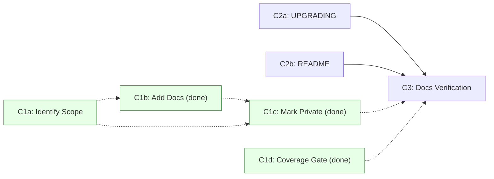

# Phase 4 / Step C — Update Documentation: Execution Plan

> **🚧 Status: Partial.**
>
> **C1 (YARD audit) is fully complete:**
> - **C1a ✅** — Public API scope TSV produced at `redesign/c1a-public-api-scope.tsv`
>   (255 rows: 42 public, 213 internal).
> - **C1b ✅** — All of `lib/` passes `bundle exec yard-lint lib/` with no offenses
>   (`yardstick` retired in favor of `yard-lint`; the `rake yard:lint` alias is
>   Ruby 3.3+ only).
> - **C1c ✅** — `@api` tags set for all 37 previously-unmarked internal constants
>   (commit `83225f3f`).
> - **C1d ✅** — Coverage gate enforced by `yard-lint` + `.yard-lint.yml`; no PR needed.
> - **C2b ✅** — `README.md` updated: prominent `## Upgrading from v4.x to v5.0.0`
>   section added, `UPGRADING.md` linked from the Deprecations section, outdated
>   version-pinned install snippets removed, and ToC updated.
>
> Remaining work:
>
> - **C2a:** review and expand `UPGRADING.md` to comprehensively cover all
>   v4.x → v5.0.0 breaking changes
> - **C3:** run the full final documentation verification before v5.0.0 release.
>

- [Goal](#goal)
- [Done-When Criteria](#done-when-criteria)
- [Workstreams \& PR Granularity](#workstreams--pr-granularity)
- [PR Creation Protocol](#pr-creation-protocol)
- [C1a Results Storage](#c1a-results-storage)
- [C1 — Public API YARD Audit \& Coverage](#c1--public-api-yard-audit--coverage)
  - [C1a — Identify public API scope](#c1a--identify-public-api-scope)
    - [C1a Steps (executable)](#c1a-steps-executable)
    - [Classification heuristics](#classification-heuristics)
  - [C1b — Document all elements (already complete)](#c1b--document-all-elements-already-complete)
  - [C1c — Set correct `@api` tags](#c1c--set-correct-api-tags)
  - [C1d — Coverage gate (already complete)](#c1d--coverage-gate-already-complete)
- [C2 — Guidance \& README Update](#c2--guidance--readme-update)
  - [C2a — Update `UPGRADING.md` (PR)](#c2a--update-upgradingmd-pr)
  - [C2b — Update `README.md` (PR)](#c2b--update-readmemd-pr)
- [C3 — Documentation Completeness Verification](#c3--documentation-completeness-verification)
  - [C3a — Run full CI pipeline](#c3a--run-full-ci-pipeline)
  - [C3b — Manual documentation spot-check](#c3b--manual-documentation-spot-check)
  - [C3c — Link validation](#c3c--link-validation)
  - [C3d — Step C sign-off](#c3d--step-c-sign-off)
- [Resolved Decisions](#resolved-decisions)
  - [YARD `@api private` scope](#yard-api-private-scope)
  - [Topic module documentation](#topic-module-documentation)
  - [README vs. UPGRADING split](#readme-vs-upgrading-split)
  - [Documentation coverage bar](#documentation-coverage-bar)
- [Execution Notes](#execution-notes)
  - [Sequencing \& Parallelization](#sequencing--parallelization)
  - [RSpec for documentation examples](#rspec-for-documentation-examples)
  - [Out of scope: gem release](#out-of-scope-gem-release)
- [File Checklist](#file-checklist)
- [Step C Completion Checklist (C3d)](#step-c-completion-checklist-c3d)

## Goal

Complete the documentation required for a stable v5.0.0 release:

1. ✅ **Done.** Ensure all **public-API classes and methods** have complete YARD
   documentation with no gaps — enforced by `yard-lint`, which passes with no
   offenses across `lib/`.
2. Mark all **internal classes** (`ExecutionContext`, `Commands::*`, `Path*`,
   `Parser*`) with `@api private` to signal they are not part of the stable
   public contract.
3. Provide **migration guidance** via `UPGRADING.md` explaining all v5.0.0
   breaking changes and how to migrate from v4.x.
4. Update **`README.md`** to reflect the new public entry points
   (`Git`, `Git::Repository`, etc.) and link to the migration guide.

Source of truth in the implementation tracker:
[`3_architecture_implementation.md`](3_architecture_implementation.md) →
"Phase 4 → Step C — Update documentation".

This is the final step of Phase 4, following [Step A](Phase%204%20-%20Step%20A.md)
(remove old code) and [Step B](Phase%204%20-%20Step%20B.md) (finalize test suite).
All breaking changes are complete; this step documents them for users.

---

## Done-When Criteria

- ✅ **Documentation coverage is complete and enforced by `yard-lint`.**
  `yardstick` has been retired; `bundle exec rake yard:lint` (which runs
  `bundle exec yard-lint lib/`) passes with **no offenses**. `yard-lint` lints
  every object — including Ruby-private and protected ones (`--private
  --protected`) — and enforces the project's documentation standard from
  `.github/skills/yard-documentation/SKILL.md`: a summary, documented parameters
  and return values, example formatting/title rules when examples exist, and tag
  ordering/style rules.
  Configuration lives in `.yard-lint.yml`; there is **no** `.yard-lint-todo.yml`
  baseline, so nothing is grandfathered. (The skill's generic baseline-removal
  guidance is not applicable in this repo because no baseline file exists.)
  - `@api private` is a **stability/visibility signal** (it marks internal
    implementation detail that users must not depend on); it is **not** a
    documentation exemption. Internal classes are documented too.
- ✅ **The bar is 100% documented — zero undocumented objects — enforced
  per-object.** `yard-lint`'s `Documentation/UndocumentedObjects` validator (on by
  default at `warning` severity) combined with `.yard-lint.yml`'s
  `FailOnSeverity: convention` fails the build on **any** undocumented object, which
  holds the line at 100%. This per-object gate is the source of truth, not a
  percentage: it gives a bright line and names the exact object that needs docs, so
  contributor friction is handled by actionable feedback and maintainer discretion
  rather than by leaving slack in a threshold. The `MinCoverage` setting (currently
  `75.0`) is only a coarse secondary backstop; the per-object validator is strictly
  stricter. `bundle exec rake yard:build` reports **100.00% documented** — an
  informational cross-check, not the enforced gate.
- `bundle exec rake yard:build` passes with no warnings. The `--fail-on-warning`
  flag lives in `.yardopts` (which `yard:build` reads), not in the rake task
  itself, so undocumented-object and other YARD warnings fail the build. Use
  `bundle exec yard-lint lib/` (optionally `--stats` or `--diff main`) as the
  diagnostic to locate any gaps.
- `UPGRADING.md` exists (already done) and comprehensively covers:
  - Breaking change overview (v4.x → v5.0.0).
  - Old entry points (`Git::Base`, `Git::Lib`) and their replacements
    (`Git::Repository` via `Git.open`, etc.).
  - Common migration patterns (command usage, return types, error handling).
  - Any deprecated methods still available for transitional use.
- `README.md` is updated to:
  - Prominently show the new public entry points (`Git`, `Git::Repository`).
  - Link to `UPGRADING.md` for migration guidance.
  - Include examples using the new `Git::Repository` facade layer.
  - Remove or contextualize any outdated references to `Git::Base` / `Git::Lib`.
- No **runtime or tooling references** to old code paths remain in the main
  library documentation — only CHANGELOG, historical design docs, and deprecated
  skill stubs (if any) may mention old classes contextually.
- Full CI pipeline (RSpec + YARD + linters) is green.
- **Out of scope:** the actual v5.0.0 gem release (CHANGELOG finalization, `v5.0.0`
  tag, `gem build`/`push`, GitHub release notes). Step C ends at docs-complete + CI
  green and hands off to the separate release process.

---

## Workstreams & PR Granularity

This step is organized into workstreams, each with **one PR per substep** for finer-grained reviews:

- **C1a: Identify Public API Scope** — ✅ **done** (`redesign/c1a-public-api-scope.tsv` produced)
- **C1b: Document All Elements** — ✅ **already done** (all of `lib/` passes
  `yard-lint`; no PR needed)
- **C1c: Set Correct @api Tags (incl. flip topic modules to private)** — ✅ **done**
  (commit `83225f3f`; all 37 previously-unmarked internal constants tagged)
- **C1d: Coverage Gate** — ✅ **already done** (`yard-lint` + `.yard-lint.yml`
  replaced the retired `yardstick` gate and pass; no PR needed)
- **C2a: Update UPGRADING.md** (1 PR)
- **C2b: Update README.md** — ✅ **done** (prominent upgrade section added,
  `UPGRADING.md` linked from Deprecations, outdated version-pinned install snippets removed)
- **C3: Documentation Completeness Verification** (1 PR)

Dependencies (remaining): C2a → C3. (C1a–C1d and C2b are all complete.)

**Documentation skill requirements:** Any remaining PR that touches YARD
comments must apply the
[yard-documentation](../.github/skills/yard-documentation/SKILL.md) skill to all
YARD comments changed or added. Additionally:

- For `Git::Commands::*` classes, also apply the
  [command-yard-documentation](../.github/skills/command-yard-documentation/SKILL.md) skill
- For `Git::Repository::*` facade methods, also apply the
  [facade-yard-documentation](../.github/skills/facade-yard-documentation/SKILL.md) skill



---

## PR Creation Protocol

All Step C PRs are created in **`ruby-git/ruby-git`** and target base branch
**`main`**. Use one PR per substep from the granularity list above.

- Create a dedicated topic branch per substep (for example:
  `docs/phase-4-step-c-c1a-scope`).
- Open each PR with `gh pr create` after pushing that topic branch.
- Keep each PR scoped to the substep's deliverables:
  - **C1a PR:** `redesign/c1a-public-api-scope.tsv` (and only minimal related plan/tracker
    adjustments if strictly required for accuracy).
  - **C1b PR:** ✅ already complete — all of `lib/**/*.rb` passes `yard-lint`, so
    no documentation-coverage PR is required.
  - **C1c PR:** correct `@api` tags in `lib/**/*.rb` for every element per the C1a
    TSV, including flipping the `Git::Repository::*` topic modules that are
    currently `@api public` to `@api private`.
  - **C1d PR:** ✅ already complete — `yardstick` was retired in favor of
    `yard-lint` (`.yard-lint.yml` + `rake yard:lint`), which passes; no
    coverage-gate PR is required.
  - **C2a PR:** `UPGRADING.md` updates only.
  - **C2b PR:** `README.md` updates only.
  - **C3 PR:** verification/sign-off updates only (for example Step C completion
    tracking in `redesign/3_architecture_implementation.md`).

If verification discovers additional documentation defects, fix them in the
appropriate workstream PR (C1* or C2*) rather than broadening C3 scope.

---

## C1a Results Storage

The results of C1a (public API scope identification) will be stored in:

```text
redesign/c1a-public-api-scope.tsv
```

This TSV file will contain columns:

- `constant_name` — fully qualified class or module name
- `type` — "class" or "module" (C1a is scoped to classes and modules only; methods are not included)
- `scope` — "public" or "internal"
- `category` — e.g. "entry-point", "return-type", "value-object", "topic-module",
  "command-wrapper", "parser", "plumbing", "state-object", etc.
- `api_private_current` — "yes" or "no": whether `@api private` is already applied
  (drives the C1c gap-fill so it only touches what's still unmarked)
- `defining_file` — path to the file where the constant is defined (e.g.,
  `lib/git/object.rb` for `Git::Object::Blob`)
- `notes` — any relevant context or classification rationale. A note may also
  carry an **actionable instruction** for a later phase, prefixed with the phase
  name (e.g. `C1c action: ...`); the consuming phase must read and follow it.

Subsequent PRs (C1b, C1c, C1d) will reference this file to understand the scope
decisions made in C1a. The file serves as the source of truth for public vs.
internal classification.

---

## C1 — Public API YARD Audit & Coverage

**Goal:** Verify all public-API classes and methods have complete documentation;
mark internal classes with `@api private`.

### C1a — Identify public API scope

**Goal:** Produce a complete, authoritative classification of every class/module
in `lib/` as either **public** (part of the stable v5.0.0 contract) or **internal**
(`@api private`). This classification is the source of truth consumed by C1b, C1c,
and C1d.

> **⚠️ The lists below are ILLUSTRATIVE, not exhaustive.** The C1a agent MUST
> enumerate the real set of classes/modules via tooling (`yard list`) and classify
> every entry — do not treat these lists as complete. Many public value objects are
> not named here (e.g., `Git::Author`, `Git::Branches`, `Git::Stash`,
> `Git::Worktree`, `Git::Url`, `Git::FileRef`, and numerous `*Info`/`*Result`
> objects), and the majority of internal classes are `Git::Commands::*` and parser
> classes.

#### C1a Steps (executable)

1. **Enumerate all top-level and nested constants.** Generate the full class/module
   inventory with YARD:

   ```bash
   bundle exec yard list --query 'object.type == :class || object.type == :module'
   ```

   (Or parse `bundle exec yard stats --list-undoc` output.) Cross-check
   against the file tree (Ruby is cross-platform; `find` is not available in a
   default Windows shell):

   ```bash
   ruby -e "puts Dir.glob('lib/**/*.rb').sort"
   ```

2. **Classify each constant** as `public` or `internal` using the heuristics below.
3. **Detect current `@api private` state per constant** so C1c knows what still
   needs marking. Query YARD for every object that already carries an
   `@api private` tag — this reports each element individually as
   `file:line: Fully::Qualified::Name`, not just the containing file:

   ```bash
   bundle exec yard list --query 'object.has_tag?(:api) && object.tag(:api).text == "private"'
   ```

   Set `api_private_current = yes` for each enumerated constant whose fully
   qualified name appears in that output, and `no` for the rest. (Avoid
   `git grep -l '@api private'`, which only reports files and cannot tell you
   which specific constant in a multi-class file is tagged.)

4. **Write the results** to `redesign/c1a-public-api-scope.tsv` (schema in the
   "C1a Results Storage" section above). Every enumerated constant gets one row.

#### Classification heuristics

**Public-API entry points** (illustrative — verify against real inventory):

- `Git` — module with factory methods (`.open`, `.clone`, `.init`, `.bare`,
  `.git_version`, `.default_branch`), defined in `lib/git.rb`
- `Git::Repository` — main facade for repository operations
- `Git::Object` and its nested subclasses `Git::Object::Blob`, `::Tree`,
  `::Commit`, `::Tag` — **all defined in `lib/git/object.rb`** (there are no
  separate `blob.rb`/`tree.rb`/`commit.rb`/`tag.rb` files)
- `Git::Branch`, `Git::Branches` — branch representation and collection
- `Git::Remote` — remote representation
- `Git::Diff`, `Git::DiffResult`, `Git::DiffStats` — diff representations
- `Git::Status` — repository status snapshot
- `Git::Log` — log entry and log enumeration
- `Git::Config` — configuration access
- `Git::Stash`, `Git::Stashes`, `Git::Worktree`, `Git::Worktrees` — collections
  and value objects returned from facade methods

> **Note:** There is **no `Git::Index` class.** Staging is handled by the
> `Git::Repository::Staging` module. Do not document a non-existent class.

**Value objects / return types** (public if returned from public methods —
classify each individually):

- `Git::Author`, `Git::FileRef`, `Git::Url`
- `Git::*Info` classes (`BranchInfo`, `TagInfo`, `StashInfo`, `ConfigEntryInfo`,
  `DetachedHeadInfo`, `DiffInfo`, `DirstatInfo`, etc.)
- `Git::*Result` / `Git::*Failure` classes (`BranchDeleteResult`,
  `TagDeleteResult`, `FsckResult`, `DiffResult`, etc.)
- Relevant exceptions in `lib/git/errors.rb`

**Internal / private classes** (must be marked `@api private`):

- `Git::ExecutionContext` and nested — internal execution context
- `Git::Commands::*` — command wrappers (impl detail of command layer)
- `Git::Parsers::*` / parser value objects — output parsers (impl detail)
- `Git::ArgsBuilder`, `Git::CommandLine`, `Git::CommandLineResult`,
  `Git::EncodingUtils`, `Git::EscapedPath` — internal plumbing (candidates for
  `@api private` — verify current state and flag if unmarked)
- `Git::Repository::*` topic modules (e.g., `Branching`, `Staging`, `Committing`) —
  organizational containers that group facade methods; the modules are `@api private`
  but the **methods** they define are public (see C1b for documentation location)
- `Git::Repository::<topic>::*Path`, `*State` — path/state objects within
  facade modules (e.g., `Git::Repository::Branching::HeadState`). These are
  internal helper classes that should be marked `@api private` and documented in
  their own class definition. The owning method simply references them in its
  `@return` tag (e.g., `@return [Git::Repository::Branching::HeadState]`).
- Any `::Internal::*` helpers

**Done-when (C1a):** `redesign/c1a-public-api-scope.tsv` exists with one row per
enumerated constant, each classified `public`/`internal` with its current
`@api private` state recorded.

### C1b — Document all elements (already complete)

> ✅ **Already done.** All of `lib/` passes `bundle exec rake yard:lint` with no
> offenses, so the documentation-coverage work below is complete. The steps are
> retained for historical context. `yardstick` has been retired; `yard-lint`
> (config in `.yard-lint.yml`) now enforces documentation completeness.

**Input:** `redesign/c1a-public-api-scope.tsv` (from C1a). Process **every** row —
both `public` and `internal` — adding whatever docs `yard-lint` requires: a
summary, an `@api` tag, and documented params/returns for every element (public
and internal alike). `@example` blocks are **strongly encouraged on key public
methods** where they aid understanding, but they are **not** machine-enforced —
`yard-lint` validates the syntax/style of examples that exist (`Tags/ExampleSyntax`)
but has no validator that requires an example to be present. Example coverage on
the key public-API classes is therefore verified manually in C3b, not gated by
`yard-lint`.

**Documentation conventions:** Every YARD comment added or changed in this PR MUST
follow the [yard-documentation](../.github/skills/yard-documentation/SKILL.md) skill.
For `Git::Repository::*` facade methods also apply
[facade-yard-documentation](../.github/skills/facade-yard-documentation/SKILL.md); for
`Git::Commands::*` also apply
[command-yard-documentation](../.github/skills/command-yard-documentation/SKILL.md).

**Important:** Methods are documented where they are defined, even if in a private topic module.

For **methods in `Git::Repository::*` topic modules** (e.g., `Git::Repository::Branching#current_branch`):

- Document the method in the topic module where it's defined
- Mark the **module itself** as `@api private` to signal it's an organizational container
  (the actual marking happens in C1c; C1b only adds method docs)
- The **method** remains public (do NOT mark methods `@api private`)
- YARD automatically includes these docs in the public `Git::Repository` interface
- Users will see `Git::Repository#current_branch` with docs from the topic module

For **other public classes** (e.g., `Git::Object`, `Git::Branch`):

- Document each class and its methods in the file where it's defined
  (remember `Blob`/`Tree`/`Commit`/`Tag` live in `lib/git/object.rb`)

**General documentation checklist** for each public class/method:

1. **Check for existing YARD doc.** Use `bundle exec yard doc --quiet` and
   review output in `doc/` or use `bundle exec yardoc --no-output` to check
   warnings.
2. **Add docs if missing.** Write clear, concise YARD comments following
   the skills referenced above:
   - `@param` for each argument with type and description
   - `@return` with type and description
   - `@example` for common usage patterns on key public methods (encouraged where
     it aids understanding; not required on trivial accessors, and not
     machine-enforced by `yard-lint`)
   - Cross-references to related methods using `{ClassName#method_name}`
   - `@raise` for exceptions that may be raised
3. **Verify docs render correctly.** Generate HTML docs and visually inspect
   that parameter names, types, and examples are rendered correctly.

### C1c — Set correct `@api` tags

> ✅ **Done.** Commit `83225f3f` set the correct `@api` tags for all 37 previously-unmarked
> internal constants identified in `redesign/c1a-public-api-scope.tsv`. All
> `Git::Repository::*` topic modules are now `@api private`. `bundle exec yard-lint lib/`
> passes with no offenses (the `rake yard:lint` alias is Ruby 3.3+ only). The steps
> below are retained for historical context.

**Input:** `redesign/c1a-public-api-scope.tsv` (from C1a). Set the correct `@api`
tag on **every** element per the TSV: `@api public` for the `public` surface,
`@api private` for `internal` implementation detail. Add or correct tags
wherever they are missing or wrong — including flipping the `Git::Repository::*`
topic modules that are currently `@api public` to `@api private`.

> **Note:** `@api` tags are already present on parts of `lib/`, but coverage is
> uneven — some topic modules are still `@api public` and some internal plumbing
> classes are unmarked. Treat C1c as an **audit and gap-fill** driven entirely by
> the C1a TSV: for every element whose recorded tag is missing or wrong, set the
> correct value. Do not rely on hard-coded lists here — the TSV is the source of
> truth.

For each internal class needing the marker:

1. **Add `@api private` tag** at the top of the class/module YARD comment.
   Examples:

   ```ruby
   module Git
     module Commands
       # @api private
       #
       # Internal command wrapper for `git show`.
       class Show < Base
         ...
       end
     end
   end
   ```

   ```ruby
   module Git
     module Repository
       # @api private
       #
       # Branching operations (organizational module mixed into Git::Repository).
       # Users interact with these methods via Git::Repository#current_branch, etc.
       module Branching
         # Get the current branch.
         #
         # @return [Git::Branch] the current branch
         def current_branch
           ...
         end
       end
     end
   end
   ```

2. **Note:** Topic modules like `Git::Repository::Branching` are marked `@api private`
   to indicate they are organizational containers, but the **methods they define are
   public** and should be fully documented (they are mixed into the public
   `Git::Repository` class). Do not add `@api private` to those methods.

3. **Read and follow per-row `notes` instructions.** Some rows carry an actionable
   instruction in the `notes` column prefixed `C1c action: ...`. Apply it in
   addition to setting the `@api` tag. For example, several work-in-progress diff
   value objects (e.g. `Git::DiffResult`, `Git::DiffInfo`, `Git::FileDiffInfo`,
   `Git::FileRef`, the `Git::DiffFile*Info` classes, `Git::Dirstat*`,
   `Git::DetachedHeadInfo`) instruct you to also add a YARD comment noting the
   class is work-in-progress and may be made public in a later release. Example:

   ```ruby
   module Git
     # Immutable result object from git diff commands.
     #
     # @note Work in progress: this class is not yet part of the public API and
     #   may be made public in a later release (targeted for a future
     #   Git::Repository::Diffing refactor). Do not depend on it.
     #
     # @api private
     #
     DiffResult = Data.define(...)
   end
   ```

4. **Verify the tags are applied.** Run:

   ```
   bundle exec yard list --query 'object.has_tag?(:api) && object.tag(:api).text == "private"'
   ```

   and confirm all 37 target constants from `redesign/c1a-public-api-scope.tsv`
   (those with `api_private_current=no`) appear in the output. Also run
   `bundle exec rake yard:build` (included in the CI `yard`/`default` task) and
   examine the build output for any warnings or errors introduced by the changes.

**Done-when (C1c):** Every element in `redesign/c1a-public-api-scope.tsv` has an
effective `@api` status matching its recorded `scope` — `internal` rows resolve to
`@api private` (tagged directly or inherited from an enclosing `@api private`
namespace) and `public` rows resolve to `@api public`. YARD propagates an
`@api private` tag from a namespace to its children, so a method inside an
`@api private` class is already private without its own tag; do not require a literal
tag on every element. Concretely: all `Git::Repository::*` topic modules are
`@api private`; the per-constant `@api private` query from C1a step 3 lists every
`internal` element and no `public` one; `bundle exec rake yard:lint` passes with no
offenses; and generated docs render internal elements with `@api private`
annotation (not as public API contract). Additionally, every `C1c action: ...`
instruction recorded in a row's `notes` column has been applied (e.g. the
work-in-progress diff value objects carry a `@note` marking them not-yet-public).

### C1d — Coverage gate (already complete)

> ✅ **Already done.** The coverage gate has been migrated from the retired
> `yardstick` tool to [`yard-lint`](https://github.com/mensfeld/yard-lint):
>
> - `tasks/yard.rake` defines a `yard:lint` task (`bundle exec yard-lint lib/`)
>   that is part of the aggregate `yard` task on Ruby 3.3+.
> - Configuration lives in `.yard-lint.yml` (lints `--private`/`--protected`
>   objects, `FailOnSeverity: convention`). The enforced bar is **100% — zero
>   undocumented objects** — via the `Documentation/UndocumentedObjects` validator
>   plus `FailOnSeverity: convention`; the `MinCoverage: 75.0` setting is only a
>   coarse secondary backstop. Tuned to the project's `yard-documentation` skill.
> - `bundle exec rake yard:lint` passes with **no offenses** and there is no
>   `.yard-lint-todo.yml` baseline, so the codebase is clean with no exceptions.
>
> No further action is required for the coverage gate. The per-object validator
> already holds the line at 100%; `bundle exec rake yard:build` reports **100.00%
> documented** as an informational cross-check.

---

## C2 — Guidance & README Update

**Goal:** Ensure `UPGRADING.md` comprehensively covers v4.x → v5.0.0 migration and
that `README.md` reflects the new public API and links to the migration guide.
Delivered as **two independent PRs** (C2a and C2b) that both gate C3.

### C2a — Update `UPGRADING.md` (PR)

**Input:** existing `UPGRADING.md` (already present, ~6 KB from earlier release
prep) and the list of v5.0.0 breaking changes from Steps A and B.

1. **Read `UPGRADING.md` end-to-end** to understand current coverage.
2. **Verify it comprehensively covers** (add/expand any gaps):
   - Breaking change overview (v4.x → v5.0.0).
   - Old entry points (`Git::Base`, `Git::Lib`) and their replacements
     (`Git::Repository` via `Git.open`, etc.).
   - Common migration patterns (command usage, return types, error handling).
   - Any deprecated methods still available for transitional use.
3. **Verify all code snippets** are valid against the v5.0.0 API (spot-check a
   representative sample against the real classes identified in C1a).
4. **Verify internal links** (e.g., to class docs, README) use correct Markdown.

**Done-when (C2a):** `UPGRADING.md` covers every breaking change with accurate
before/after examples; all links valid.

### C2b — Update `README.md` (PR)

**Input:** existing `README.md` and the finalized `UPGRADING.md` (C2a). C2b can
proceed in parallel with C2a since it only links to `UPGRADING.md` (which already
exists); coordinate wording if both change the upgrade callout.

1. **Read `README.md` end-to-end** to understand current structure and messaging.
2. **Replace any `Git::Base` / `Git::Lib` references with new public API examples:**
   - Old: `repo = Git::Base.new(path)` → New: `repo = Git.open(path)`
   - Old: `Git::Lib.new.ls_files` → New: `repo.ls_files`
   - Add a brief explanation of what `Git::Repository` is and why it's the main
     interface.
3. **Add or refresh a "Getting Started" / "Basic Usage" section** with 2–3 clear
   examples showing:
   - Opening/creating repositories
   - Running common operations (listing files, checking status, etc.)
   - Accessing objects (commits, branches)
4. **Add a prominent migration callout** pointing to `UPGRADING.md`:

   ```markdown
   ## Upgrading from v4.x to v5.0.0

   v5.0.0 is a major release with breaking changes. See
   [UPGRADING.md](UPGRADING.md) for a comprehensive migration guide.
   ```

5. **Test all code examples** by running them locally or in an isolated RSpec
   example, and **verify all internal links** are valid.

**Done-when (C2b):** `README.md` shows the new entry points, includes working
examples, and links to `UPGRADING.md`; no stale `Git::Base`/`Git::Lib` references
remain outside historical context.

---

## C3 — Documentation Completeness Verification

**Goal:** Final comprehensive check that all documentation is complete and correct.
Step C ends here at **docs-complete + CI green**. The actual v5.0.0 gem release
(tagging, `gem build`/`push`, publishing) is **out of scope** and handled by a
separate release process (see the [release-management](../.github/skills/release-management/SKILL.md)
skill).

**Input:** finalized `redesign/c1a-public-api-scope.tsv` (C1a–C1d) and the updated
`UPGRADING.md`/`README.md` (C2a/C2b).

### C3a — Run full CI pipeline

```bash
bundle exec rake default
```

This runs:

- RSpec (unit + integration) ✓
- RuboCop linting ✓
- YARD documentation build (plus lint on Ruby 3.3+) ✓
- Gem build check ✓

All must pass with 0 failures and 0 warnings.

> **Note:** The YARD tasks are **not defined on JRuby or TruffleRuby** (redcarpet
> cannot install there), and `yard:lint` is only defined on **Ruby 3.3+**.
> On MRI Ruby 3.2, `rake default` still runs `yard:build` but omits `yard:lint`.
> Run the final documentation verification on MRI Ruby 3.3+ to exercise both
> `yard:build` and `yard:lint`.

### C3b — Manual documentation spot-check

1. **Generate docs locally** using the same command CI runs:

   ```bash
   bundle exec rake yard:build
   ```

2. **Spot-check 5–10 key public-API classes** in the generated HTML docs
   (`doc/index.html`):

   - Verify each has complete parameter/return documentation.
   - Verify key public methods carry a usable `@example`. This is the
     **authoritative check for example presence** — `yard-lint` validates the
     syntax of examples that exist but cannot require one, so a human confirms the
     important entry points have them here.
   - Verify cross-references render correctly.
   - Verify `@api private` items are clearly annotated as private/internal and
     not presented as stable public API contract.

### C3c — Link validation

1. **Check `README.md` links:**

   - `UPGRADING.md` exists and is readable.
   - Any URLs to GitHub/external resources are still valid.

2. **Check cross-file references:**

   - Any internal skill or doc files that reference the API use correct examples.

### C3d — Step C sign-off

Once C1a–C1d, C2a/C2b, and C3a–c are complete:

1. **Open the C3 verification PR** summarizing that all documentation is complete
   and CI is green.
2. **Include the final YARD stats** in the PR description.
3. **Mark Phase 4 → Step C complete** in
   [`3_architecture_implementation.md`](3_architecture_implementation.md).
4. **Hand off to the separate release process** for the actual v5.0.0 release
   (out of Step C scope).

---

## Resolved Decisions

### YARD `@api private` scope

- **Decision:** Mark `Git::Commands::*`, `Git::Parsers::*`, `Git::ExecutionContext::*`,
  `Git::Repository::*` (topic modules), and any `Internal::*` helpers as `@api private`.
  These are implementation details subject to change without notice.
- **Rationale:** Users should interact only through `Git` and `Git::Repository`
  facades. Exposing internals would lock us into API stability for details that
  should remain flexible.
- **Note:** `@api private` signals *instability*, not *absence of docs*. These
  classes must still be fully documented (see the coverage bar below); `yard-lint`
  lints them too (it runs with `--private --protected`).

### Topic module documentation

- **Decision:** `Git::Repository::*` topic modules (e.g., `Branching`, `Staging`) are
  marked `@api private`, but the methods they define are documented in the module
  where defined. These methods are mixed into `Git::Repository` and become part of
  the public API. YARD automatically includes them in the `Git::Repository` public
  interface documentation.
- **Rationale:** Topic modules are organizational containers, not part of the user
  API contract. However, the methods they contain are public. This dual marking
  signals: "the module structure is internal; the functionality it exposes is public."

### README vs. UPGRADING split

- **Decision:** `README.md` focuses on current best practices with new API examples;
  `UPGRADING.md` is a comprehensive "old → new" migration reference.
- **Rationale:** Users landing on `README.md` should see the current recommended
  approach, not be confused by old patterns. Migration users reference the guide
  directly.

### Documentation coverage bar

- **Decision (locked):** The documentation bar is **100% — zero undocumented
  objects — enforced per-object**, not as a coverage percentage. `yard-lint`
  (which replaced the retired `yardstick` tooling) enforces it: `.yard-lint.yml`
  lints all objects (`--private --protected`) and fails on any offense at
  `convention` severity or higher, so the built-in
  `Documentation/UndocumentedObjects` validator fails the build on **any**
  undocumented object. `bundle exec rake yard:lint` currently passes with **no
  offenses** and no baseline exceptions, and `bundle exec rake yard:build` reports
  **100.00% documented**. The `MinCoverage` setting (`75.0`) is only a coarse
  secondary backstop; the per-object validator is the source of truth.
- **Rationale:** A single, tool-enforced bright line aligned with the
  `yard-documentation` skill. Per-object enforcement catches new undocumented code
  immediately and names the exact object to fix, so contributor friction is handled
  by that actionable feedback and by maintainer discretion (a maintainer can add a
  missing doc or fix a gap in a follow-up) — not by baking permanent slack into a
  threshold, which would let debt accumulate and eventually block an unrelated PR.
  `@api private` documents internal detail for maintainers while signaling users not
  to depend on it; it does not exempt code from documentation.

---

## Execution Notes

### Sequencing & Parallelization

- **Remaining C1 work is sequential:** `C1a → C1c → C3`. (C1b documentation
  coverage and the C1d coverage gate are already complete — see their sections.)
  C1c consumes `redesign/c1a-public-api-scope.tsv` from C1a to set the correct
  `@api` tags, so C1a must land first.
- **C2a and C2b are independent** of C1 and of each other, and may proceed in
  parallel at any time (both only require the pre-existing `UPGRADING.md`).
- **C3 gates the Step's completion** — requires C1c, C2a, and C2b all merged.

### RSpec for documentation examples

For examples added to YARD comments (e.g., in `@example` blocks), consider:

- **Simple examples** (e.g., "open a repo") can be inline in the comment.
- **Complex examples** that need actual repos or setup should either:
  - Reference an integration test that demonstrates the behavior, OR
  - Be conceptual pseudocode with clear comments.

Do not add new tests purely to support documentation examples; reuse existing
integration tests if possible.

### Out of scope: gem release

The actual v5.0.0 release (CHANGELOG finalization, `v5.0.0` git tag, `gem build`,
`gem push`, GitHub release notes) is **not part of Step C**. It is handled
separately via the
[release-management](../.github/skills/release-management/SKILL.md) skill once
Step C reaches docs-complete + CI green.

---

## File Checklist

> Illustrative anchor points — the authoritative list is
> `redesign/c1a-public-api-scope.tsv` produced by C1a. Paths reflect the real
> file layout (e.g., `Blob`/`Tree`/`Commit`/`Tag` live inside `object.rb`; there
> is no `index.rb`).

> ✅ **Documentation coverage is complete:** all files under `lib/` pass
> `bundle exec rake yard:lint`. The per-file "docs complete" boxes below are
> checked accordingly; the remaining unchecked items are `@api`-tag (C1c),
> `README`/`UPGRADING` (C2), and CI (C3) work.

- [x] `lib/git.rb` — top-level `Git` module + factory method docs complete
- [x] `lib/git/repository.rb` — facade class docs complete
- [x] `lib/git/object.rb` — `Object` base class **and nested** `Blob`, `Tree`,
      `Commit`, `Tag` subclass docs complete
- [x] `lib/git/branch.rb`, `lib/git/branches.rb` — branch class/collection docs complete
- [x] `lib/git/remote.rb` — remote class docs complete
- [x] `lib/git/diff.rb` + diff value objects (`diff_result.rb`, `diff_stats.rb`,
      `diff_info.rb`, `diff_file_*.rb`) — docs complete
- [x] `lib/git/status.rb` — status class docs complete
- [x] `lib/git/log.rb` — log class docs complete
- [x] `lib/git/config.rb` — config class docs complete
- [x] `lib/git/stash*.rb`, `lib/git/worktree*.rb` — collection/value object docs complete
- [ ] Public value objects (`author.rb`, `url.rb`, `file_ref.rb`, `*_info.rb`,
      `*_result.rb`, `*_failure.rb`) — classified in C1a (docs already complete)
- [ ] Every element carries a correct `@api` tag; topic modules flipped to
      `@api private` (per C1a TSV) — C1c
- [ ] `README.md` updated with new entry points — C2b
- [ ] `UPGRADING.md` reviewed and complete — C2a
- [x] Documentation coverage complete and gated by `yard-lint`
      (`.yard-lint.yml`); `rake yard:lint` passes with no offenses — C1b/C1d
- [ ] Full CI pipeline green — C3

---

## Step C Completion Checklist (C3d)

Step C is complete (docs-complete + CI green) when all of the following hold. The
actual gem release is tracked separately and is **not** part of this checklist.

- [ ] `redesign/c1a-public-api-scope.tsv` produced and kept authoritative (C1a)
- [x] All elements (public and internal) documented; `rake yard:lint` passes with
      no offenses (C1b)
- [ ] Every element carries a correct `@api` tag; topic modules `@api private` (C1c)
- [x] Coverage gate migrated to `yard-lint` (`.yard-lint.yml`) and green (C1d)
- [ ] `UPGRADING.md` comprehensive and links valid (C2a)
- [ ] `README.md` examples tested and working; links valid (C2b)
- [ ] `bundle exec rake default` passes (C3a)
- [ ] Manual doc spot-check passes; `@api private` items annotated as internal
      and not presented as stable public API contract (C3b)
- [ ] Phase 4 → Step C marked complete in `3_architecture_implementation.md` (C3d)
