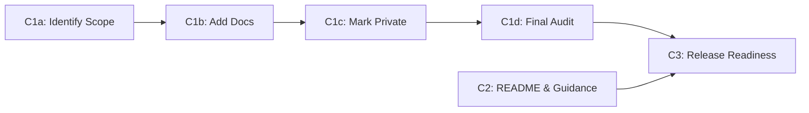

# Phase 4 / Step C — Update Documentation: Execution Plan

> **🚧 Status: Partial.**
>
> Core infrastructure complete (`UPGRADING.md` exists, `@api private` markers
> applied broadly).
>
> Remaining work:
>
> - verify `yard stats` reports no missing docs on public API classes/methods
> - confirm `README.md` reflects the new entry points and links to migration guide
> - run full final documentation audit before v5.0.0 release.
>

## Goal

Complete the documentation required for a stable v5.0.0 release:

1. Ensure all **public-API classes and methods** have complete YARD documentation
   with no gaps.
2. Mark all **internal classes** (`ExecutionContext`, `Commands::*`, `Path*`,
   `Parser*`) with `@api private` to signal they are not part of the stable
   public contract.
3. Provide **migration guidance** via `UPGRADING.md` explaining all v5.0.0
   breaking changes and how to migrate from v4.x.
4. Update **`README.md`** to reflect the new public entry points
   (`Git`, `Git::Repository`, etc.) and link to the migration guide.

Source of truth in the implementation tracker:
[`3_architecture_implementation.md`](3_architecture_implementation.md) →
"Phase 4 → Step C — Update documentation".

This is the final step of Phase 4, following [Step A](Phase%204%20-%20Step%20A.md)
(remove old code) and [Step B](Phase%204%20-%20Step%20B.md) (finalize test suite).
All breaking changes are complete; this step documents them for users.

---

## Done-When Criteria

- `bundle exec yard stats` reports **0 missing docs** on all public-API classes
  and methods (i.e., `@api private` and top-level library classes are the only
  items without docs). The coverage percentage should be 100% for public API.
- `UPGRADING.md` exists (already done) and comprehensively covers:
  - Breaking change overview (v4.x → v5.0.0).
  - Old entry points (`Git::Base`, `Git::Lib`) and their replacements
    (`Git::Repository` via `Git.open`, etc.).
  - Common migration patterns (command usage, return types, error handling).
  - Any deprecated methods still available for transitional use.
- `README.md` is updated to:
  - Prominently show the new public entry points (`Git`, `Git::Repository`).
  - Link to `UPGRADING.md` for migration guidance.
  - Include examples using the new `Git::Repository` facade layer.
  - Remove or contextualize any outdated references to `Git::Base` / `Git::Lib`.
- No **runtime or tooling references** to old code paths remain in the main
  library documentation — only CHANGELOG, historical design docs, and deprecated
  skill stubs (if any) may mention old classes contextually.
- Full CI pipeline (RSpec + YARD + linters) is green.

---

## Workstreams & PR Granularity

This step is organized into three workstreams, each with **one PR per substep** for finer-grained reviews:

- **C1a: Identify Public API Scope** (1 PR)
- **C1b: Add Missing YARD Docs to Public API** (1 PR)
- **C1c: Mark Internal Classes with @api private** (1 PR)
- **C1d: Final YARD Coverage Audit** (1 PR)
- **C2: README & Guidance Update** (1 PR)
- **C3: Release Readiness Verification** (1 PR)

Dependencies: C1a → C1b → C1c → C1d → C3; C2 → C3



---

## C1 — Public API YARD Audit & Coverage

**Goal:** Verify all public-API classes and methods have complete documentation;
mark internal classes with `@api private`.

### C1a — Identify public API scope

Identify all classes/modules that are intentionally part of the public contract
and deserve YARD documentation:

**Public-API top-level exports** (documented in root `lib/git.rb`):

- `Git` — module with factory methods (`.open`, `.clone`, `.init`, `.bare`,
  `.git_version`, `.default_branch`)
- `Git::Repository` — main facade for repository operations
- `Git::Object` — represents a Git object (commit, tree, blob, tag)
- `Git::Blob`, `Git::Tree`, `Git::Commit`, `Git::Tag` — subclasses of `Git::Object`
- `Git::Branch` — branch representation
- `Git::Remote` — remote representation
- `Git::Diff` — diff representation
- `Git::Status` — repository status snapshot
- `Git::Log` — log entry and log enumeration
- `Git::Index` — staging area operations
- `Git::Config` — configuration access

**Common return/support types** (likely already documented):

- `Git::Diff::DiffFile`, `Git::Diff::DiffHunk` — parts of diffs
- `Git::Status::StatusFile` — parts of status
- Relevant exceptions (e.g., `Git::GitExecuteError`)

**Internal / private classes** (must be marked `@api private`):

- `Git::ExecutionContext::Repository` — internal execution context
- `Git::Commands::*` — command wrappers (impl detail of command layer)
- `Git::Parsers::*` — output parsers (impl detail of parser layer)
- `Git::Repository::*` topic modules (e.g., `Branching`, `Staging`, `Committing`) —
  organizational containers that group facade methods; the modules are `@api private`
  but the **methods** they define are public (see C1b for documentation location)
- `Git::Repository::<topic>::*Path`, `*State` — path/state objects within
  facade modules (e.g., `Git::Repository::Branching::HeadState`). These are
  internal helper classes that should be marked `@api private` and documented in
  their own class definition. The owning method simply references them in its
  `@return` tag (e.g., `@return [Git::Repository::Branching::HeadState]`).
- Any `::Internal::*` helpers

### C1b — Add missing YARD docs to public API

**Important:** Methods are documented where they are defined, even if in a private topic module.

For **methods in `Git::Repository::*` topic modules** (e.g., `Git::Repository::Branching#current_branch`):

- Document the method in the topic module where it's defined
- Mark the **module itself** as `@api private` to signal it's an organizational container
- The **method** remains public (do NOT mark methods `@api private`)
- YARD automatically includes these docs in the public `Git::Repository` interface
- Users will see `Git::Repository#current_branch` with docs from the topic module

For **other public classes** (e.g., `Git::Object`, `Git::Branch`):

- Document each class and its methods in the file where it's defined

**General documentation checklist** for each public class/method:

1. **Check for existing YARD doc.** Use `bundle exec yard doc --quiet` and
   review output in `doc/` or use `bundle exec yardoc --no-output` to check
   warnings.
2. **Add docs if missing.** Write clear, concise YARD comments following
   project style (see `yard-documentation` skill):
   - `@param` for each argument with type and description
   - `@return` with type and description
   - `@example` for common usage patterns
   - Cross-references to related methods using `{ClassName#method_name}`
   - `@raise` for exceptions that may be raised
3. **Verify docs render correctly.** Generate HTML docs and visually inspect
   that parameter names, types, and examples are rendered correctly.

### C1c — Mark internal classes with `@api private`

For each internal class identified in C1a:

1. **Add `@api private` tag** at the top of the class/module YARD comment.
   Examples:

   ```ruby
   module Git
     module Commands
       # @api private
       #
       # Internal command wrapper for `git show`.
       class Show < Base
         ...
       end
     end
   end
   ```

   ```ruby
   module Git
     module Repository
       # @api private
       #
       # Branching operations (organizational module mixed into Git::Repository).
       # Users interact with these methods via Git::Repository#current_branch, etc.
       module Branching
         # Get the current branch.
         #
         # @return [Git::Branch] the current branch
         def current_branch
           ...
         end
       end
     end
   end
   ```

2. **Note:** Topic modules like `Git::Repository::Branching` are marked `@api private`
   to indicate they are organizational containers, but the **methods they define are
   public** and should be fully documented (they are mixed into the public
   `Git::Repository` class).

3. **Verify YARD respects the marker.** Run `bundle exec yard stats` — internal
   classes marked `@api private` are excluded from the public-API coverage count.

### C1d — Run final YARD coverage audit

1. **Generate YARD statistics:** `bundle exec yard stats --list-undocumented`.
2. **Confirm 100% public-API coverage:** All non-`@api private` classes and
   methods must appear as documented. If undocumented items are found:
   - Determine if they are truly part of the public API (if yes, add docs; if no,
     mark `@api private`).
   - Re-run stats until no public-API undocumented items remain.
3. **Document the final count:** Record the YARD statistics in a comment in
   `lib/git.rb` or in release notes for v5.0.0.

---

## C2 — README & Guidance Update

**Goal:** Update `README.md` to reflect the new public API and link users to
migration guidance.

### C2a — Review current README and UPGRADING

1. **Read `README.md` end-to-end** to understand current structure and messaging.
2. **Review `UPGRADING.md`** to confirm it comprehensively covers breaking
   changes and migration patterns. (This file should already exist from earlier
   release prep.)

### C2b — Update README entry points section

If `README.md` still contains examples or references to `Git::Base` / `Git::Lib`:

1. **Replace with new public API examples:**

   - Old: `repo = Git::Base.new(path)` → New: `repo = Git.open(path)`
   - Old: `Git::Lib.new.ls_files` → New: `repo.ls_files`
   - Add brief explanation of what `Git::Repository` is and why it's the main
     interface.

2. **Add "Getting Started" or "Basic Usage" section** with 2–3 clear examples
   showing:

   - Opening/creating repositories
   - Running common operations (listing files, checking status, etc.)
   - Accessing objects (commits, branches)

### C2c — Add migration guide link

1. **Add a prominent link or callout** in `README.md` pointing to `UPGRADING.md`
   for users migrating from v4.x.
2. **Example text:**

   ```markdown
   ## Upgrading from v4.x to v5.0.0

   v5.0.0 is a major release with breaking changes. See
   [UPGRADING.md](UPGRADING.md) for a comprehensive migration guide.
   ```

### C2d — Verify links and examples

1. **Test all code examples** in `README.md` by running them locally or in an
   isolated RSpec example.
2. **Verify all internal links** (e.g., to `UPGRADING.md`, class documentation)
   are valid and use correct Markdown syntax.

---

## C3 — Release Readiness Verification

**Goal:** Final comprehensive check that all documentation is complete and
correct before release.

### C3a — Run full CI pipeline

```bash
bundle exec rake default
```

This runs:

- RSpec (unit + integration) ✓
- RuboCop linting ✓
- YARD documentation coverage ✓
- Gem build check ✓

All must pass with 0 failures and 0 warnings.

### C3b — Manual documentation spot-check

1. **Generate docs locally:**

   ```bash
   bundle exec yard doc
   ```

2. **Spot-check 5–10 key public-API classes** in the generated HTML docs
   (`doc/index.html`):

   - Verify each has complete parameter/return/example documentation.
   - Verify cross-references render correctly.
   - Verify `@api private` items are not visible in the public API listing.

### C3c — Link validation

1. **Check `README.md` links:**

   - `UPGRADING.md` exists and is readable.
   - Any URLs to GitHub/external resources are still valid.

2. **Check cross-file references:**

   - CHANGELOG mentions v5.0.0 breaking changes.
   - Any internal skill or doc files that reference the API use correct examples.

### C3d — Final sign-off

Once C1, C2, and C3a–c are complete:

1. **Create a release PR** summarizing all documentation updates.
2. **Include the final YARD stats** in the PR description or commit message.
3. **Request final review** from maintainers.
4. **On approval, merge and tag v5.0.0.**

---

## Resolved Decisions

### YARD `@api private` scope

- **Decision:** Mark `Git::Commands::*`, `Git::Parsers::*`, `Git::ExecutionContext::*`,
  `Git::Repository::*` (topic modules), and any `Internal::*` helpers as `@api private`.
  These are implementation details subject to change without notice.
- **Rationale:** Users should interact only through `Git` and `Git::Repository`
  facades. Exposing internals would lock us into API stability for details that
  should remain flexible.

### Topic module documentation

- **Decision:** `Git::Repository::*` topic modules (e.g., `Branching`, `Staging`) are
  marked `@api private`, but the methods they define are documented in the module
  where defined. These methods are mixed into `Git::Repository` and become part of
  the public API. YARD automatically includes them in the `Git::Repository` public
  interface documentation.
- **Rationale:** Topic modules are organizational containers, not part of the user
  API contract. However, the methods they contain are public. This dual marking
  signals: "the module structure is internal; the functionality it exposes is public."

### README vs. UPGRADING split

- **Decision:** `README.md` focuses on current best practices with new API examples;
  `UPGRADING.md` is a comprehensive "old → new" migration reference.
- **Rationale:** Users landing on `README.md` should see the current recommended
  approach, not be confused by old patterns. Migration users reference the guide
  directly.

### Documentation coverage bar

- **Decision:** 100% public-API YARD coverage (no undocumented public classes/methods).
- **Rationale:** Users relying on the gem need to trust that the public surface is
  fully documented. Missing docs are a support liability and source of confusion.

---

## Execution Notes

### Parallelization

- **C1a, C1b, C1c can start immediately** once C1a scope is confirmed.
- **C2a, C2b, C2c can start in parallel** with C1 once `UPGRADING.md` is reviewed.
- **C3 gates final merge** — requires C1 and C2 complete.

### RSpec for documentation examples

For examples added to YARD comments (e.g., in `@example` blocks), consider:

- **Simple examples** (e.g., "open a repo") can be inline in the comment.
- **Complex examples** that need actual repos or setup should either:
  - Reference an integration test that demonstrates the behavior, OR
  - Be conceptual pseudocode with clear comments.

Do not add new tests purely to support documentation examples; reuse existing
integration tests if possible.

### Gem release process

Once C3 is complete:

1. **Ensure CHANGELOG.md is up to date** with all v5.0.0 entries (auto-generated
   by release-please if configured).
2. **Create a git tag** `v5.0.0` pointing to the release commit.
3. **Run `gem build` and `gem push`** (or use release automation if available).

---

## File Checklist

- [ ] `lib/git.rb` — top-level module docs complete
- [ ] `lib/git/repository.rb` — facade class docs complete
- [ ] `lib/git/object.rb` — base object class docs complete
- [ ] `lib/git/blob.rb`, `tree.rb`, `commit.rb`, `tag.rb` — subclass docs complete
- [ ] `lib/git/branch.rb` — branch class docs complete
- [ ] `lib/git/remote.rb` — remote class docs complete
- [ ] `lib/git/diff.rb`, `diff/diff_file.rb` — diff classes docs complete
- [ ] `lib/git/status.rb`, `status/status_file.rb` — status classes docs complete
- [ ] `lib/git/log.rb` — log class docs complete
- [ ] `lib/git/index.rb` — index class docs complete
- [ ] `lib/git/config.rb` — config class docs complete
- [ ] All internal classes marked `@api private` ✓
- [ ] `README.md` updated with new entry points ✓
- [ ] `UPGRADING.md` reviewed and complete ✓
- [ ] `yard stats` reports 100% public-API coverage ✓
- [ ] Full CI pipeline green ✓

---

## Release Checklist (C3d)

- [ ] All YARD docs written and reviewed
- [ ] `yard stats` shows 100% public-API coverage
- [ ] `bundle exec rake default` passes
- [ ] `README.md` examples tested and working
- [ ] All links in docs are valid
- [ ] CHANGELOG.md updated with v5.0.0 changes
- [ ] Git tag created (`v5.0.0`)
- [ ] Gem released to rubygems.org
- [ ] Release notes published (GitHub releases page)
